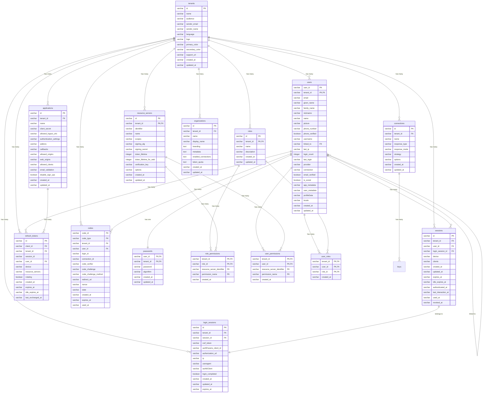

# Kysely Adapter

The Kysely adapter provides type-safe SQL database operations for AuthHero using the [Kysely](https://github.com/kysely-org/kysely) query builder. It supports PostgreSQL, MySQL, SQLite, and other SQL databases with full TypeScript integration.

## Features

- **Type-Safe Queries**: Full TypeScript support with compile-time query validation
- **Multiple Databases**: PostgreSQL, MySQL, SQLite, SQL Server, and more
- **Migration System**: Built-in database migration management
- **Query Builder**: Powerful and flexible query construction
- **Transaction Support**: Full ACID transaction capabilities
- **Connection Pooling**: Efficient database connection management

## Installation

```bash
npm install @authhero/kysely
```

## Configuration

### SQLite (Development)

```typescript
import { Database } from "@authhero/kysely";
import { createSQLiteDialect } from "@authhero/kysely";

const database = new Database({
  dialect: createSQLiteDialect({
    database: "authhero.db",
  }),
});
```

### PostgreSQL (Production)

```typescript
import { Database } from "@authhero/kysely";
import { createPostgreSQLDialect } from "@authhero/kysely";

const database = new Database({
  dialect: createPostgreSQLDialect({
    host: "localhost",
    port: 5432,
    database: "authhero",
    user: "username",
    password: "password",
  }),
});
```

### MySQL

```typescript
import { Database } from "@authhero/kysely";
import { createMySQLDialect } from "@authhero/kysely";

const database = new Database({
  dialect: createMySQLDialect({
    host: "localhost",
    port: 3306,
    database: "authhero",
    user: "username",
    password: "password",
  }),
});
```

## Database Operations

### Users

```typescript
// Create a user
const user = await database.users.create({
  user_id: "user_123",
  tenant_id: "tenant_456",
  email: "user@example.com",
  name: "John Doe",
  provider: "auth0",
  email_verified: true,
  is_social: false,
  app_metadata: "{}",
  user_metadata: "{}",
  created_at: new Date().toISOString(),
  updated_at: new Date().toISOString(),
});

// Get users with filtering
const users = await database.users.list({
  tenant_id: "tenant_456",
  page: 0,
  per_page: 10,
  search: "john",
  include_totals: true,
});

// Update a user
await database.users.update("user_123", "tenant_456", {
  name: "John Smith",
  updated_at: new Date().toISOString(),
});
```

### Applications

```typescript
// Create an application
const app = await database.applications.create({
  id: "app_123",
  tenant_id: "tenant_456",
  name: "My App",
  client_secret: "secret_key",
  callbacks: JSON.stringify(["http://localhost:3000/callback"]),
  allowed_origins: JSON.stringify(["http://localhost:3000"]),
  disable_sign_ups: false,
  created_at: new Date().toISOString(),
  updated_at: new Date().toISOString(),
});
```

### Sessions

```typescript
// Create a session
const session = await database.sessions.create({
  id: "session_123",
  tenant_id: "tenant_456",
  user_id: "user_123",
  created_at: new Date().toISOString(),
  expires_at: new Date(Date.now() + 24 * 60 * 60 * 1000).toISOString(),
  device: JSON.stringify({ browser: "Chrome" }),
  clients: JSON.stringify(["app_123"]),
});
```

## Migrations

The Kysely adapter includes a comprehensive migration system to manage database schema changes:

```bash
# Run migrations
npx kysely migrate up

# Create a new migration
npx kysely migrate create add_new_table

# Rollback migrations
npx kysely migrate down
```

### Migration Files

Migrations are TypeScript files that define schema changes:

```typescript
import { Kysely } from "kysely";
import { Database } from "@authhero/kysely";

export async function up(db: Kysely<Database>): Promise<void> {
  await db.schema
    .createTable("new_table")
    .addColumn("id", "varchar(255)", (col) => col.primaryKey())
    .addColumn("tenant_id", "varchar(255)", (col) =>
      col.notNull().references("tenants.id").onDelete("cascade"),
    )
    .addColumn("created_at", "varchar(255)", (col) => col.notNull())
    .execute();
}

export async function down(db: Kysely<Database>): Promise<void> {
  await db.schema.dropTable("new_table").execute();
}
```

## Database Schema

The Kysely adapter implements a comprehensive multi-tenant database schema designed for authentication and authorization. The schema supports:

- **Multi-tenancy**: Complete data isolation between tenants
- **User Management**: Comprehensive user profiles and authentication
- **OAuth/OIDC**: Full OAuth 2.0 and OpenID Connect support
- **RBAC**: Role-based access control with permissions
- **Organizations**: Hierarchical multi-tenancy
- **Audit Logging**: Complete audit trail
- **Customization**: Themes, branding, and custom domains

<style>
.mermaid-container {
  position: relative;
  width: 100%;
  min-height: 400px;
  max-height: 80vh;
  border: 1px solid var(--vp-c-border);
  border-radius: 8px;
  overflow: hidden;
  background: var(--vp-c-bg);
}

.mermaid-controls {
  position: absolute;
  top: 10px;
  right: 10px;
  z-index: 100;
  display: flex;
  gap: 8px;
}

.mermaid-btn {
  padding: 6px 12px;
  background: var(--vp-c-brand);
  color: white;
  border: none;
  border-radius: 4px;
  cursor: pointer;
  font-size: 12px;
  font-weight: 500;
}

.mermaid-btn:hover {
  background: var(--vp-c-brand-dark);
}

.mermaid-wrapper {
  width: 100%;
  height: 100%;
  overflow: auto;
  transform-origin: 0 0;
  transition: transform 0.3s ease;
}

.fullscreen-overlay {
  position: fixed;
  top: 0;
  left: 0;
  width: 100vw;
  height: 100vh;
  background: rgba(0, 0, 0, 0.9);
  z-index: 1000;
  display: none;
}

.fullscreen-overlay.active {
  display: flex;
  align-items: center;
  justify-content: center;
}

.fullscreen-content {
  width: 95%;
  height: 95%;
  background: var(--vp-c-bg);
  border-radius: 8px;
  position: relative;
  overflow: hidden;
}

.fullscreen-controls {
  position: absolute;
  top: 15px;
  right: 15px;
  z-index: 101;
  display: flex;
  gap: 8px;
}

.close-btn {
  background: #ef4444;
}

.close-btn:hover {
  background: #dc2626;
}

#mermaid-diagram {
  transform-origin: center center;
}

.mermaid {
  display: flex;
  justify-content: center;
  align-items: center;
  width: 100%;
  height: 100%;
  background: transparent !important;
}

.mermaid svg {
  max-width: 100%;
  height: auto;
  background: transparent !important;
}

/* Fix Mermaid text rendering */
.mermaid .er.entityBox {
  fill: var(--vp-c-bg) !important;
  stroke: var(--vp-c-border) !important;
  stroke-width: 1px !important;
}

.mermaid .er.entityLabel {
  fill: var(--vp-c-text-1) !important;
  font-family: var(--vp-font-family-base) !important;
  font-size: 14px !important;
  font-weight: 600 !important;
}

.mermaid .er.attributeBoxEven,
.mermaid .er.attributeBoxOdd {
  fill: var(--vp-c-bg-soft) !important;
  stroke: var(--vp-c-border) !important;
  stroke-width: 0.5px !important;
}

.mermaid text {
  fill: var(--vp-c-text-1) !important;
  font-family: var(--vp-font-family-base) !important;
  font-size: 12px !important;
}

/* More specific targeting for ERD elements */
.mermaid .er .er-attributeText {
  fill: var(--vp-c-text-2) !important;
  font-size: 11px !important;
}

.mermaid .er .er-entityNameText {
  fill: var(--vp-c-text-1) !important;
  font-weight: bold !important;
  font-size: 14px !important;
}

/* Ensure all text is visible */
.mermaid g text {
  fill: var(--vp-c-text-1) !important;
  visibility: visible !important;
  opacity: 1 !important;
}

/* Override any white text */
.mermaid [fill="white"] {
  fill: var(--vp-c-text-1) !important;
}

.mermaid [fill="#ffffff"] {
  fill: var(--vp-c-text-1) !important;
}
</style>

### Entity Relationship Diagram

<div class="mermaid-container">
  <div class="mermaid-controls">
    <button class="mermaid-btn" onclick="zoomIn()">Zoom In</button>
    <button class="mermaid-btn" onclick="zoomOut()">Zoom Out</button>
    <button class="mermaid-btn" onclick="resetZoom()">Reset</button>
    <button class="mermaid-btn" onclick="toggleFullscreen()">Fullscreen</button>
  </div>
  <div class="mermaid-wrapper" id="mermaid-wrapper">



  </div>
</div>

<div class="fullscreen-overlay" id="fullscreen-overlay">
  <div class="fullscreen-content">
    <div class="fullscreen-controls">
      <button class="mermaid-btn" onclick="zoomIn()">Zoom In</button>
      <button class="mermaid-btn" onclick="zoomOut()">Zoom Out</button>
      <button class="mermaid-btn" onclick="resetZoom()">Reset</button>
      <button class="mermaid-btn close-btn" onclick="toggleFullscreen()">Close</button>
    </div>
    <div class="mermaid-wrapper" id="fullscreen-mermaid-wrapper"></div>
  </div>
</div>

<script>
// Initialize when page loads
if (typeof window !== 'undefined') {
  // Global variables
  window.currentZoom = 1;
  window.isFullscreen = false;
  window.mermaidSvg = null;

  // Make functions globally available
  window.zoomIn = function() {
    window.currentZoom = Math.min(window.currentZoom * 1.2, 3);
    applyZoom();
  }

  window.zoomOut = function() {
    window.currentZoom = Math.max(window.currentZoom / 1.2, 0.3);
    applyZoom();
  }

  window.resetZoom = function() {
    window.currentZoom = 1;
    applyZoom();
    
    // Reset scroll position
    const wrapper = window.isFullscreen ? 
      document.getElementById('fullscreen-mermaid-wrapper') : 
      document.getElementById('mermaid-wrapper');
    if (wrapper) {
      wrapper.scrollLeft = 0;
      wrapper.scrollTop = 0;
    }
  }

  window.toggleFullscreen = function() {
    const overlay = document.getElementById('fullscreen-overlay');
    const normalWrapper = document.getElementById('mermaid-wrapper');
    const fullscreenWrapper = document.getElementById('fullscreen-mermaid-wrapper');
    
    if (!overlay || !normalWrapper || !fullscreenWrapper) {
      console.log('Missing elements:', { overlay: !!overlay, normalWrapper: !!normalWrapper, fullscreenWrapper: !!fullscreenWrapper });
      return;
    }
    
    window.isFullscreen = !window.isFullscreen;
    
    if (window.isFullscreen) {
      overlay.classList.add('active');
      // Move mermaid to fullscreen container
      const mermaidElement = normalWrapper.querySelector('.mermaid');
      if (mermaidElement) {
        fullscreenWrapper.appendChild(mermaidElement);
        addPanFunctionality(); // Re-add pan functionality for fullscreen
        fixMermaidTextColors(); // Fix text colors after moving
      }
      document.body.style.overflow = 'hidden';
    } else {
      overlay.classList.remove('active');
      // Move mermaid back to normal container
      const mermaidElement = fullscreenWrapper.querySelector('.mermaid');
      if (mermaidElement) {
        normalWrapper.appendChild(mermaidElement);
        addPanFunctionality(); // Re-add pan functionality for normal view
        fixMermaidTextColors(); // Fix text colors after moving
      }
      document.body.style.overflow = '';
    }
    
    applyZoom();
  }
  // Try multiple initialization methods
  if (document.readyState === 'loading') {
    document.addEventListener('DOMContentLoaded', initializeMermaidControls);
  } else {
    initializeMermaidControls();
  }
  
  // Also try with a timeout for Mermaid rendering
  setTimeout(initializeMermaidControls, 1000);
  setTimeout(initializeMermaidControls, 2000);
  
  // Set up MutationObserver to detect when Mermaid renders
  const observer = new MutationObserver(function(mutations) {
    mutations.forEach(function(mutation) {
      if (mutation.type === 'childList') {
        const mermaidElements = document.querySelectorAll('.mermaid svg');
        if (mermaidElements.length > 0 && !window.mermaidSvg) {
          initializeMermaidControls();
        }
      }
    });
  });
  
  observer.observe(document.body, {
    childList: true,
    subtree: true
  });
}

function initializeMermaidControls() {
  console.log('Initializing Mermaid controls...');
  
  // Look for mermaid element
  const mermaidElement = document.querySelector('.mermaid');
  const mermaidSvg = document.querySelector('.mermaid svg');
  
  console.log('Found elements:', { 
    mermaidElement: !!mermaidElement, 
    mermaidSvg: !!mermaidSvg 
  });
  
  if (mermaidElement && mermaidSvg) {
    window.mermaidSvg = mermaidSvg;
    console.log('Found Mermaid SVG, initializing...');
    window.mermaidSvg.id = 'mermaid-diagram';
    
    // Ensure proper styling
    window.mermaidSvg.style.maxWidth = '100%';
    window.mermaidSvg.style.height = 'auto';
    window.mermaidSvg.style.background = 'transparent';
    
    // Fix text colors
    fixMermaidTextColors();
    
    // Make sure it's in the wrapper
    const wrapper = document.getElementById('mermaid-wrapper');
    if (wrapper && !wrapper.contains(mermaidElement)) {
      wrapper.appendChild(mermaidElement);
      console.log('Moved mermaid to wrapper');
    }
    
    // Add pan functionality
    addPanFunctionality();
    
    // Apply initial zoom
    applyZoom();
    
    return true;
  }
  
  console.log('Mermaid elements not found yet');
  return false;
}

function fixMermaidTextColors() {
  if (!window.mermaidSvg) return;
  
  console.log('Fixing Mermaid text colors...');
  
  // Get computed CSS variables
  const textColor = getComputedStyle(document.documentElement).getPropertyValue('--vp-c-text-1').trim() || '#213547';
  const textColor2 = getComputedStyle(document.documentElement).getPropertyValue('--vp-c-text-2').trim() || '#476582';
  
  // Fix all text elements
  const textElements = window.mermaidSvg.querySelectorAll('text');
  textElements.forEach(text => {
    text.style.fill = textColor;
    text.style.fontFamily = 'inherit';
    text.style.visibility = 'visible';
    text.style.opacity = '1';
  });
  
  // Fix specific ERD text elements
  const entityLabels = window.mermaidSvg.querySelectorAll('.er-entityNameText, .entityLabel');
  entityLabels.forEach(label => {
    label.style.fill = textColor;
    label.style.fontWeight = 'bold';
    label.style.fontSize = '14px';
  });
  
  const attributeTexts = window.mermaidSvg.querySelectorAll('.er-attributeText');
  attributeTexts.forEach(attr => {
    attr.style.fill = textColor2;
    attr.style.fontSize = '12px';
  });
  
  // Force any white text to be visible
  const whiteTexts = window.mermaidSvg.querySelectorAll('[fill="white"], [fill="#ffffff"], [fill="#FFFFFF"]');
  whiteTexts.forEach(text => {
    text.setAttribute('fill', textColor);
  });
  
  console.log(`Fixed ${textElements.length} text elements`);
}

function addPanFunctionality() {
  if (!window.mermaidSvg) return;
  
  let isPanning = false;
  let startX, startY, scrollLeft, scrollTop;
  
  const wrapper = window.isFullscreen ? 
    document.getElementById('fullscreen-mermaid-wrapper') : 
    document.getElementById('mermaid-wrapper');
  
  if (!wrapper) return;
  
  // Remove existing event listeners to avoid duplicates
  wrapper.style.cursor = 'grab';
  
  const startPan = (e) => {
    isPanning = true;
    startX = e.pageX - wrapper.offsetLeft;
    startY = e.pageY - wrapper.offsetTop;
    scrollLeft = wrapper.scrollLeft;
    scrollTop = wrapper.scrollTop;
    wrapper.style.cursor = 'grabbing';
  };
  
  const endPan = () => {
    isPanning = false;
    wrapper.style.cursor = 'grab';
  };
  
  const pan = (e) => {
    if (!isPanning) return;
    e.preventDefault();
    const x = e.pageX - wrapper.offsetLeft;
    const y = e.pageY - wrapper.offsetTop;
    const walkX = (x - startX) * 2;
    const walkY = (y - startY) * 2;
    wrapper.scrollLeft = scrollLeft - walkX;
    wrapper.scrollTop = scrollTop - walkY;
  };
  
  wrapper.addEventListener('mousedown', startPan);
  wrapper.addEventListener('mouseleave', endPan);
  wrapper.addEventListener('mouseup', endPan);
  wrapper.addEventListener('mousemove', pan);
}

function applyZoom() {
  if (!window.mermaidSvg) return;
  
  window.mermaidSvg.style.transform = `scale(${window.currentZoom})`;
  
  // Fix text colors after zoom (sometimes they get reset)
  fixMermaidTextColors();
  
  // Update container size to accommodate scaled content
  const wrapper = window.isFullscreen ? 
    document.getElementById('fullscreen-mermaid-wrapper') : 
    document.getElementById('mermaid-wrapper');
    
  if (wrapper && window.mermaidSvg) {
    const rect = window.mermaidSvg.getBoundingClientRect();
    wrapper.style.minWidth = `${rect.width * window.currentZoom}px`;
    wrapper.style.minHeight = `${rect.height * window.currentZoom}px`;
  }
}

// Close fullscreen with Escape key
if (typeof window !== 'undefined') {
  window.addEventListener('keydown', function(e) {
    if (e.key === 'Escape' && window.isFullscreen) {
      window.toggleFullscreen();
    }
  });
}
</script>

## Performance Considerations

### Query Optimization

- **Use Indexes**: Ensure proper indexing on frequently queried columns
- **Limit Results**: Always use pagination for large result sets
- **Select Specific Columns**: Avoid `SELECT *` in production queries
- **Connection Pooling**: Configure appropriate pool sizes for your workload

### Production Deployment

- **Connection Limits**: Configure max connections based on database capacity
- **Read Replicas**: Use read replicas for query-heavy workloads
- **Monitoring**: Set up database performance monitoring
- **Backups**: Implement regular automated backups
- **SSL/TLS**: Always use encrypted connections in production

## Troubleshooting

### Common Issues

1. **Migration Errors**: Ensure database user has DDL permissions
2. **Connection Timeouts**: Increase connection timeout settings
3. **Type Errors**: Verify schema types match database structure
4. **Performance Issues**: Check query execution plans and indexes

### Debug Logging

Enable debug logging to troubleshoot issues:

```typescript
const database = new Database({
  dialect: dialect,
  log: ["query", "error"], // Enable query and error logging
});
```

This will log all SQL queries and errors to the console, helping with debugging and performance optimization.
