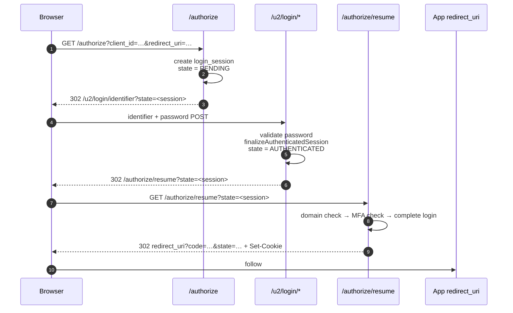
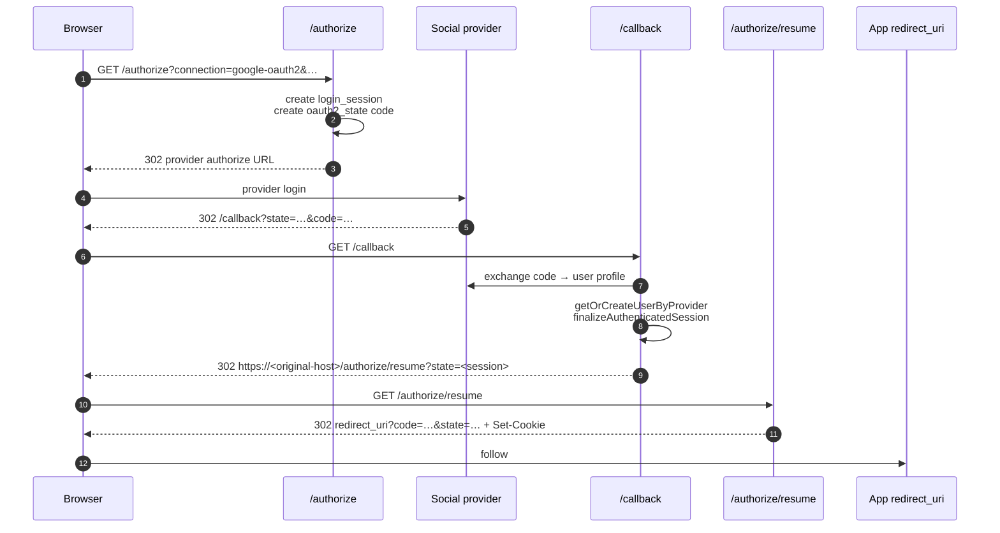
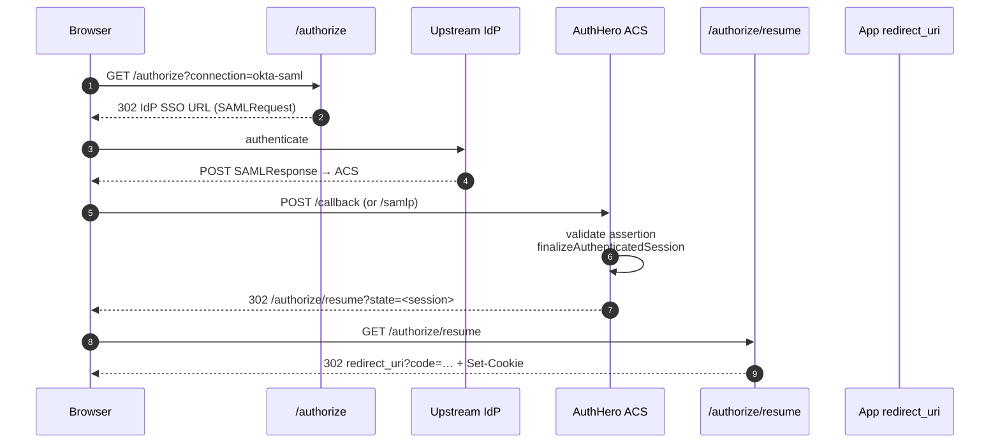

# Login flow — endpoints and responsibilities

A login in AuthHero is always a sequence of redirects between a small set of endpoints. This page walks through the sequence and says exactly what each endpoint owns, so you can answer "where does the cookie get set?" or "which step runs the hooks?" without reading the code.

## Endpoints at a glance

| Endpoint | Role |
| --- | --- |
| `GET /authorize` | Entry point. Validates the OAuth request, creates the login session, and dispatches to Universal Login, silent auth, a connection, or a ticket. |
| `/u/*` and `/u2/*` | Universal Login screens (identifier, password, OTP, MFA, signup, passkey, consent). They render UI and, when credentials are accepted, 302 to `/authorize/resume`. |
| `GET/POST /callback` | External OAuth / social provider callback. Exchanges the provider's code for a user, then 302s to `/authorize/resume`. |
| `/samlp/*` | SAML SP-side endpoint. Consumes a SAML assertion from an upstream IdP (or starts a UL flow for IdP-initiated), then eventually 302s to `/authorize/resume`. |
| `GET /authorize/resume` | **Terminal endpoint.** Sets the session cookie, issues the authorization code or tokens, and redirects the browser to the application's `redirect_uri`. |
| `GET /u/continue` | Out-of-band resumption point for hook / continuation flows (e.g. change-email mid-login). Eventually funnels back through `/authorize/resume`. |

The **login session** (table `login_sessions`) is the thread that ties these together. It is created at `/authorize`, its `state` column is driven by an xstate machine (see [state-machines/login-session.ts](https://github.com/markusahlstrand/authhero/tree/main/packages/authhero/src/state-machines/login-session.ts)), and its `id` is carried through every hop as the `state` query parameter.

## 1. Universal Login flow (password, OTP, signup)



Key points:

- The Universal Login screen **never issues tokens or sets the auth cookie**. Its job is: validate credentials, write `user_id` + `auth_strategy` + `auth_connection` onto the login session, transition the state machine to `AUTHENTICATED`, and 302 to `/authorize/resume`.
- If MFA or email verification is required, the state transitions to `AWAITING_MFA` / `AWAITING_EMAIL_VERIFICATION` and `/authorize/resume` redirects back to the appropriate UL screen instead of completing.
- Only `/authorize/resume` writes the `{tenant_id}-auth-token` cookie (via `serializeAuthCookie`), and it does so on the host the authorize request originated from.

## 2. Social (OAuth) connection flow



Two things distinguish the social flow from the UL flow:

- `/callback` is called by the provider's redirect, which may land on a different host than `/authorize` did (especially when a tenant has multiple custom domains and only one is registered with the provider). `finalizeAuthenticatedSession` detects this by comparing `login_session.authorization_url` to the current host and makes the `/authorize/resume` redirect absolute when needed so the browser ends up on the host whose wildcard domain the session cookie belongs to.
- The provider's authorization code is exchanged **once, on whichever host `/callback` was invoked on**. Only the final cookie-write hops to the original domain — not the token exchange.

Previously (pre-`/authorize/resume`), `/callback` did a `307 POST` re-dispatch to `/callback` on the original domain. That preserved the POST body but re-ran the provider code exchange, which can fail because OAuth codes are single-use. The current split is strictly safer.

## 3. SAML flows

### SP-side — AuthHero consumes an IdP assertion

Used when AuthHero is configured as an SP against an upstream SAML IdP (e.g. Okta) via the SAML adapter.



Same two-hop pattern as the social flow — assertion consume, then terminal resume.

### IdP-side — AuthHero signs a SAML response for a downstream SP

When a client uses AuthHero as its IdP (`response_mode=saml_post`), the login session's `authParams.response_mode` is `SAML_POST`. `/authorize/resume` detects this inside `createFrontChannelAuthResponse` and calls `samlCallback`, which renders the auto-submitting HTML form that POSTs a signed SAML response to the SP's ACS URL.

The auth cookie is still written on the AuthHero domain during this step; the SAML POST to the SP is cross-origin by design and does not involve our cookie.

## 4. Out-of-band continuation (`/u/continue`)

Some flows pause mid-login to run an external step (an Actions redirect, a mandatory email change, a form-node). These pause by transitioning the login session to `AWAITING_HOOK` or `AWAITING_CONTINUATION` and storing a return URL on the session. When the external step finishes, the browser lands on `/u/continue?state=<session>`, which advances the state machine back to `AUTHENTICATED` and then 302s to `/authorize/resume`.

The mental model: `/u/continue` is the re-entry point for **hook/flow continuations**. `/authorize/resume` is the re-entry point for **login completion**. Both ultimately run the same final cookie-write + redirect logic, but only `/authorize/resume` does the cross-domain hop — continuations are expected to stay on the AuthHero domain.

## What goes where

| Responsibility | Owner |
| --- | --- |
| Create login session, validate OAuth params | `/authorize` |
| Render identifier / password / OTP / signup UI | `/u/*` and `/u2/*` screens |
| Accept credentials, persist `user_id` onto the session | UL screen → `finalizeAuthenticatedSession` |
| Exchange a social provider code for a user | `/callback` → `connectionCallback` |
| Validate a SAML assertion and map it to a user | SP ACS handler |
| Cross-domain hop to the original authorization host | `finalizeAuthenticatedSession` (relative→absolute 302) and `/authorize/resume` (defensive re-check) |
| State-machine dispatch (MFA, email-verify, continuations) | `/authorize/resume` (delegates to `createFrontChannelAuthResponse`) |
| Set `{tenant_id}-auth-token` cookie | `createFrontChannelAuthResponse`, only reached via `/authorize/resume` |
| Issue `code` / tokens and 302 to `redirect_uri` | `createFrontChannelAuthResponse` |
| Post-login hooks (`postUserLoginHook`) | `completeLogin`, inside `createFrontChannelAuthResponse` |
| Silent auth (iframe cookie check without UL) | `silent.ts` — does not use `/authorize/resume` |

## Compatibility with Auth0

The `/authorize/resume` endpoint mirrors Auth0's own endpoint of the same name. In an Auth0 HAR the sequence for a password login is:

```text
POST identity.tenant.com/u/login/password?state=…
  → 302 /authorize/resume?state=…
GET  identity.tenant.com/authorize/resume?state=…
  → 302 app.tenant.com/auth/callback?code=…&state=…
```

The state parameter on `/authorize/resume` is an opaque login-session identifier, different from the long state blob the UL page uses internally. AuthHero uses the same login-session `id` for both, which is simpler and still opaque.

Auth0 additionally has a separate `/continue?state=…` endpoint used by [Redirect with Actions](https://auth0.com/docs/customize/actions/explore-triggers/signup-and-login-triggers/login-trigger/redirect-with-actions) to resume the server-side Actions pipeline after an external hop. AuthHero's equivalent is `/u/continue` — it is not the same as `/authorize/resume`, and serves a different purpose.

The one behavioural difference: Auth0 enforces a single custom domain per tenant, so their `/authorize/resume` never needs to hop domains. AuthHero supports multiple custom domains per tenant, so `/authorize/resume` additionally compares the current host against `login_session.authorization_url` and redirects to the original host when they differ. This is the mechanism that keeps the session cookie under the correct wildcard.
