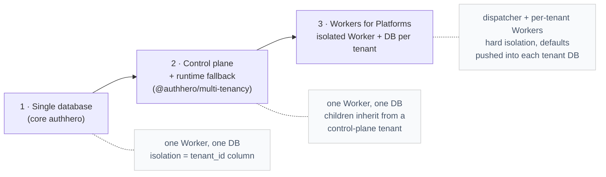
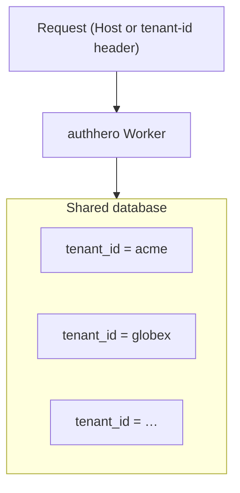
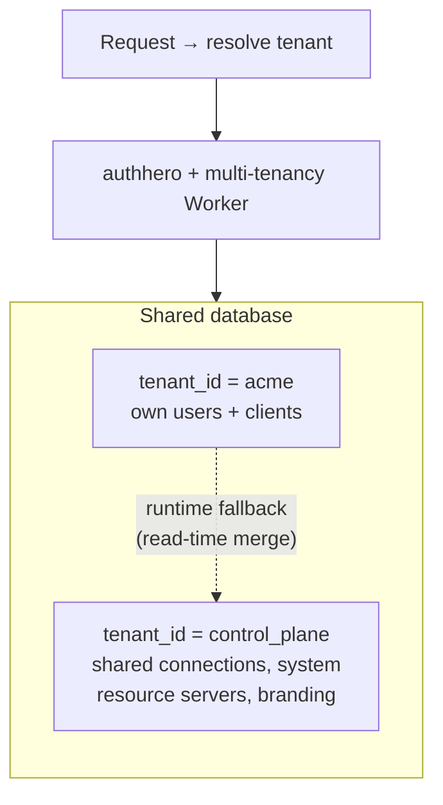
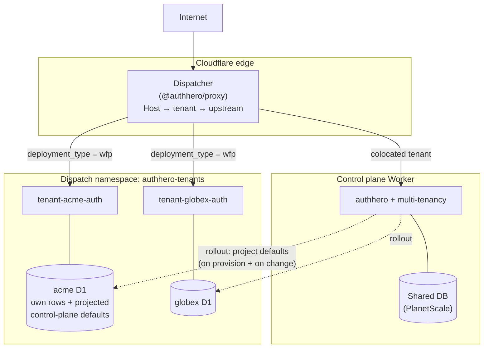
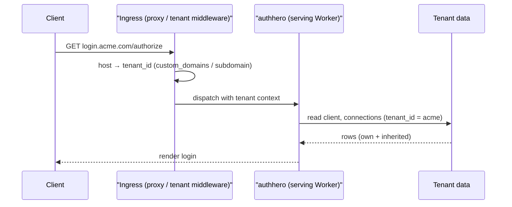

# Multi-Tenancy

AuthHero is multi-tenant by design. **Every API request is scoped to a tenant**,
and all data is isolated by a `tenant_id` column on every table. What changes
between deployments is _how far apart_ tenants live — from sharing one database,
to sharing a Worker but inheriting from a control plane, to running in their own
isolated Worker and database.

This page is the map. It shows the three deployment models side by side, how a
request finds its tenant, and where to go for the implementation details.

## The three deployment models



Each model is a superset of the one before it — you adopt the next tier only
when you need stronger isolation, and the read path (`tenant_id`-scoped queries)
never changes.

| | 1 · Single DB | 2 · Control plane | 3 · Workers for Platforms |
| --- | --- | --- | --- |
| Package | `authhero` | `@authhero/multi-tenancy` | `+ @authhero/proxy`, dispatch namespace |
| Isolation | Logical (`tenant_id`) | Logical (`tenant_id`) | **Hard** (separate isolate + DB) |
| Database | One shared | One shared | One per tenant (or shared) |
| Inheritance | — | Runtime fallback (read-time) | Projection (defaults pushed into tenant DB) |
| Per-tenant code | — | — | Yes (a bundle per tenant) |
| Blast radius of an outage | Whole deployment | Whole deployment | One tenant |
| Good for | You own all tenants | B2B SaaS, many customers | Untrusted/large tenants, custom builds |

### 1 · Single shared database

The default. One Worker, one database; tenants are rows partitioned by
`tenant_id`. Each tenant has its own users, applications, connections, branding
and settings. This is enough for most deployments where you control all tenants.



### 2 · Control plane + runtime fallback

For B2B SaaS, the `@authhero/multi-tenancy` package adds a **control-plane
tenant** that other tenants inherit from. Still one Worker and one database, but
a child tenant that has no row of its own for a given connection, resource
server, branding or email provider **falls back to the control plane's row at
read time** — so shared social logins and system APIs are configured once.



Two related mechanisms live here:

- **Entity sync** copies control-plane resource servers and roles _into_ child
  tenants as `is_system` rows (so they exist locally and can't be edited).
- **Runtime fallback** resolves connections, secrets, branding and prompts from
  the control plane _without_ copying them, at read time.

See [Control Plane](/customization/multi-tenancy/control-plane),
[Runtime Fallback](/customization/multi-tenancy/runtime-fallback) and
[Entity sync](/customization/multi-tenancy/#entity-synchronization).

### 3 · Workers for Platforms (isolated)

When tenants need **hard isolation** — a bug, a runaway request, or a custom
code bundle in one tenant must not affect any other — each tenant runs in its
**own Worker with its own database**, fronted by a thin **dispatcher** built on
`@authhero/proxy`.



Because a tenant Worker can't read the control plane's database at request time,
the control plane **projects** its defaults (connections, system resource
servers, branding, shared OAuth secrets) into each tenant's own database at
release cadence. The tenant then reads only its own DB and the same runtime
fallback resolves the inherited rows — no WFP-specific read code.

This is the deepest topic and has its own diagrammed guides:

- [Cloudflare Workers for Platforms](/deployment/cloudflare-wfp) — the deploy
  playbook (dispatcher, dispatch namespace, per-tenant onboarding)
- [Control Plane Defaults (WFP)](/customization/multi-tenancy/control-plane-defaults)
  — how defaults and shared secrets are projected and held at rest
- [Proxy package](/customization/proxy/) — the dispatcher's routing and handlers

## How a request finds its tenant

Whatever the model, ingress resolves a **host** (or, for the management API, a
`tenant-id` header) to a `tenant_id` before any auth logic runs. A tenant can be
addressed three ways:

| Addressing | Resolved by | Example |
| --- | --- | --- |
| **Custom domain** | `custom_domains` table | `login.acme.com` |
| **Tenant subdomain** | subdomain → tenant | `acme.token.example.com` |
| **`tenant-id` header** | management API only | `tenant-id: acme` |



::: tip Three orthogonal concepts
**Host** = which tenant's auth surface. **`deployment_type`** (`shared` |
`wfp`) = which Worker serves it. The **control-plane host** is the platform
acting _as itself_ (management API, admin UI, rollout source) — not a tenant
auth surface. Keeping these separate is what makes the WFP topology tractable.
:::

The direction of travel is toward **host-based resolution** (subdomains and
custom domains) as the primary mechanism; the `tenant-id` header remains for the
management API and backwards compatibility.

## Cross-tenant & forwarded control-plane requests

The management API resolves its target tenant from the `tenant-id` header. A
token issued for tenant A may only operate on tenant B when it comes from the
deployment's **control-plane tenant** — every other cross-tenant hop is rejected
with `403 Cross-tenant management requires a control-plane token`. See
[Management API Security](/security/management-api).

In a WFP setup the control plane mints admin tokens with **its own issuer**
(e.g. `https://controlplane.token.example.com/`), but those requests are
forwarded to a per-tenant Worker whose `env.ISSUER` is per-tenant. The
signature still verifies (the control-plane JWKS is fetched), but the strict
issuer check would otherwise reject the token. Two host-app resolvers widen the
accepted set without authhero hardcoding anything:

```typescript
import { init } from "authhero";

const { app } = init({
  dataAdapter,

  // Accept the control-plane issuer in addition to this Worker's own issuer.
  // authhero never derives an issuer itself — return [] to refuse.
  additionalIssuers: ({ tenant_id }) =>
    tenant_id ? ["https://controlplane.token.example.com/"] : [],

  // Likewise widen the accepted management-API audience.
  additionalManagementAudiences: ({ tenant_id }) => [
    "https://controlplane.token.example.com/v2/api/",
    `https://${tenant_id}.token.example.com/v2/api/`,
  ],
});
```

Both resolvers receive the token's `tenant_id` and default to the strict,
single-value check when unset. See
[Workers for Platforms → Control-plane admin tokens](/deployment/cloudflare-wfp#control-plane-admin-tokens).

## Organizations

Organizations group users _within_ a tenant and apply specific access controls.
When a user authenticates with an organization context, the access token carries
an `org_id` (and/or `org_name`) claim your API uses for authorization:

```json
{
  "sub": "auth0|user123",
  "org_id": "org_acme",
  "scope": "openid read:data"
}
```

The same user can belong to multiple organizations with different roles in each.
In the control-plane model, an organization on the control plane represents a
child tenant — membership there is what grants a user the right to manage that
tenant.

See [Entities — Organizations](/entities/identity/organizations) and
[Security — Multi-Tenancy & Organizations](/security/multi-tenancy).

## Where to next

- **Build it:** [Multi-Tenancy Package](/customization/multi-tenancy/) — quick
  start, entity sync, configuration
- **Isolate databases:** [Database Isolation](/customization/multi-tenancy/database-isolation)
- **Route by host:** [Subdomain Routing](/customization/multi-tenancy/subdomain-routing)
  · [Custom Domain Setup](/deployment/custom-domain-setup)
- **Go to WFP:** [Cloudflare Workers for Platforms](/deployment/cloudflare-wfp)
  · [Control Plane Defaults](/customization/multi-tenancy/control-plane-defaults)
- **Migrate:** [Single → multi-tenant](/customization/multi-tenancy/migration)
- **Compare with Auth0:** [Multi-Tenant](/auth0-comparison/multi-tenant)
