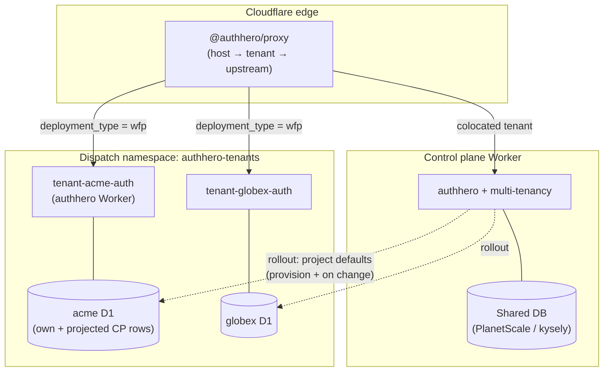
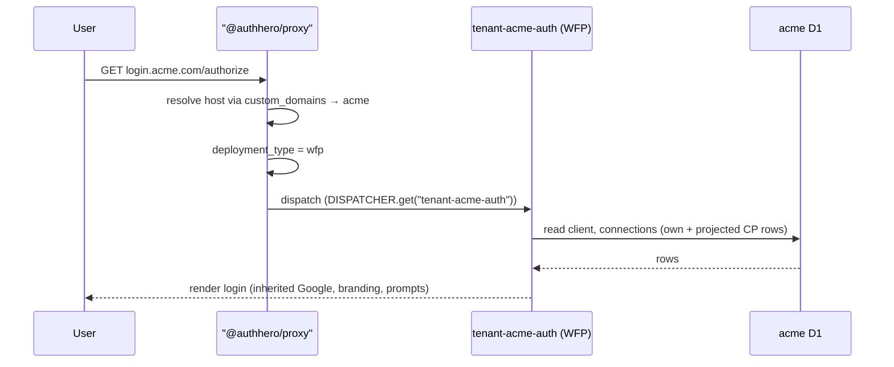
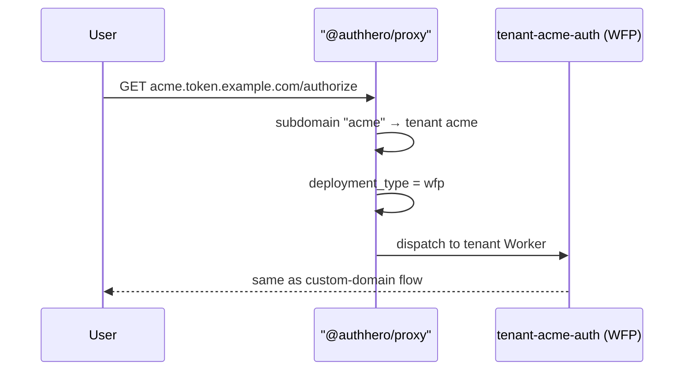
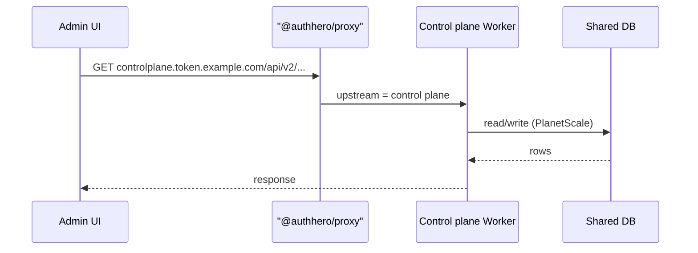
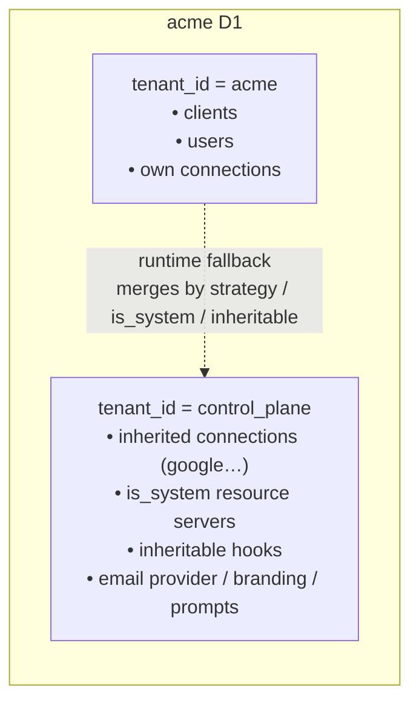
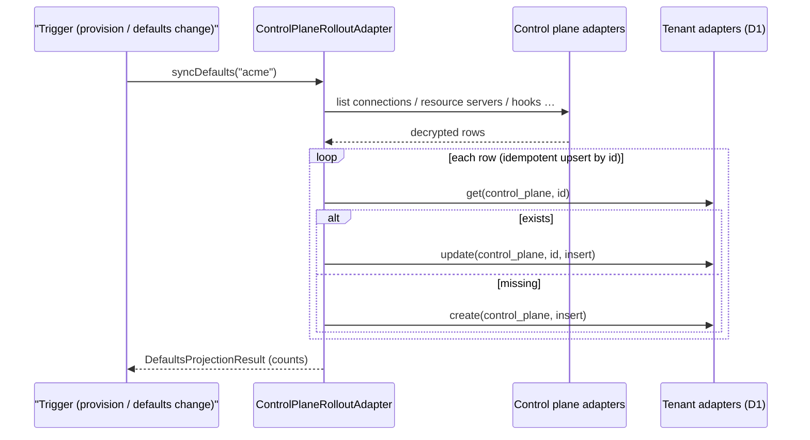
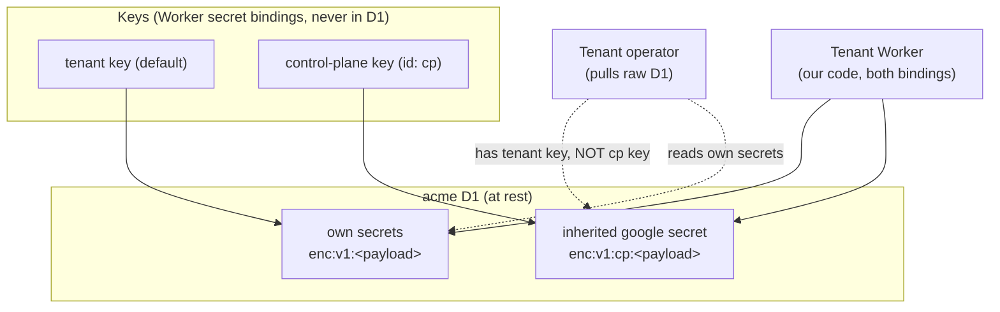
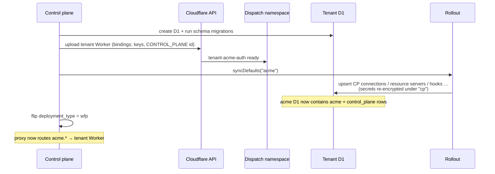

# Control Plane Defaults for WFP Tenants

When every tenant shares one Worker and one database, a child tenant inherits
defaults from the **control plane tenant** at request time via
[Runtime Fallback](./runtime-fallback) — the adapter simply reads the control
plane tenant's rows from the same database.

That breaks under [Workers for Platforms](../../deployment/cloudflare-wfp)
(WFP), where each tenant runs in its **own Worker with its own D1 database**. A
tenant Worker cannot read the control plane's database at request time, so it
has nothing to fall back to.

This page describes how a WFP tenant still gets its default connections,
prompts, branding and **shared social-login secrets** (Google, Apple, …) — and
how it can hold those secrets at rest without being able to decrypt them.

## The core idea: push a durable copy, don't pull on the hot path

The naive fix is a request-time call from the tenant Worker to the control
plane (service binding + a short cache). It works, but it re-introduces shared
fate: if the control plane is degraded, a cold tenant isolate fails its first
logins. That defeats the isolation WFP exists to provide.

Instead, **the control plane's defaults are projected into each tenant's own
database**, under the control plane tenant id. The tenant Worker then reads
**only its own D1**, and the existing runtime fallback resolves the inherited
rows with **no read-path change** — the tenant database is, in effect, a
miniature control-plane-colocated database.

| | Pull (cache) | **Push (projection)** |
| --- | --- | --- |
| Read path | new remote source, blocks on miss | existing runtime fallback, unchanged |
| Control plane outage | cold isolate fails | serves last-known-good from D1 |
| Freshness | bounded by cache TTL | bounded by rollout cadence |
| Where new code lives | request path | rollout (write) path only |

::: tip
Defaults, schema migrations and tenant Worker code all change at **release
cadence**, not per request. A push on change — made durable later by Cloudflare
Workflows — is the right tool, and the same rollout mechanism serves all three.
:::

## Topology



The proxy is a single front door: it resolves the host to a tenant, then picks
an upstream by the tenant's `deployment_type` — a WFP Worker in the dispatch
namespace, or the control plane Worker for colocated tenants. The control plane
is also the **rollout source**: it projects defaults into each WFP tenant's D1.

## Request routing

A tenant can be addressed three ways. All converge on the same defaults
mechanism — the ingress path never changes how a tenant gets its defaults.

### 1. Custom domain — `login.acme.com`



### 2. Tenant subdomain — `acme.token.example.com`

Identical to the custom-domain case past resolution; only the resolver differs
(subdomain → tenant instead of the `custom_domains` table).



### 3. Control plane host — `controlplane.token.example.com`

The control plane's own system identity (management API, admin UI, and the
**rollout source**). Colocated tenants are served here directly; this host is
not a tenant auth surface.



::: warning Keep three concepts orthogonal
**Host** = which tenant's auth surface (`acme.token.example.com` / custom
domain). **`deployment_type`** = which Worker serves it (control plane vs WFP).
**`controlplane.token.example.com`** = the control plane *as itself*. A
control-plane-*colocated* tenant is still addressed at its own host — it is not
reachable as the control plane.
:::

## Storage model: the control plane is a tenant inside the tenant's DB

Projection writes the control plane's inheritable rows into the tenant's
database **under the control plane tenant id**. So a WFP tenant's D1 physically
contains two tenants: itself, and a defaults-only copy of the control plane.



Because the rows live under the control plane tenant id,
[`withRuntimeFallback`](./runtime-fallback) resolves them with the **exact same
code** it uses in a shared database. Nothing on the read path is WFP-aware.

What gets projected (the "defaults bundle"):

| Entity | Filter | Consumed on read by |
| --- | --- | --- |
| Connections | all | runtime fallback, matched by `strategy` |
| Resource servers | `is_system === true` | runtime fallback scope inheritance |
| Hooks | `metadata.inheritable === true` | runtime fallback hook inheritance |
| Email provider | singleton | runtime fallback email-provider fallback |
| Branding | singleton | tenant resolving control-plane branding |
| Prompt settings | singleton | tenant resolving control-plane prompts |

## The rollout

Projection is exposed behind a **rollout adapter** — the seam for execution
strategy. Today it runs **inline** (right for validating with a single pilot
tenant). The same interface will later be backed by Cloudflare Workflows for
durable, retryable, resumable fan-out, with no change to callers.



Every row is **upserted by its stable id**, so re-running converges instead of
duplicating — a re-sync, a later rollout, and a provision-time seed all reach
the same state.

```typescript
import { createDirectRolloutAdapter } from "@authhero/multi-tenancy";

const rollout = createDirectRolloutAdapter({
  controlPlaneTenantId: "control_plane",
  // Reads the control plane's rows (secrets decrypted).
  getControlPlaneAdapters: async () => controlPlaneAdapters,
  // The target tenant's own database (its D1).
  getAdapters: async (tenantId) => getTenantAdapters(tenantId),
});

// On tenant provision, and whenever control plane defaults change:
const result = await rollout.syncDefaults("acme");
// result.connections.upserted, result.resourceServers.upserted, …
```

::: tip Why this is the non-breaking option
The projection is new code on the **write path only**. `withRuntimeFallback`,
`getEnrichedClient`, and every request handler are untouched. Colocated tenants
keep resolving defaults from the shared database exactly as before.
:::

## Pushing over the wire: build + apply

`createDirectRolloutAdapter` assumes the rollout process can reach the tenant's
D1 directly (`getAdapters(tenantId)`). For a fully **push-based** topology — the
control plane never touches a tenant's database, the tenant Worker applies
defaults to its own D1 — the projection splits into two transport-agnostic
halves:

- **`buildControlPlaneDefaultsPayload(controlPlaneAdapters, controlPlaneTenantId, entities?)`**
  runs on the control plane and returns a plain `ControlPlaneDefaultsPayload`
  (the same defaults bundle, plus public signing keys — see below). Send it over
  any transport: a Cloudflare dispatch push, an HTTP POST, a queue message.
- **`applyControlPlaneDefaultsPayload(payload, targetAdapters, controlPlaneTenantId, options?)`**
  runs on the tenant and writes the payload into the tenant's own adapter,
  reusing the **exact same idempotent upsert/filter path** as
  `projectControlPlaneDefaults`. The payload is treated as a trust boundary:
  every entity is re-validated and signing keys are re-stripped of private
  material before anything is written.

```typescript
// On the control plane: build the payload from its adapters.
import { buildControlPlaneDefaultsPayload } from "@authhero/multi-tenancy";

const payload = await buildControlPlaneDefaultsPayload(
  controlPlaneAdapters,
  CONTROL_PLANE_TENANT_ID,
);
// → POST payload to the tenant Worker's /internal/sync-defaults

// On the tenant Worker: apply it to the tenant's own D1.
import { applyControlPlaneDefaultsPayload } from "@authhero/multi-tenancy";

const result = await applyControlPlaneDefaultsPayload(
  payload,
  tenantAdapters, // same key-ring adapter as step 2 below
  CONTROL_PLANE_TENANT_ID,
);
// result.signingKeys.upserted, result.connections.upserted, …
```

::: tip Pure push, seeded at provision
In a push topology a freshly provisioned tenant starts with an **empty** D1, so
the control plane sends one initial payload as part of provisioning (the tenant
is not ready until it lands). After that, the tenant Worker makes no
request-time call to the control plane at all — it stays up even if the control
plane is down. A scalable, durable fan-out for re-syncing every tenant (e.g. on
key rotation) is the natural next step, backed by Cloudflare Workflows.
:::

### Signing keys travel as public verify keys

The payload carries the control plane's `jwt_signing` keys so a tenant can
**verify** tokens the control plane signed (e.g. a forwarded admin token)
without a request-time JWKS fetch. This is security-sensitive, so the invariants
are owned centrally:

| Invariant | Enforced |
| --- | --- |
| Public only — never the private key | `pkcs7` stripped on build **and** re-stripped on apply |
| Stored as shared, not tenant-scoped | written with **no `tenant_id`**, so `listControlPlaneKeys` resolves them |
| Verify-only by construction | with no private material the sign path physically can't use them |
| Rotation-safe | **create-if-missing by `kid`**; old public keys are harmless to leave |

The selection (`type:jwt_signing AND -_exists_:tenant_id`) is authhero's
`listControlPlaneKeys`, reused so the public-key query has a single source of
truth. Opt out with `buildControlPlaneDefaultsPayload(..., { signingKeys: false })`.

## Secrets: held at rest, not readable by the tenant

A shared Google connection means the tenant Worker needs the Google
`client_secret` to complete the token exchange. But a tenant operator may be
able to **pull a copy of their own D1** — and must not be able to read *our*
shared secret out of it.

The solution is envelope-style **keyed encryption**: control-plane-owned secrets
are encrypted under a **control-plane-only key**, identified by a key id baked
into the ciphertext.



- The tenant **Worker** holds both keys as bindings (we set them at WFP upload),
  so it decrypts the inherited secret to call Google.
- The tenant **operator** who exports the raw D1 sees the Google secret as
  opaque `enc:v1:cp:…` ciphertext — they hold the tenant key, never the `cp`
  key.

::: warning The boundary depends on us owning the tenant Worker
This holds because **we** upload the tenant Worker script and its bindings; the
tenant owns only data. If tenants could run arbitrary code in their Worker, the
`cp` key binding would leak and you would instead have to proxy the IdP token
exchange through the control plane. WFP's "platform uploads the script" model is
what makes envelope-in-place safe.
:::

### Wiring the key ring

The ciphertext format is backward compatible. Legacy values stay
`enc:v1:<payload>` (default key); keyed values add a key id:
`enc:v1:<keyId>:<payload>`.

```typescript
import { createEncryptedDataAdapterWithKeyRing } from "authhero";

const CONTROL_PLANE_TENANT_ID = "control_plane";

// On the tenant Worker: hold both keys, but tag control-plane-tenant rows
// with the "cp" key id so the operator can't read them.
const tenantAdapters = createEncryptedDataAdapterWithKeyRing(
  baseAdapters,
  {
    default: tenantKey, // env.ENCRYPTION_KEY
    keys: { cp: controlPlaneKey }, // env.CONTROL_PLANE_ENCRYPTION_KEY
  },
  {
    resolveEncryptKeyId: (tenantId) =>
      tenantId === CONTROL_PLANE_TENANT_ID ? "cp" : undefined,
  },
);
```

On **read**, the key is selected from the id embedded in each value, so a single
database transparently mixes tenant-key and control-plane-key ciphertext. On
**write**, `resolveEncryptKeyId(tenantId)` decides the key id — returning
`undefined` produces the legacy default-key form.

During projection the secret crosses **decrypted in the rollout process's
memory** (trusted — it runs on the control plane, which holds every key) and
lands **re-encrypted under `cp`** in the tenant's D1.

## Complete setup example

Three pieces wire together: the **control plane Worker** (the rollout source and
home of colocated tenants), the **tenant Worker** (reads only its own D1), and
the **rollout** that connects them. The snippets below use environment names for
illustration — adapt them to your bindings.

::: tip Scaffold it with `create-authhero`
You don't have to write this from scratch. `create-authhero` ships matching
templates:

```bash
npm create authhero@latest -- --template cloudflare-control-plane   # rollout source + management
npm create authhero@latest -- --template cloudflare-wfp-tenant      # per-tenant worker (own D1)
npm create authhero@latest -- --template cloudflare-wfp-dispatcher  # front door
```

The control-plane template exposes `POST /internal/tenants/:id/sync-defaults`
(backed by `createDirectRolloutAdapter`); the tenant template ships the
`key ring → withRuntimeFallback` layering below. The snippets here explain what
those templates generate.
:::

### 1. Control plane Worker

The control plane owns every key and serves colocated tenants from the shared
database. Its adapters are the *source* for projection.

```typescript
import createAdapters from "@authhero/kysely-adapter";
import {
  createEncryptedDataAdapter,
  loadEncryptionKey,
  type DataAdapters,
} from "authhero";
import { initMultiTenant } from "@authhero/multi-tenancy";

const CONTROL_PLANE_TENANT_ID = "control_plane";

// Both keys live as Worker secret bindings — never in any database.
const tenantKey = await loadEncryptionKey(env.ENCRYPTION_KEY);
const controlPlaneKey = await loadEncryptionKey(env.CONTROL_PLANE_ENCRYPTION_KEY);

// The control plane reads/writes its own rows; a single key is enough here.
const controlPlaneAdapters: DataAdapters = createEncryptedDataAdapter(
  createAdapters(controlPlaneDb), // PlanetScale / kysely
  controlPlaneKey,
);

const { app } = initMultiTenant({
  dataAdapter: controlPlaneAdapters,
  controlPlane: { tenantId: CONTROL_PLANE_TENANT_ID, clientId: "default" },
});

export default app;
```

### 2. Tenant Worker (WFP)

Each tenant Worker builds its adapter over **its own D1**, layering:
**base → keyed encryption → runtime fallback**. It never reaches the control
plane at request time.

```typescript
import createAdapters from "@authhero/kysely-adapter";
import {
  createEncryptedDataAdapterWithKeyRing,
  loadEncryptionKey,
} from "authhero";
import { withRuntimeFallback } from "@authhero/multi-tenancy";

const CONTROL_PLANE_TENANT_ID = "control_plane";

const tenantKey = await loadEncryptionKey(env.ENCRYPTION_KEY);
const controlPlaneKey = await loadEncryptionKey(env.CONTROL_PLANE_ENCRYPTION_KEY);

// Encrypt this tenant's own rows under the tenant key, but control-plane-tenant
// rows under the "cp" key id (so the operator can hold but not read them).
const encrypted = createEncryptedDataAdapterWithKeyRing(
  createAdapters(env.TENANT_D1),
  { default: tenantKey, keys: { cp: controlPlaneKey } },
  {
    resolveEncryptKeyId: (tenantId) =>
      tenantId === CONTROL_PLANE_TENANT_ID ? "cp" : undefined,
  },
);

// Runtime fallback resolves the projected control-plane rows from the SAME D1 —
// identical to a colocated tenant, no WFP-specific read code.
const dataAdapter = withRuntimeFallback(encrypted, {
  controlPlaneTenantId: CONTROL_PLANE_TENANT_ID,
});

// ...pass dataAdapter to authhero's init() as usual.
```

### 3. The rollout (runs on the control plane)

Build a rollout adapter once, then call `syncDefaults` when a tenant is
provisioned and whenever the control plane's defaults change.

```typescript
import { createDirectRolloutAdapter } from "@authhero/multi-tenancy";

const rollout = createDirectRolloutAdapter({
  controlPlaneTenantId: CONTROL_PLANE_TENANT_ID,
  // Source: the control plane's adapters (secrets decrypted on read).
  getControlPlaneAdapters: async () => controlPlaneAdapters,
  // Target: the tenant's own D1, wrapped with the SAME key ring as the tenant
  // Worker so projected secrets are re-encrypted under "cp" at rest.
  getAdapters: async (tenantId) => buildTenantAdapters(tenantId),
});

// On provision (after the D1 + Worker exist):
await rollout.syncDefaults(newTenantId);

// On a defaults change (e.g. rotating the shared Google secret):
await rollout.syncDefaultsToTenants(await getWfpTenantIds());
```

::: tip Provisioning hook
In practice you call `syncDefaults` from the same control-plane flow that
creates the tenant's D1 and uploads its Worker — i.e. the tenant `afterCreate`
hook, after [database isolation](./database-isolation) has provisioned the
target database. `getAdapters` there is the same per-tenant factory the rollout
uses above.
:::

The `buildTenantAdapters(tenantId)` factory is exactly the keyed-encryption
adapter from step 2 (the rollout writes the projected rows; the tenant Worker
reads them) — define it once and share it.

## End-to-end: provisioning a WFP tenant



## Migration safety

Every piece is additive and reversible — except one. The only one-way door is
**issuer hostnames**: existing tokens, discovery documents and cached JWKS
reference today's issuer, so do not change `ISSUER` for existing tenants; give
new issuer hosts only to new or deliberately migrated tenants.

| Change | Breaking? | Note |
| --- | --- | --- |
| Project defaults into tenant D1 | No | New code on the WFP/provision path; colocated tenants untouched |
| Runtime fallback (read path) | No | Not modified — the whole point of the push model |
| Keyed encryption | No | `enc:v1:<payload>` still decrypts; key id is additive |
| `controlplane.*` host | No, if additive | Add as an accepted host; keep the existing/apex path working |
| Issuer / JWT `iss` host | **Irreversible** | Pin names before any token carries them |

Suggested order, each step independently shippable:

1. Project defaults at **provision time** into new WFP tenants' D1 (the empty
   pilot D1 is the natural first test).
2. Add **on-change rollout** from the control plane (inline now).
3. Add the **control-plane host** as an additional accepted host.
4. Per tenant, flip `deployment_type` to WFP and decide its issuer host.
5. Later, swap the inline rollout for a **Cloudflare Workflows** implementation
   of `ControlPlaneRolloutAdapter` — same interface, durable fan-out.

## API reference

### `@authhero/multi-tenancy`

- **`createDirectRolloutAdapter(config)`** → `ControlPlaneRolloutAdapter`
  — inline rollout. `syncDefaults(tenantId)` / `syncDefaultsToTenants(ids)`.
- **`projectControlPlaneDefaults(config, targetTenantId)`** → `DefaultsProjectionResult`
  — the projection itself, if you want to call it directly.
- **`DefaultsProjectionConfig`** — `controlPlaneTenantId`,
  `getControlPlaneAdapters`, `getAdapters`, optional `entities` (per-entity
  toggles) and `continueOnError` (collect errors instead of throwing).
- **`buildControlPlaneDefaultsPayload(controlPlaneAdapters, controlPlaneTenantId, entities?)`**
  → `ControlPlaneDefaultsPayload` — read the defaults bundle + public signing
  keys into a transport-agnostic wire payload. `entities.signingKeys` toggles
  key projection (default `true`).
- **`applyControlPlaneDefaultsPayload(payload, targetAdapters, controlPlaneTenantId, options?)`**
  → `ControlPlaneDefaultsApplyResult` — apply a payload to a tenant adapter
  (reuses the projection's upsert path; re-validates the payload and re-strips
  private key material). `options`: `continueOnError`, `entities`.
- **`ControlPlaneDefaultsPayload`** — the wire shape: `connections`,
  `resourceServers`, `hooks`, `emailProvider`, `branding`, `promptSettings`,
  `signingKeys` (public, no `tenant_id`).

### `@authhero/cloudflare-adapter`

The Cloudflare transport for a **pure-push** topology. `createWfpForwardMiddleware`
is on the main entry; the sync helpers are on the `@authhero/cloudflare-adapter/wfp`
subpath, whose `authhero` + `@authhero/multi-tenancy` peers are **optional** —
install them only if you import `/wfp`.

- **`createWfpForwardMiddleware({ tenants, controlPlaneTenantId, dispatcherBinding?, scriptNameTemplate?, resolveTenantId? })`**
  → Hono `MiddlewareHandler` — forwards a resolved tenant's request to its WFP
  worker over the dispatch namespace. Control-plane / shared / unknown tenants,
  and `wfp` tenants not yet `provisioning_state === "ready"`, fall through to the
  local app. Pass it as `init`'s `tenantDispatch` config so it is mounted inside
  authhero's management API **after** the CORS middleware — then the central CORS
  middleware applies the `Access-Control-Allow-*` headers to the dispatched
  response and no manual CORS handling is needed in the host app. (Mounting it
  outside the authhero app, ahead of CORS, is the legacy wiring and requires the
  host to re-apply CORS itself.)
- **`createDispatchSyncDefaults({ dispatcher, internalSecret, controlPlaneTenantId, controlPlaneAdapters, scriptNameTemplate?, entities?, timeoutMs? })`**
  → `(tenantId) => Promise<void>` — builds the payload and **pushes** it to the
  tenant worker's `/internal/sync-defaults`. Use as the provision-time seed and
  for on-change / rotation re-syncs.
- **`createWfpTenantApp({ createDataAdapter, configure? })`** → `{ fetch }` — the
  tenant-worker scaffold: key-ring encryption over the tenant's own D1, runtime
  fallback, the `/internal/sync-defaults` receiver, and the control-plane issuer
  gate. `createDataAdapter(env)` injects the ORM adapter (e.g.
  `createAdapters(drizzle(env.AUTH_DB))`) so the package carries no ORM dep. Pure
  push — no request-time call to the control plane.

### `authhero`

- **`createEncryptedDataAdapterWithKeyRing(data, ring, options?)`** — encrypts
  each tenant's secrets under a key selected from a `KeyRing`;
  `options.resolveEncryptKeyId(tenantId)` chooses the key id per row.
- **`KeyRing`** — `{ default: CryptoKey; keys?: Record<string, CryptoKey> }`.
- **`encryptFieldWithRing` / `decryptFieldWithRing` / `parseKeyId`** — the
  lower-level keyed primitives.
- **`listControlPlaneKeys(keys, type?)`** — the control-plane public-key
  selection (`-_exists_:tenant_id`) reused by the payload builder.

## See also

- [Control Plane Architecture](./control-plane) — the general control-plane model (entity sync, organizations, proxy/host publishing) this WFP defaults-push is a variant of
- [Multi-Tenancy architecture](../../architecture/multi-tenancy) — the map tying the control plane, proxy, custom domains, and WFP together
- [Runtime Fallback](./runtime-fallback) — the read-path merge this builds on
- [Database Isolation](./database-isolation) — per-tenant adapters
- [Cloudflare Workers for Platforms](../../deployment/cloudflare-wfp) — the deploy topology
- [Encryption at Rest](../../security/encryption-at-rest) — the single-key baseline
