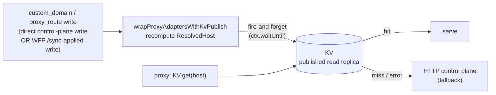
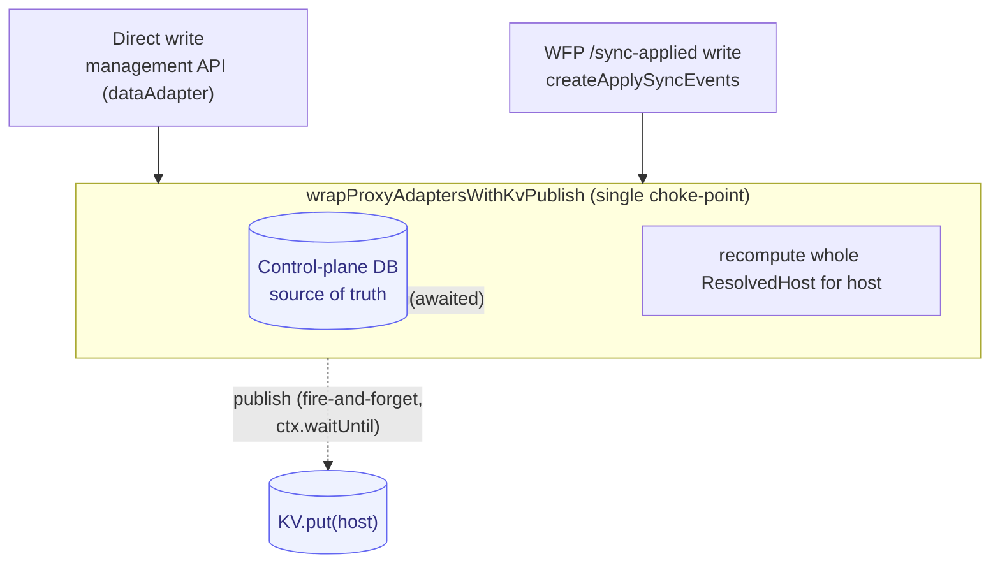

# Deployment topologies

Two architectural decisions: where the proxy lives, and how it learns about routes.

## Shape 1 — All-in-one

Run the proxy data plane in the same Worker as AuthHero by composing them in a single Hono app. Convenient for local dev or single-customer deploys.

## Shape 2 — Split, shared database (recommended for most production deployments)

```typescript
// AuthHero Worker (your existing deploy)
import { init } from "authhero";
import createAdapters from "@authhero/kysely-adapter";

export default init({
  dataAdapter: createAdapters(db),
});
// → /api/v2/proxy-routes is served here
```

```typescript
// Proxy Worker (separate deploy, may live on a different Cloudflare account)
import { createProxyApp } from "@authhero/proxy";
import { createProxyDataAdapter } from "@authhero/kysely-adapter";

export default {
  fetch(req, env, ctx) {
    const data = createProxyDataAdapter(makeDb(env.DATABASE_URL));
    return createProxyApp({ data }).fetch(req, env, ctx);
  },
};
// → handles customer traffic on /*
```

Both Workers point at the same database. The proxy needs read access to `custom_domains` and `proxy_routes`; CRUD writes happen through the AuthHero Worker.

## Shape 3 — Split, separate databases (control-plane HTTP fetch)

When the proxy Worker **cannot** share a database with AuthHero — e.g. the proxy lives in a different Cloudflare account or VPC — fetch routing data over HTTP instead.

### Proxy side: `createHttpProxyAdapter`

```typescript
import { createProxyApp, createHttpProxyAdapter } from "@authhero/proxy";

interface Env {
  CONTROL_PLANE_URL: string;     // e.g. "https://controlplane.example.com"
  CONTROL_PLANE_CLIENT_ID: string;
  CONTROL_PLANE_CLIENT_SECRET: string;
}

export default {
  fetch(req: Request, env: Env, ctx: ExecutionContext) {
    const data = createHttpProxyAdapter({
      baseUrl: env.CONTROL_PLANE_URL,
      clientId: env.CONTROL_PLANE_CLIENT_ID,
      clientSecret: env.CONTROL_PLANE_CLIENT_SECRET,
      // Optional. Defaults to `${baseUrl}/api/v2/`.
      // audience: `${env.CONTROL_PLANE_URL}/api/v2/`,
      // Optional. Defaults to "/api/v2/proxy/control-plane/hosts/".
      // resolveHostPath: "/api/v2/proxy/control-plane/hosts/",
      timeoutMs: 5000,
    });
    return createProxyApp({ data }).fetch(req, env, ctx);
  },
};
```

The adapter:

- Does a single `client_credentials` grant against `${baseUrl}/oauth/token` and caches the token in-memory.
- Calls `GET ${baseUrl}/api/v2/proxy/control-plane/hosts/:host` on every cache miss, with `Authorization: Bearer <token>`.
- Returns 404 → `null` (so the host cache can record a negative).
- Exposes `proxyRoutes` as read-only — writes throw with a clear message ("mutate via the control-plane management API"). The proxy never needs to write.

The host cache wraps this so each control-plane fetch is amortized across many requests.

### Control-plane side: outbox-driven sync

The control plane needs the `custom_domains` and `proxy_routes` data. AuthHero's outbox replicates mutations from each tenant shard:

1. A tenant-shard write to `custom_domains` or `proxy_routes` enqueues a `controlplane.sync.{entity}.{op}` event.
2. `ControlPlaneSyncDestination` POSTs each event to `${baseUrl}/api/v2/proxy/control-plane/sync` with an idempotency key.
3. The control plane applies the event via `createApplySyncEvents`. The proxy data plane reads from the control plane's database.

**Tenant shard** (each AuthHero deploy customers hit):

```typescript
import { init, ControlPlaneSyncDestination } from "authhero";

export default init({
  dataAdapter,
  outbox: { enabled: true },
  controlPlaneSync: {
    baseUrl: "https://controlplane.example.com",
    // timeoutMs defaults to 10_000
  },
});
```

**Control plane** (a separate AuthHero instance fronting the proxy's database):

```typescript
import { init, createApplySyncEvents } from "authhero";
import createAdapters from "@authhero/kysely-adapter";

const proxyAdapters = createAdapters(proxyDb);

export default init({
  dataAdapter: proxyAdapters,
  proxyControlPlane: {
    resolveHost: (host) => proxyAdapters.customDomains.resolveHost?.(host) ?? null,
    authenticate: (req) => verifyControlPlaneBearer(req),
    applySyncEvents: createApplySyncEvents({
      customDomains: proxyAdapters.customDomains,
      proxyRoutes: proxyAdapters.proxyRoutes,
    }),
  },
});
```

The receiver is idempotent by construction — it handles duplicate `created` (falls back to `update`), `updated` for a row that doesn't exist locally (falls back to `create`), and `deleted` for a row that's already gone (no-op).

`controlplane.sync.*` events are filtered out by `LogsDestination` and `LogStreamDestination`, so replication traffic does not pollute audit logs.

For the receiver-side config wiring and idempotency semantics in full, see [Control Plane → Proxy entity sync](/customization/multi-tenancy/control-plane#proxy-entity-sync).

## Shape 3b — Split DB, KV-published read replica (recommended over plain Shape 3)

Shape 3 reads routing over HTTP on every cache miss. That path is a **two-hop,
authenticated call** — an OAuth `client_credentials` token fetch followed by the
resolve fetch — which can be slow on cold/edge-cache fall-through and has failed
intermittently in production.

Shape 3b removes that hop from the hot path. The control plane **publishes** each
resolved host blob to a Cloudflare **KV** namespace whenever a `custom_domain` or
`proxy_route` changes; the proxy **reads** that blob with a single,
unauthenticated, edge-local `KV.get`. The control-plane DB stays the source of
truth — KV is a published read replica.



Three steps: **publish**, **seed**, then **use**. Keep the Shape 3 HTTP adapter
as a fallback during migration and drop it once the backfill is verified.

### Step 1 — Publish (control plane)

Wrap the control plane's `customDomains` + `proxyRoutes` adapters with
`wrapProxyAdaptersWithKvPublish`. On any write it recomputes the **whole**
`ResolvedHost` for the affected host and publishes it to KV via `ctx.waitUntil`,
so a slow or failed `KV.put` never adds latency to — or fails — the write.

Wrapping at the adapter layer makes it the **single choke-point**: pass the
wrapped pair to **both** the management API (`dataAdapter`, which serves direct
control-plane writes) **and** `createApplySyncEvents` (which applies WFP
`/sync`-replicated writes). Both paths then publish to KV.



Both write paths land on the same wrapped pair, so neither can update the DB
without also refreshing KV — there is no path that mutates routing data and
skips the publish.

```typescript
import {
  init,
  createApplySyncEvents,
  wrapProxyAdaptersWithKvPublish,
} from "authhero";
import createAdapters, { createProxyDataAdapter } from "@authhero/kysely-adapter";

const proxyAdapters = createAdapters(proxyDb);

// Same resolver the control plane already uses for GET /hosts/:host.
const resolveHost = createProxyDataAdapter(proxyDb).resolveHost;

const { customDomains, proxyRoutes } = wrapProxyAdaptersWithKvPublish({
  customDomains: proxyAdapters.customDomains,
  proxyRoutes: proxyAdapters.proxyRoutes,
  kv: env.PROXY_HOSTS, // the KV namespace binding
  resolveHost,
  // `ctx` is the Worker's ExecutionContext, threaded through (e.g. via
  // AsyncLocalStorage) so the fire-and-forget KV publish survives the response.
  waitUntil: (p) => ctx.waitUntil(p),
  onError: (err, { host, op }) =>
    console.error(`[kv-publish] ${op} ${host}`, err),
  // keyPrefix defaults to "authhero-proxy-host:" — must match the reader
});

export default init({
  // Wrapped adapters → direct management-API writes publish to KV.
  dataAdapter: { ...proxyAdapters, customDomains, proxyRoutes },
  proxyControlPlane: {
    resolveHost,
    // Wrapped adapters → WFP /sync-applied writes publish to KV.
    applySyncEvents: createApplySyncEvents({ customDomains, proxyRoutes }),
  },
});
```

Publishing is fire-and-forget, so a dropped `KV.put` can leave KV momentarily
stale. Two safety nets cover that: the proxy's HTTP fallback self-heals a missed
write on the next request (Step 3), and the periodic reconcile catches silent
drift (Step 2).

Bind the namespace in the control plane's `wrangler.toml` — it **must live in the
same Cloudflare account as the proxy Worker** (KV can't be shared cross-account):

```toml
[[kv_namespaces]]
binding = "PROXY_HOSTS"
id = "<namespace-id>"
```

### Step 2 — Seed (one-time backfill + periodic reconcile)

Existing custom domains aren't in KV until they're next written, so backfill them
once. The same helper doubles as the reconcile primitive you run on a cron to
correct any drift. The adapter interface has no cross-tenant domain list, so you
supply the host list from a direct DB query.

```typescript
import { backfillProxyHostsToKv } from "authhero";

// Your cross-tenant query over the control-plane DB.
const hosts = await proxyDb
  .selectFrom("custom_domains")
  .select("domain")
  .execute()
  .then((rows) => rows.map((r) => r.domain));

const result = await backfillProxyHostsToKv({
  hosts,
  resolveHost,
  kv: env.PROXY_HOSTS,
});
// { published: number; deleted: number; failed: string[] }
console.log("[kv-backfill]", result);
```

Hosts that no longer resolve are **deleted** from KV rather than left stale.
Schedule this on a Cloudflare [Cron Trigger](https://developers.cloudflare.com/workers/configuration/cron-triggers/)
(e.g. hourly) as the reconcile job.

### Step 3 — Use (proxy)

On the proxy, read from KV with `createKvProxyAdapter` and keep the Shape 3 HTTP
adapter as the **miss / error fallback**. Compose them into one upstream, then
layer the normal in-memory + `CacheAdapter` caches on top.

```typescript
import {
  createProxyApp,
  createKvProxyAdapter,
  createHttpProxyAdapter,
  createCacheAdapterHostCache,
  createInMemoryHostCache,
  type ProxyDataAdapter,
  type ResolvedHost,
} from "@authhero/proxy";
import { createCloudflareCache } from "@authhero/cloudflare-adapter";

const kv = createKvProxyAdapter({
  kv: env.PROXY_HOSTS,
  timeoutMs: 1000, // fall through to HTTP if KV is slow
  // keyPrefix must match the publisher's (default "authhero-proxy-host:")
});

const http = createHttpProxyAdapter({
  baseUrl: env.CONTROL_PLANE_URL,
  clientId: env.CONTROL_PLANE_CLIENT_ID,
  clientSecret: env.CONTROL_PLANE_CLIENT_SECRET,
});

// KV first; on a miss (not-yet-seeded host) or error, fall back to HTTP.
const upstream: ProxyDataAdapter = {
  proxyRoutes: kv.proxyRoutes, // read-only stub; the data plane never writes
  async resolveHost(host: string): Promise<ResolvedHost | null> {
    try {
      const fromKv = await kv.resolveHost(host);
      if (fromKv) return fromKv;
    } catch {
      // KV unavailable/slow — fall through to the control plane.
    }
    return http.resolveHost(host);
  },
};

const resolver = createCacheAdapterHostCache({
  upstream: createInMemoryHostCache(upstream, {
    freshTtlMs: 60_000,
    staleTtlMs: 5 * 60_000,
  }),
  cache: createCloudflareCache({ cacheName: "authhero-proxy-hosts" }),
  freshTtlMs: 60 * 60_000,
  staleTtlMs: 23 * 60 * 60_000,
  staleIfErrorTtlMs: 24 * 60 * 60_000,
  negativeTtlMs: 60_000, // short, so a freshly-seeded host appears quickly
  waitUntil: (p) => ctx.waitUntil(p),
});

createProxyApp({ data: upstream, resolver });
```

Once the backfill is verified and KV is in steady-state sync, you can drop the
HTTP fallback entirely (resolve straight from `kv`) and retire the
`CONTROL_PLANE_*` secrets on the proxy.

### Constraints & notes

- **Same Cloudflare account** for the KV namespace and the proxy Worker — KV is
  not shareable across accounts.
- **Eventual consistency:** KV writes propagate globally within ~60s. That's
  tighter than the long stale-revalidate window Shape 3 relied on, and acceptable
  here.
- **Negative results:** a `KV.get` returning `null` means *not found* — caching it
  under a short `negativeTtlMs` lets a newly-seeded host become reachable quickly.
  The HTTP fallback covers hosts not yet backfilled during migration.

## Shape 4 — WFP dispatcher

This is the "proxy as dispatch worker" shape. See [Cloudflare Workers for Platforms](/deployment/cloudflare-wfp) for the full deploy guide. The proxy fronts a dispatch namespace and routes each request into the matching tenant's Worker. The data adapter is typically the same one AuthHero uses, but with a synthetic default route layered on (see [Quick start → WFP dispatcher](/customization/proxy/#wfp-dispatcher-workers-for-platforms)).

## Shape 5 — Proxy-at-edge in front of a legacy control plane

Use this when you already run a single "control-plane" AuthHero Worker that owns a
wildcard auth zone (e.g. `*.token.example.com/*` → one Worker backed by a shared
PlanetScale/MySQL database), and you want to migrate tenants onto their own
per-tenant Workers **one at a time** without a big-bang cutover.

The proxy takes over the wildcard route and does two things:

- **Dispatches** hosts that have been migrated (a `custom_domains` + `proxy_routes`
  row, or a KV blob) to the tenant's own Worker via the dispatch namespace.
- **Default-forwards** everything else — legacy tenants still on the shared DB,
  JWKS, M2M `POST /api/v2/*` — to the legacy control-plane Worker, unchanged.

The default-forward is the router's fail-open `defaultHandlers` chain (see
[router.ts](https://github.com/markusahlstrand/authhero/blob/main/packages/proxy/src/data-plane/router.ts)):
an unresolved host, a resolve timeout, or a resolve error all fall through to the
same catch-all instead of returning 404/502. Point that catch-all at the legacy
control plane over a **service binding** so the hop never touches the public edge:

```typescript
import { createProxyApp } from "@authhero/proxy";

export default {
  fetch(req: Request, env: Env, ctx: ExecutionContext) {
    return createProxyApp({
      data,                                   // KV or shared-DB adapter (Shape 2/3b)
      bindings: { AUTH2: env.AUTH2 },         // service binding → legacy control plane
      // Unmatched host / resolve failure → forward to the legacy Worker verbatim.
      defaultHandlers: [
        { type: "forwarded_headers" },
        { type: "service_binding", options: { binding: "AUTH2", preserve_host: true } },
      ],
    }).fetch(req, env, ctx);
  },
};
```

`preserve_host: true` is required so the legacy Worker still resolves the tenant
from the original `Host` (its subdomain-/custom-domain-based tenant resolution and
`iss` claim depend on it). Verify this end-to-end for `POST /api/v2/*` with auth
headers before cutover — a dropped Host silently reroutes the write to the wrong
tenant.

### The self-loop foot-gun (fix this first)

If the proxy's control-plane resolution (`createHttpProxyAdapter`) targets a
hostname **on the wildcard the proxy now owns** — e.g. `CONTROL_PLANE_URL` is
`https://controlplane.token.example.com` while the proxy serves
`*.token.example.com/*` — then the proxy's own `/oauth/token` and `resolveHost`
calls loop back into the proxy. That is a self-DoS, and it triggers the moment you
move the route.

Two fixes, use at least one:

1. **Point `CONTROL_PLANE_URL` off the wildcard** — e.g. `https://auth2.example.com`.
2. **Resolve over a service binding** with `createServiceBindingFetch`, so the
   control-plane calls never traverse the public edge regardless of `baseUrl`:

```typescript
import { createHttpProxyAdapter, createServiceBindingFetch } from "@authhero/proxy";

const data = createHttpProxyAdapter({
  baseUrl: env.CONTROL_PLANE_URL,           // may even stay on the wildcard
  clientId: env.CONTROL_PLANE_CLIENT_ID,
  clientSecret: env.CONTROL_PLANE_CLIENT_SECRET,
  fetch: createServiceBindingFetch(env.AUTH2),
});
```

The binding routes straight to the control-plane Worker, so the loop cannot form.
Do this **before** moving the route.

### Phased cutover runbook

The route move and the per-tenant database migration are decoupled — Phase 1
changes only topology, Phase 2 migrates tenants incrementally. Both are reversible.

**Phase 0 — prepare (no traffic change)**

- [ ] Deploy the proxy Worker with the `AUTH2` service binding to the legacy
      control plane, the dispatch-namespace binding, and the loop-fix above.
- [ ] Confirm the default-forward chain is active (`defaultHandlers` → `AUTH2`).
- [ ] Smoke-test the proxy on a spare hostname: legacy host forwards (200), JWKS
      returns the expected keys, `POST /api/v2/users` preserves Host + tenant.

**Phase 1 — edge cutover (behaviorally transparent)**

- [ ] Move the wildcard route (`*.token.example.dev/*` first, then `.com`) from
      the legacy Worker to the proxy Worker. All tenants stay on the shared DB.
- [ ] Every request now default-forwards to the legacy control plane over `AUTH2`
      — one extra SWR-cached hop, no behavior change. Only topology moved.
- [ ] **Rollback:** move the route back to the legacy Worker. Instant, total.
- [ ] Verify in dev first — this both validates the topology and fixes the
      "`403 Client not found` on a WFP host" symptom for any already-migrated tenant.

**Phase 2 — per-tenant database migration (incremental)**

For each tenant, in isolation:

- [ ] Provision the tenant's per-tenant Worker + database (its client/connection
      data now lives in the tenant DB, not the shared control-plane DB).
- [ ] Add the routing row: a `custom_domains` + `proxy_routes` entry (or a KV blob,
      Shape 3b) mapping `<tenant>.token.example.com` → `tenant-{id}-auth`.
- [ ] The proxy now dispatches that host to the tenant Worker; all other hosts keep
      default-forwarding to the legacy control plane.
- [ ] **Rollback:** delete the routing row → the host falls back through
      `defaultHandlers` to the legacy control plane again.

### Verify before prod

- **Host preservation** through the service binding for `POST /api/v2/*` with auth
  headers — replay a real M2M call in dev, confirm the correct tenant/issuer.
- **JWKS** resolves for both a forwarded legacy host and (Phase 2) a WFP host
  served by the tenant Worker with projected shared signing keys.
- **Loop fix live** before the route move — confirm control-plane resolution never
  re-enters the wildcard (it should traverse the binding, not the public edge).

## Database setup

The `proxy_routes` table is part of the standard AuthHero schema and is created by the regular adapter migrations (`migrateToLatest` for `@authhero/kysely-adapter`, the equivalent step for `@authhero/drizzle` and `@authhero/aws`). The proxy reads from the existing `custom_domains` table that AuthHero already manages — so when you share a database with AuthHero, no extra setup is needed at all.

For Shape 3 (split databases), the control-plane instance owns the schema. Run migrations there; the proxy never talks to a database directly.

## Deployment

You own the Worker entry, `wrangler.toml`, and secrets — `@authhero/proxy` is a library. The CNAME target customers point to should be stable (Sesamy uses `*.sesamy-dns.com`, mirroring Vercel's `*.vercel-dns.com` convention).

A minimal `wrangler.toml` for a shared-DB proxy:

```toml
name = "my-proxy"
main = "src/index.ts"
compatibility_date = "2026-05-26"
compatibility_flags = ["nodejs_compat"]

[observability]
enabled = true
```

For a WFP dispatcher, add the dispatch namespace binding and the platform D1 — see [Cloudflare Workers for Platforms → Step 1](/deployment/cloudflare-wfp#step-1-set-up-the-dispatcher).

Secrets (shared-DB shape):

- `DATABASE_URL` — PlanetScale (or other Kysely-supported) connection string

Secrets (HTTP control-plane shape):

- `CONTROL_PLANE_URL`
- `CONTROL_PLANE_CLIENT_ID`
- `CONTROL_PLANE_CLIENT_SECRET`

All cache tuning happens in code via the `cache` option on `createProxyApp` (see [Host caching](/customization/proxy/caching)).

For a runnable reference deployment, see [`apps/proxy-dev`](https://github.com/markusahlstrand/authhero/tree/main/apps/proxy-dev) in the monorepo. It shows the canonical Cloudflare Workers setup, including threading `ExecutionContext.waitUntil` through `AsyncLocalStorage` so background SWR refreshes survive the response.

