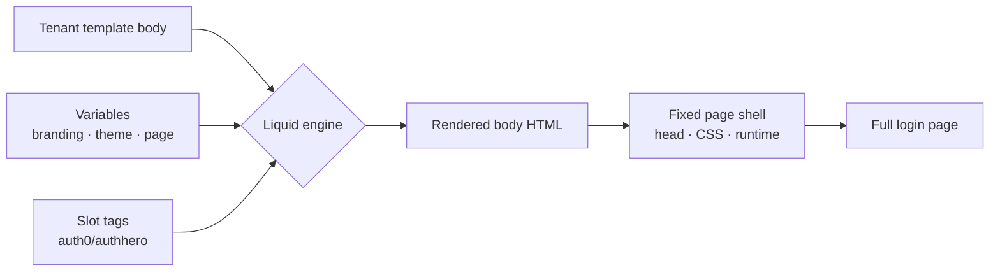

# Universal Login Page Templates

The Universal Login **page template** controls the chrome _around_ the login widget — the logo, the dark-mode toggle, the language picker, the "powered by" badge, the terms/privacy links, and any custom content you place above or below the card.

It is rendered with **Liquid** (the same engine as [Email Templates](/features/email-templates)), so a template can use variables, conditionals, and a small set of AuthHero **slot tags** that expand to ready-made, fully-styled components.

::: tip The mental model in one sentence
You don't author a whole HTML page — you compose a **body** out of slots and your own markup, and AuthHero wraps it in a fixed, accessible page shell.
:::

## What you control, and what you don't

AuthHero splits the page into two layers:

```text
┌─ Page shell — owned by AuthHero (fixed) ───────────────────┐
│  <!doctype html> · <head> · favicon · fonts · page CSS     │
│  background tint · dark-mode runtime · responsive layout   │
│                                                            │
│   ┌─ Body — owned by your template (Liquid) ───────────┐   │
│   │          │
│   │                                                    │   │
│   │              ┌────────────────────┐                │   │
│   │              │  │  ← required   │   │
│   │              └────────────────────┘                │   │
│   │                                                    │   │
│   │      │
│   └────────────────────────────────────────────────────┘  │
└────────────────────────────────────────────────────────────┘
```

- **The shell is fixed.** You never write `<head>`, the dark-mode runtime, the background CSS, or the responsive rules. That keeps every tenant's login accessible, secure, and consistent across upgrades — and keeps you out of CSS-and-JS authoring you'd otherwise have to maintain.
- **The body is yours.** You decide which slots render, where they go, and what custom markup sits around them.

## Why this design

The goal is a **gentle slope** from "tweak the defaults" to "fully custom", with no cliff in between:

- **Adjust the default design.** Start from the default template and rearrange or restyle the built-in components.
- **Add ready-made components.** Drop in a dark-mode toggle or a language picker as a single tag — they come pre-built, themed, and wired up (the toggle persists a cookie; the picker re-renders the page in the chosen locale). You don't reimplement them.
- **Remove what you don't want.** Delete a slot tag and that component is gone. No flag, no config — absence _is_ the configuration.
- **Go full custom.** Because the body is plain Liquid + HTML, you can ignore every slot except the required widget and build whatever you like around it.

## How this differs from Auth0

Auth0's [page template](https://auth0.com/docs/customize/login-pages/universal-login/customize-templates) is a **single Liquid layout that you own end-to-end**: you write the `<html>`/`<head>`/`<body>`, your own CSS, and drop in two magic tags — `` and ``. Powerful, but you're now responsible for the whole document, and a dark-mode toggle or language switcher is something you build and maintain yourself.

AuthHero keeps the document shell and gives you **composable, pre-built slot components** instead:

|                             | Auth0                                    | AuthHero                                                                                     |
| --------------------------- | ---------------------------------------- | -------------------------------------------------------------------------------------------- |
| What you author             | The whole page (`<html>`, `<head>`, CSS) | Just the **body**                                                                            |
| Magic tags                  | `auth0:head`, `auth0:widget`             | `auth0:widget` (required) + `authhero:*` component slots; `auth0:head` in full-document mode |
| Dark mode / language picker | Build it yourself                        | `` / ``                     |
| Page CSS / runtime          | Yours to maintain                        | Managed by the shell                                                                         |
| Removing a component        | Edit your own markup                     | Delete the slot tag                                                                          |
| Bad template                | Can break the page                       | Validated on save; falls back to a working page at render                                    |

The `` tag is intentionally identical to Auth0's, so the muscle memory carries over. The `authhero:*` namespace is the additive part: batteries-included components you opt into.

### Auth0-style full-document templates

For migration, AuthHero also accepts a **full HTML document** — the Auth0 page-template shape — as an escape hatch. If your stored template contains an `<html>` element, AuthHero renders it as the entire page instead of wrapping it in the shell, and the `` tag expands to the functional head essentials (page CSS, fonts, favicon, the widget script, and the dark-mode runtime):

```html
<!DOCTYPE html>
<html>
  <head>
    
    <link rel="stylesheet" href="https://example.com/my-brand.css" />
  </head>
  <body>
    
  </body>
</html>
```

This means an existing Auth0 template can be pasted in and work. The trade-off mirrors Auth0: in full-document mode **you own the layout and CSS**, so the curated chip chrome and page-level dark/light theming aren't applied for you — `auth0:head` provides only what the widget needs to run. The `authhero:*` chip slots still work if you want to drop them in.

::: tip Which mode am I in?
A template containing `<html>` is rendered as a **full document**. Anything else is a **body fragment** wrapped in the fixed shell (the recommended path). Most tenants should stay with fragments — reach for a full document only when migrating an Auth0 template or when you truly need to own the whole page.
:::

## The render pipeline



Slot tags are real Liquid tags, so they can live inside `` blocks and loops, and they sit alongside ordinary variable output (the `branding.logo_url` style references shown below).

## Slots

| Slot tag                            | Position     | Renders when                                                                |
| ----------------------------------- | ------------ | --------------------------------------------------------------------------- |
| ``              | center       | **required** — the login widget mount                                       |
| ``                | `<head>`     | full-document templates only — injects the head essentials (see below)      |
| ``             | top-left     | logo placement is set to `chip` (otherwise the logo sits inside the widget) |
| ``         | top-right    | always — wraps the dark-mode toggle **and** language picker                 |
| `` | —            | always — just the toggle                                                    |
| ``  | —            | two or more languages are available                                         |
| ``       | bottom-left  | a "powered by" logo is configured                                           |
| ``            | bottom-right | a terms & conditions URL is configured                                      |

A slot whose condition isn't met renders nothing — so you can list every slot in your template and they'll appear only when relevant. An **unknown** slot (a typo like `authhero:lego`) also renders empty rather than erroring.

## The default template

This is what's served when a tenant hasn't uploaded a custom template — copy it as your starting point:

```liquid
<div class="ah-widget-stack">
  <div class="ah-above-widget" data-ah-slot="above-widget"></div>
  
  <div class="ah-below-widget" data-ah-slot="below-widget"></div>
</div>




```

## Examples

### Remove a component

Don't want the language picker, but want to keep the dark-mode toggle? Replace the bundled `settings` slot (which contains both) with just the toggle, and drop the legal slot:

```liquid



```

Want the absolute minimum — just the widget, nothing else? That's a valid template:

```liquid

```

### Content above and below the widget

The widget sits in an optional `.ah-widget-stack` that centers a column and shares the widget's width. Drop your own markup into the `.ah-above-widget` / `.ah-below-widget` regions — empty regions collapse, so they only take space when used:

```liquid
<div class="ah-widget-stack">
  <div class="ah-above-widget">
    <h1>Welcome to {{ client.name }}</h1>
  </div>

  

  <div class="ah-below-widget">
    Need help? <a href="https://support.example.com">Contact support</a>
  </div>
</div>

```

### Pills vs. plain links

By default the corner chips render as translucent **pills** when there's a background image, and as **plain text** on a solid background. Override per slot with a `style` argument:

```liquid

      {# always plain text #}
   {# always a pill #}
```

`style` accepts `auto` (default), `plain`, or `pill`, and works on `logo`, `settings`, `powered-by`, and `legal`.

### Branch on page context

Slot tags are real Liquid, so you can branch — for example, only show a heading when there's no background image competing with it:

```liquid
<div class="ah-widget-stack">
  
    <div class="ah-above-widget"><h1>Sign in</h1></div>
  
  
</div>


```

### Full custom

Because the body is just Liquid + HTML, you can ignore the helper classes entirely and lay things out yourself. Only `` is required:

```liquid
<header class="my-banner">
  
</header>

<main class="my-layout">
  
</main>


```

## Variables

These are available in the Liquid scope:

```liquid
{{ branding.logo_url }}          {{ branding.colors.primary }}
{{ theme.page_background.background_image_url }}
{{ client.name }}                <!-- the application name -->
{{ prompt.screen.name }}         <!-- current screen, e.g. "login-id" -->
{{ locale }}                     <!-- active language code -->

{{ page.has_background_image }}  <!-- true / false -->
{{ page.dark_mode }}             <!-- "auto" | "light" | "dark" -->
{{ page.logo_position }}         <!-- "widget" | "chip" | "none" -->
{{ page.layout }}                <!-- "center" | "left" | "right" -->
```

`branding` and `theme` are the tenant's full Branding and Theme objects, so anything stored there is reachable.

## Validation & safety

Saving a template (`PUT`) is validated:

- It **must** mount the widget — any spelling of the tag works (``, ``).
- It **must** be syntactically valid Liquid. An unclosed `` is rejected with `400`.

At render time, if a stored template somehow fails (e.g. a variable edge case), AuthHero falls back to the **default template**, and finally to the **bare widget** — the login page can never be taken down by a template.

## Management API

```http
GET    /api/v2/branding/templates/universal-login
PUT    /api/v2/branding/templates/universal-login
DELETE /api/v2/branding/templates/universal-login
POST   /api/v2/branding/templates/universal-login/preview
```

- `GET` returns the stored template, or the AuthHero default when none is set.
- `PUT` stores a template (`{ "body": "…" }`), subject to the validation above.
- `DELETE` reverts to the default.
- `POST …/preview` renders a **full-page** preview HTML for a sample screen. It accepts optional `body`, `branding`, and `theme` overrides so an editor can preview unsaved edits:

```json
{
  "screen": "login",
  "body": ""
}
```

## Admin UI

In the admin app, **Branding → Universal Login** has the template editor, the slot/variable reference, and an **Open full preview** button that opens the rendered page (with your unsaved edits) in a new tab. The branding preview pane also has a full-page preview that reflects your live colour/logo edits.

## See Also

- [UI Widget — Customization](/customization/ui-widget/customization) — theming the widget itself via CSS custom properties and parts
- [Universal Login](/architecture/universal-login) — the `/u2/` widget-based login architecture
- [Email Templates](/features/email-templates) — the other Liquid-rendered surface
