```mermaid
erDiagram
    %% Core Tables
    tenants {
        varchar id PK
        varchar name
        varchar audience
        varchar sender_email
        varchar sender_name
        varchar language
        varchar logo
        varchar primary_color
        varchar secondary_color
        varchar support_url
        varchar created_at
        varchar updated_at
    }

    users {
        varchar user_id PK
        varchar tenant_id PK,FK
        varchar email
        varchar given_name
        varchar family_name
        varchar nickname
        varchar name
        varchar picture
        varchar phone_number
        boolean phone_verified
        varchar username
        varchar linked_to FK
        varchar last_ip
        integer login_count
        varchar last_login
        varchar provider
        varchar connection
        boolean email_verified
        boolean is_social
        varchar app_metadata
        varchar user_metadata
        varchar profileData
        varchar locale
        varchar created_at
        varchar updated_at
    }

    applications {
        varchar id PK
        varchar tenant_id FK
        varchar name
        varchar client_secret
        varchar allowed_logout_urls
        varchar authentication_settings
        varchar addons
        varchar callbacks
        varchar allowed_origins
        varchar web_origins
        varchar allowed_clients
        varchar email_validation
        boolean disable_sign_ups
        varchar created_at
        varchar updated_at
    }

    connections {
        varchar id PK
        varchar tenant_id FK
        varchar name
        varchar response_type
        varchar response_mode
        varchar strategy
        varchar options
        varchar created_at
        varchar updated_at
    }

    %% Authentication & Sessions
    sessions {
        varchar id PK
        varchar tenant_id FK
        varchar user_id FK
        varchar login_session_id FK
        varchar device
        varchar clients
        varchar created_at
        varchar updated_at
        varchar expires_at
        varchar idle_expires_at
        varchar authenticated_at
        varchar last_interaction_at
        varchar used_at
        varchar revoked_at
    }

    login_sessions {
        varchar id PK
        varchar tenant_id FK
        varchar session_id FK
        varchar csrf_token
        varchar authParams_client_id
        varchar authorization_url
        varchar ip
        varchar useragent
        varchar auth0Client
        boolean login_completed
        varchar created_at
        varchar updated_at
        varchar expires_at
    }

    refresh_tokens {
        varchar id PK
        varchar client_id FK
        varchar tenant_id FK
        varchar session_id
        varchar user_id FK
        varchar device
        varchar resource_servers
        boolean rotating
        varchar created_at
        varchar expires_at
        varchar idle_expires_at
        varchar last_exchanged_at
    }

    codes {
        varchar code_id PK
        varchar code_type PK
        varchar tenant_id FK
        varchar user_id FK
        varchar login_id
        varchar connection_id
        varchar code_verifier
        varchar code_challenge
        varchar code_challenge_method
        varchar redirect_uri
        varchar nonce
        varchar state
        varchar created_at
        varchar expires_at
        varchar used_at
    }

    passwords {
        varchar user_id PK,FK
        varchar tenant_id PK,FK
        varchar password
        varchar algorithm
        varchar created_at
        varchar updated_at
    }

    %% RBAC (Role-Based Access Control)
    roles {
        varchar id PK
        varchar tenant_id PK,FK
        varchar name
        varchar description
        varchar created_at
        varchar updated_at
    }

    resource_servers {
        varchar id PK
        varchar tenant_id PK,FK
        varchar identifier
        varchar name
        varchar scopes
        varchar signing_alg
        varchar signing_secret
        integer token_lifetime
        integer token_lifetime_for_web
        varchar verification_key
        varchar options
        varchar created_at
        varchar updated_at
    }

    role_permissions {
        varchar tenant_id PK,FK
        varchar role_id PK,FK
        varchar resource_server_identifier PK
        varchar permission_name PK
        varchar created_at
    }

    user_permissions {
        varchar tenant_id PK,FK
        varchar user_id PK,FK
        varchar resource_server_identifier PK
        varchar permission_name PK
        varchar created_at
    }

    user_roles {
        varchar tenant_id PK,FK
        varchar user_id PK,FK
        varchar role_id PK,FK
        varchar created_at
    }

    %% Organizations (Multi-tenant Organizations)
    organizations {
        varchar id PK
        varchar tenant_id FK
        varchar name
        varchar display_name
        text branding
        text metadata
        text enabled_connections
        text token_quota
        varchar created_at
        varchar updated_at
    }

    user_organizations {
        varchar id PK
        varchar tenant_id FK
        varchar user_id FK
        varchar organization_id FK
        varchar created_at
        varchar updated_at
    }

    invites {
        varchar id PK
        varchar tenant_id FK
        varchar organization_id FK
        text inviter
        text invitee
        varchar invitation_url
        varchar ticket_id
        varchar client_id
        varchar connection_id
        text app_metadata
        text user_metadata
        text roles
        integer ttl_sec
        boolean send_invitation_email
        varchar created_at
        varchar expires_at
    }

    %% Customization & Branding
    branding {
        varchar tenant_id PK,FK
        varchar logo_url
        varchar favicon_url
        varchar font_url
        varchar colors_primary
        varchar colors_page_background_type
        varchar colors_page_background_start
        varchar colors_page_background_end
        integer colors_page_background_angle_dev
    }

    %% Configuration & Settings
    prompt_settings {
        varchar tenant_id PK,FK
        varchar universal_login_experience
        boolean identifier_first
        boolean password_first
        boolean webauthn_platform_first_factor
    }

    email_providers {
        varchar tenant_id PK,FK
        varchar name
        boolean enabled
        varchar default_from_address
        varchar credentials
        varchar settings
        varchar created_at
        varchar updated_at
    }

    custom_domains {
        varchar custom_domain_id PK
        varchar tenant_id FK
        varchar domain
        boolean primary
        varchar status
        varchar type
        varchar origin_domain_name
        varchar verification
        varchar custom_client_ip_header
        varchar tls_policy
        varchar domain_metadata
        varchar created_at
        varchar updated_at
    }

    %% Forms & Hooks
    forms {
        varchar id PK
        varchar tenant_id FK
        varchar name
        varchar messages
        varchar languages
        varchar translations
        varchar nodes
        varchar start
        varchar ending
        varchar style
        varchar created_at
        varchar updated_at
    }

    hooks {
        varchar hook_id PK
        varchar tenant_id FK
        varchar trigger_id
        boolean enabled
        boolean synchronous
        integer priority
        text form_id
        varchar url
        varchar created_at
        varchar updated_at
    }

    %% Security & Cryptography
    keys {
        varchar kid PK
        varchar tenant_id FK
        varchar connection FK
        varchar type
        varchar cert
        varchar pkcs7
        varchar fingerprint
        varchar thumbprint
        varchar current_since
        varchar current_until
        varchar created_at
        varchar revoked_at
    }

    %% Audit & Logging
    logs {
        varchar id PK
        varchar tenant_id FK
        varchar user_id
        varchar ip
        varchar type
        varchar date
        varchar client_id
        varchar client_name
        varchar description
        varchar details
        varchar user_name
        varchar auth0_client
        boolean isMobile
        varchar connection
        varchar connection_id
        varchar audience
        varchar scope
        varchar strategy
        varchar strategy_type
        varchar hostname
        varchar session_connection
        varchar user_agent
    }

    %% Legacy/Administrative
    members {
        varchar id PK
        varchar tenant_id FK
        varchar sub
        varchar email
        varchar name
        varchar status
        varchar role
        varchar picture
        varchar created_at
        varchar updated_at
    }

    migrations {
        varchar id PK
        varchar tenant_id FK
        varchar provider
        varchar client_id
        varchar origin
        varchar domain
        varchar created_at
        varchar updated_at
    }

    %% Core Relationships
    tenants ||--o{ users : "has many"
    tenants ||--o{ applications : "has many"
    tenants ||--o{ connections : "has many"
    tenants ||--o{ sessions : "has many"
    tenants ||--o{ login_sessions : "has many"
    tenants ||--o{ refresh_tokens : "has many"
    tenants ||--o{ codes : "has many"
    tenants ||--o{ roles : "has many"
    tenants ||--o{ resource_servers : "has many"
    tenants ||--o{ organizations : "has many"
    tenants ||--|| branding : "has one"
    tenants ||--|| prompt_settings : "has one"
    tenants ||--|| email_providers : "has one"
    tenants ||--o{ custom_domains : "has many"
    tenants ||--o{ forms : "has many"
    tenants ||--o{ hooks : "has many"
    tenants ||--o{ keys : "has many"
    tenants ||--o{ logs : "has many"
    tenants ||--o{ members : "has many"
    tenants ||--o{ migrations : "has many"

    %% User Relationships
    users ||--|| passwords : "has one"
    users ||--o{ sessions : "has many"
    users ||--o{ refresh_tokens : "has many"
    users ||--o{ codes : "has many"
    users ||--o{ user_permissions : "has many"
    users ||--o{ user_roles : "has many"
    users ||--o{ user_organizations : "has many"
    users ||--o{ users : "linked to"

    %% Application Relationships
    applications ||--o{ refresh_tokens : "has many"

    %% Connection Relationships
    connections ||--o{ keys : "has many"

    %% Session Relationships
    sessions ||--|| login_sessions : "belongs to"

    %% RBAC Relationships
    roles ||--o{ role_permissions : "has many"
    roles ||--o{ user_roles : "has many"
    resource_servers ||--o{ role_permissions : "has many"
    resource_servers ||--o{ user_permissions : "has many"

    %% Organization Relationships
    organizations ||--o{ user_organizations : "has many"
    organizations ||--o{ invites : "has many"
    user_organizations }o--|| users : "belongs to"
    user_organizations }o--|| organizations : "belongs to"

    %% Form Relationships
    forms ||--o{ hooks : "used by"
```

# Database Schema

AuthHero uses a comprehensive database schema designed for multi-tenant authentication and authorization. This page documents the complete database structure and relationships.

## Entity Relationship Diagram

  

    <button class="mermaid-btn" onclick="zoomIn()">Zoom In</button>
    <button class="mermaid-btn" onclick="zoomOut()">Zoom Out</button>
    <button class="mermaid-btn" onclick="resetZoom()">Reset</button>
    <button class="mermaid-btn" onclick="toggleFullscreen()">Fullscreen</button>
  

  

  

  

    

      <button class="mermaid-btn" onclick="zoomIn()">Zoom In</button>
      <button class="mermaid-btn" onclick="zoomOut()">Zoom Out</button>
      <button class="mermaid-btn" onclick="resetZoom()">Reset</button>
      <button class="mermaid-btn close-btn" onclick="toggleFullscreen()">Close</button>
    

    

  

## Key Tables and Their Purpose

### Core Multi-Tenant Tables

#### `tenants`

The root table for multi-tenancy. Every other table references this through `tenant_id` to ensure complete data isolation between tenants.

#### `users`

Stores user accounts with comprehensive profile information. Supports:

- Social and password-based authentication
- Account linking (users can link multiple social accounts)
- Detailed profile data and metadata
- Email and phone verification status

#### `applications`

OAuth/OIDC client applications that can authenticate users. Each application has:

- Client secrets for confidential clients
- Allowed redirect URIs and origins
- OAuth flow configuration
- Custom addons and settings

#### `connections`

Identity providers (social logins, enterprise connections, etc.) that users can authenticate through:

- Strategy-based configuration (Google, Facebook, SAML, etc.)
- Custom options for each provider
- Response type and mode settings

### Authentication Flow Tables

#### `login_sessions`

Tracks the authentication flow from start to completion:

- CSRF protection tokens
- OAuth parameters (client_id, scope, redirect_uri, etc.)
- Authorization URL construction
- Login completion status

#### `sessions`

Active user sessions after successful authentication:

- Session expiration and idle timeout
- Device and client information
- Session lifecycle tracking

#### `refresh_tokens`

Enables token renewal without re-authentication:

- Rotating refresh token support
- Resource server scoping
- Device binding

#### `codes`

Temporary authorization codes for OAuth flows:

- Multiple code types (authorization, password reset, etc.)
- PKCE support (code challenge/verifier)
- Expiration and usage tracking

#### `passwords`

Secure password storage:

- Algorithm specification for password hashing
- Linked to users via composite foreign key

### Role-Based Access Control (RBAC)

#### `roles`

User roles within a tenant:

- Role names and descriptions
- Tenant-scoped roles

#### `resource_servers`

APIs that can be accessed through AuthHero:

- JWT signing configuration
- Token lifetime settings
- Scope definitions
- Verification keys

#### `role_permissions`

Links roles to specific permissions on resource servers:

- Composite primary key (tenant_id, role_id, resource_server_identifier, permission_name)
- Enables fine-grained access control

#### `user_permissions`

Direct user permissions (bypass roles):

- Same structure as role permissions
- Allows for user-specific access grants

#### `user_roles`

Assigns roles to users:

- Many-to-many relationship between users and roles
- Tenant-scoped assignments

### Organizations (Sub-Tenancy)

#### `organizations`

Enables hierarchical multi-tenancy within a tenant:

- Organization branding and metadata
- Enabled connections per organization
- Token quotas and limits

#### `user_organizations`

Maps users to organizations (many-to-many relationship):

- Allows users to belong to multiple organizations
- Tracks organization membership per tenant

#### `invites`

Manages organization invitations for user onboarding:

- Pre-configured user attributes (roles, metadata)
- Invitation tracking with inviter/invitee information
- Expiration management (default 7 days, max 30 days)
- Connection specification for authentication
- Unique invitation URLs with tickets
- Optional email delivery

### Customization and Branding

#### `branding`

Simple branding configuration per tenant:

- Logo and favicon URLs
- Primary colors and page backgrounds
- Font customization

#### `themes`

Comprehensive UI theming (more detailed than branding):

- Complete color palette customization
- Typography settings
- Border and layout configurations
- Widget positioning and styling

#### `custom_domains`

White-label domain support:

- Domain verification and status
- TLS policy configuration
- Custom client IP headers

### Configuration and Settings

#### `prompt_settings`

Controls the login flow behavior:

- Universal login experience settings
- Username-first vs password-first flows
- WebAuthn configuration

#### `email_providers`

Custom email delivery configuration:

- Provider credentials (SendGrid, Mailgun, etc.)
- Email templates and settings
- Per-tenant email customization

### Forms and Extensibility

#### `forms`

Custom forms for various workflows:

- Multi-language support
- Node-based form definition
- Custom styling and branding

#### `hooks`

Webhooks for extending AuthHero functionality:

- Trigger-based execution
- Synchronous and asynchronous hooks
- Form integration
- Priority-based ordering

### Security and Cryptography

#### `keys`

Cryptographic keys for JWT signing and other security operations:

- Key rotation support
- Connection-specific keys
- Certificate and fingerprint storage
- Revocation tracking

### Audit and Logging

#### `logs`

Comprehensive audit trail:

- All authentication events
- User actions and administrative changes
- Detailed context including IP, user agent, etc.
- Performance and security monitoring

### Administrative Tables

#### `members`

Administrative users who can manage tenants:

- Separate from regular users
- Role-based access to admin functions
- Multi-tenant administration support

#### `migrations`

Tracks data migrations and imports:

- Migration from other auth providers
- Audit trail for data movement
- Client and domain mapping

## Database Design Principles

### Multi-Tenancy

Every table (except `tenants` and system tables) includes a `tenant_id` foreign key, ensuring complete data isolation between tenants.

### Audit Trail

Most tables include `created_at` and `updated_at` timestamps for audit purposes and change tracking.

### Soft Relationships

Many relationships use varchar IDs rather than integer foreign keys, providing flexibility for distributed systems and easier data migration.

### JSON Storage

Complex configuration data is often stored as JSON strings in varchar/text fields, allowing for flexible schema evolution without database migrations.

### Composite Keys

Several tables use composite primary keys (typically including `tenant_id`) to enforce tenant isolation at the database level.

This schema supports AuthHero's core mission of providing a flexible, secure, and scalable multi-tenant authentication system while maintaining compatibility with Auth0 APIs.
