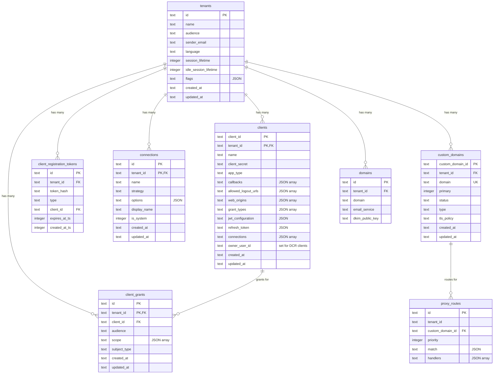
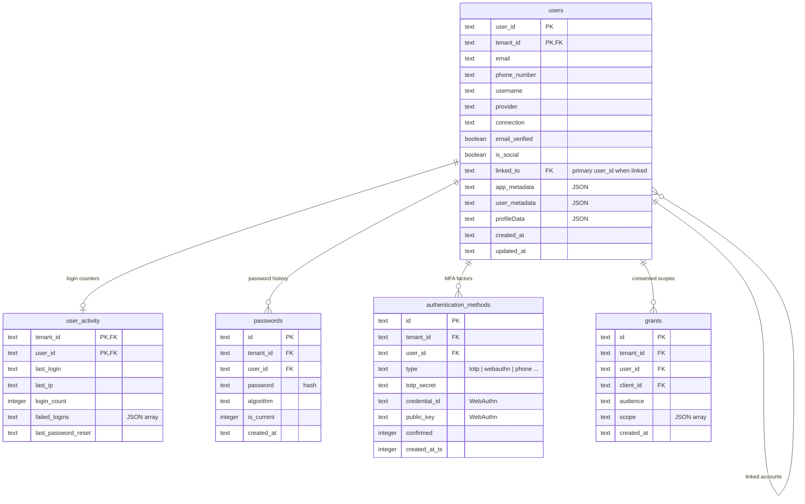
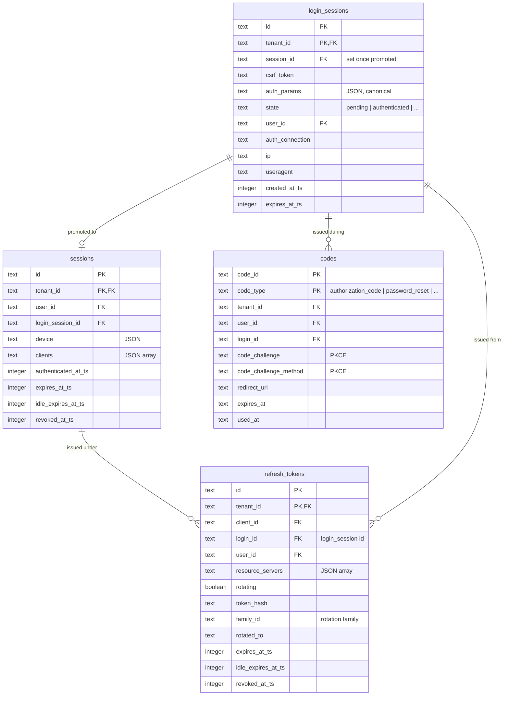
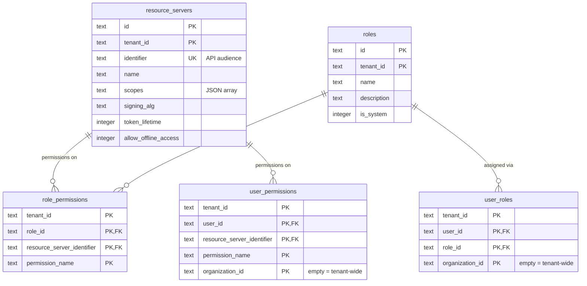
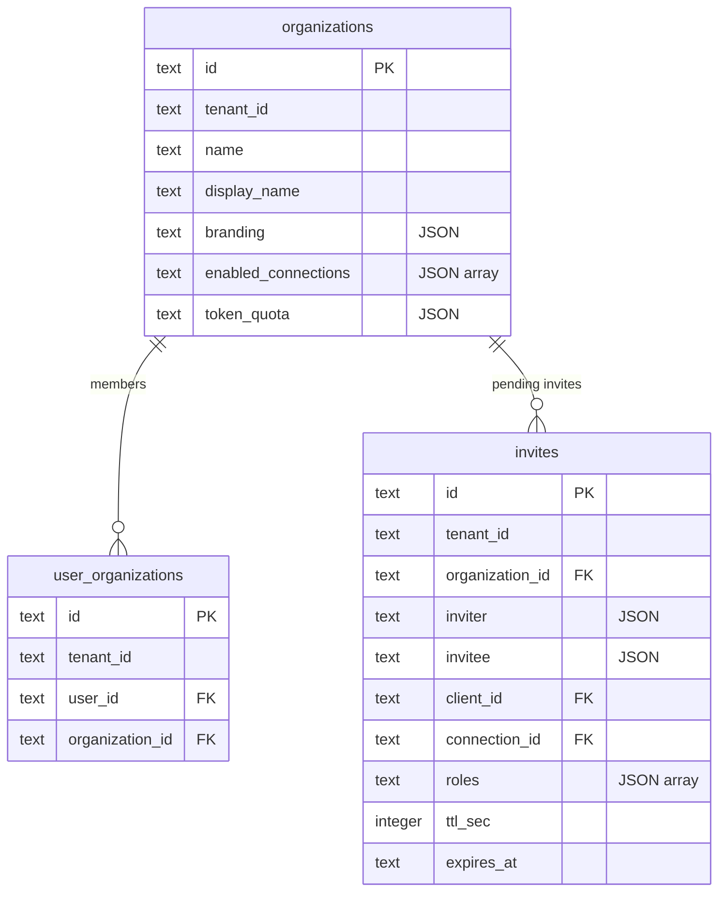
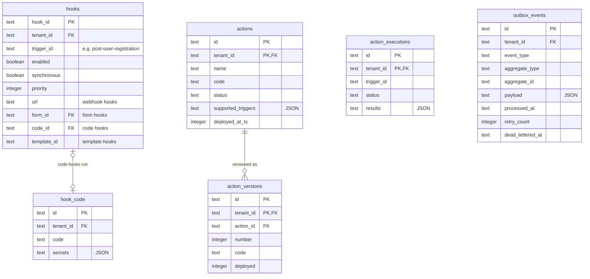
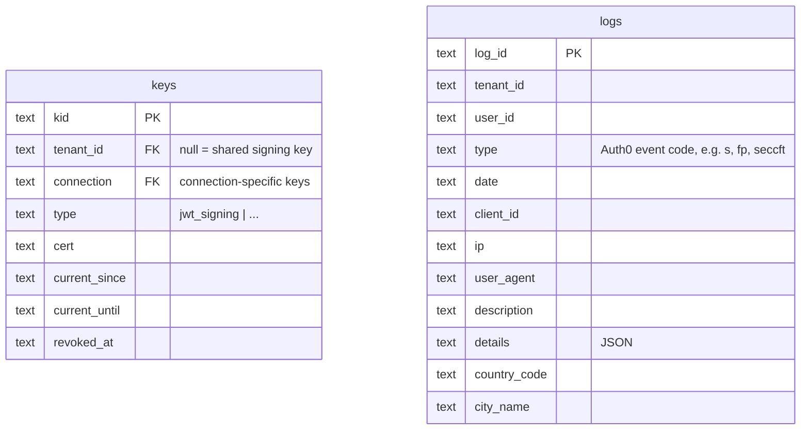

# Database Schema

AuthHero uses a multi-tenant database schema where almost every table is scoped by `tenant_id`. This page documents the schema as defined by the primary [Drizzle adapter](/customization/drizzle/) — the authoritative source is [`packages/drizzle/src/schema/sqlite/`](https://github.com/markusahlstrand/authhero/tree/main/packages/drizzle/src/schema/sqlite). The Kysely adapter implements the same logical model.

Rather than one giant diagram, the schema is presented one domain at a time. Wide tables (`tenants`, `clients`, `themes`, `logs`) show their identity and relationship columns plus the most important attributes; settings-style columns are elided for readability — see the schema source for the full column lists.

## Tenants, Clients, and Domains

The `tenants` table is the root of the hierarchy. Clients (OAuth/OIDC applications, called `applications` in older versions) and custom domains hang directly off it.

- **`tenants`** — the root table for multi-tenancy. Alongside branding and session-lifetime settings it also carries provisioning metadata (`deployment_type`, `provisioning_state`, `worker_version`, `d1_database_id`, …) used by the [tenant lifecycle operations](#control-plane-tables) machinery.
- **`clients`** — OAuth/OIDC client applications, mirroring the Auth0 client shape. Most complex configuration (JWT settings, refresh-token policy, addons, native social login) is stored as JSON text columns. `owner_user_id` and `registration_type` support Dynamic Client Registration.
- **`client_grants`** — client-credentials grants: which client may get machine-to-machine tokens for which API (`audience`) with which scopes.
- **`client_registration_tokens`** — hashed initial-access / registration-access tokens for Dynamic Client Registration.
- **`connections`** — identity providers (email, SMS, social, SAML, OIDC, …) configured per tenant; provider specifics live in the JSON `options` column.
- **`custom_domains`** — white-label domains with verification status and TLS policy. **`proxy_routes`** attach path-based routing rules (used by `@authhero/proxy`) to a custom domain.
- **`domains`** — legacy per-tenant email/DKIM domain configuration.

## Users and Credentials

- **`users`** — user profiles keyed by `(user_id, tenant_id)`. One identity per row: linked accounts point at their primary profile via `linked_to`. Standard OIDC profile claims (name, locale, address, …) are individual columns; free-form data goes in `app_metadata` / `user_metadata`.
- **`user_activity`** — write-often login counters (`last_login`, `last_ip`, `login_count`, failed-login lockout timestamps) split out of `users` so the profile row isn't rewritten on every login.
- **`passwords`** — password hashes with algorithm tag; multiple rows per user form a history, with `is_current` marking the active one.
- **`authentication_methods`** — enrolled MFA factors: TOTP secrets, WebAuthn credentials (public key, sign count, transports), and phone numbers.
- **`grants`** — per `(user, client, audience)` OAuth consent grants backing the consent screen and the `/grants` management endpoints.

## Authentication Flow and Sessions

The login flow creates a `login_session`, which on success is promoted into a long-lived `session`; refresh tokens and authorization codes reference back to it.

- **`login_sessions`** — one row per authentication attempt. The OAuth authorization parameters live in the JSON `auth_params` column (the legacy hoisted `authParams_*` columns were dropped). `state` tracks the flow (`pending` → `authenticated` / `failed`), and CSRF token, IP, and user agent support flow security.
- **`sessions`** — authenticated browser sessions with absolute and idle expiration, the device fingerprint, and the list of clients that have used the session (single sign-on).
- **`refresh_tokens`** — supports rotating refresh tokens: tokens are stored hashed (`token_hash`), rotation chains share a `family_id`, and `rotated_to` links each token to its successor so reuse of a stale token can revoke the whole family.
- **`codes`** — short-lived one-time codes keyed by `(code_id, code_type)`: authorization codes (with PKCE challenge), email verification, password reset, and similar.

Three older single-purpose stores — `authentication_codes`, `otps`, and `tickets` — still exist for backwards compatibility and hold the same kind of short-lived flow state.

## Roles and Permissions (RBAC)

- **`resource_servers`** — APIs that AuthHero issues access tokens for: audience `identifier`, scope definitions, signing configuration, and token lifetimes.
- **`roles`** / **`role_permissions`** — named roles and the permissions they grant on resource servers.
- **`user_roles`** / **`user_permissions`** — role assignments and direct permission grants per user. Both include `organization_id` in the primary key, so the same user can hold different roles per organization (empty string means tenant-wide).

## Organizations

Organizations provide B2B-style sub-tenancy within a tenant.

- **`organizations`** — per-organization branding, enabled connections, and token quotas.
- **`user_organizations`** — many-to-many membership between users and organizations.
- **`invites`** — organization invitations carrying pre-configured roles and metadata for the invited user.

## Customization and Login Experience

All of these tables are keyed by (or scoped to) `tenant_id` and configure how the hosted login looks and behaves.

| Table | Purpose |
| --- | --- |
| `branding` | Logo, favicon, font, and color settings (one row per tenant). |
| `themes` | Full Universal Login theme: complete color palette, typography, borders, and widget layout. |
| `universal_login_templates` | Custom page template (HTML) wrapping the login widget. |
| `custom_text` | Per-prompt, per-language text overrides, keyed by `(tenant_id, prompt, language)`. |
| `prompt_settings` | Login flow behavior: identifier-first vs. combined, WebAuthn as first factor. |
| `email_providers` | Outbound email provider and credentials (one row per tenant). |
| `email_templates` | Per-template email content (subject, body, syntax), keyed by `(tenant_id, template)`. |
| `forms` | Custom form definitions (Auth0 Forms schema) with nodes, translations, and styling. |
| `flows` | Named action sequences that forms and hooks can trigger. |

## Extensibility: Hooks, Actions, and the Outbox

- **`hooks`** — trigger-based extension points. A hook is one of several types: webhook (`url`), form (`form_id`), custom code (`code_id` → `hook_code`), or template (`template_id`).
- **`actions`** / **`action_versions`** / **`action_executions`** — Auth0-compatible actions with versioned code deployments and per-trigger execution records.
- **`outbox_events`** — transactional outbox for reliably delivering domain events (webhooks, logs) with retries, claim-based workers, and a dead-letter state.

## Keys and Logs

- **`keys`** — signing keys with rotation (`current_since` / `current_until`) and revocation. Keys can be tenant-wide or bound to a specific connection (e.g. SAML certificates).
- **`logs`** — the audit trail, using Auth0's event type codes, enriched with client, connection, and geo-IP context. Log rows are intentionally denormalized and have no foreign keys.

## Control-Plane Tables

Deployments that provision one isolated database per tenant (Workers for Platforms) keep a small control-plane schema in a separate database, defined in [`packages/drizzle/src/schema/control-plane/`](https://github.com/markusahlstrand/authhero/tree/main/packages/drizzle/src/schema/control-plane):

- **`tenant_operations`** / **`tenant_operation_events`** — long-running tenant lifecycle operations (provision, migrate, upgrade) with per-step event history. The database is the source of truth; workflow engines (e.g. Cloudflare Workflows) act as executors.
- **`rollouts`** — staged fleet-wide upgrades with canary tenants and wave sizes.

## Database Design Principles

### Multi-Tenancy

Every tenant-scoped table includes `tenant_id`, usually as part of a composite primary key, enforcing tenant isolation at the database level. Tables with a `references` constraint cascade-delete when the tenant is removed.

### Timestamps

Older tables store ISO-8601 strings in `created_at` / `updated_at`; newer tables use epoch-millisecond integers with a `_ts` suffix (`created_at_ts`). Adapters surface both as ISO strings in the API.

### JSON Storage

Complex or evolving configuration (auth params, client settings, device info, metadata) is stored as JSON in text columns, allowing schema evolution without migrations. The adapter layer parses and validates these against the shared types in `@authhero/adapter-interfaces`.

### Soft Relationships

Many relationships are by-ID without database foreign keys (marked `FK` in the diagrams for clarity). This keeps adapters portable across databases and simplifies data migration; referential integrity is maintained by the application layer.

This schema supports AuthHero's core mission of providing a flexible, secure, and scalable multi-tenant authentication system while maintaining compatibility with Auth0 APIs.
