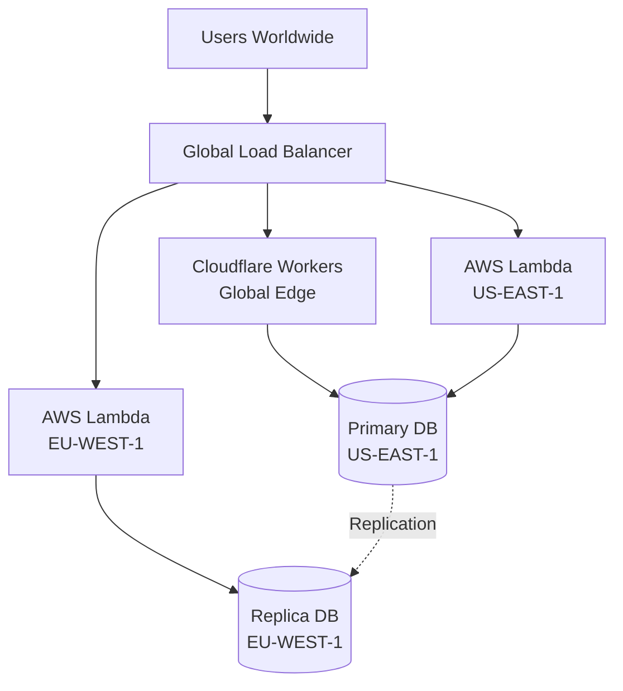
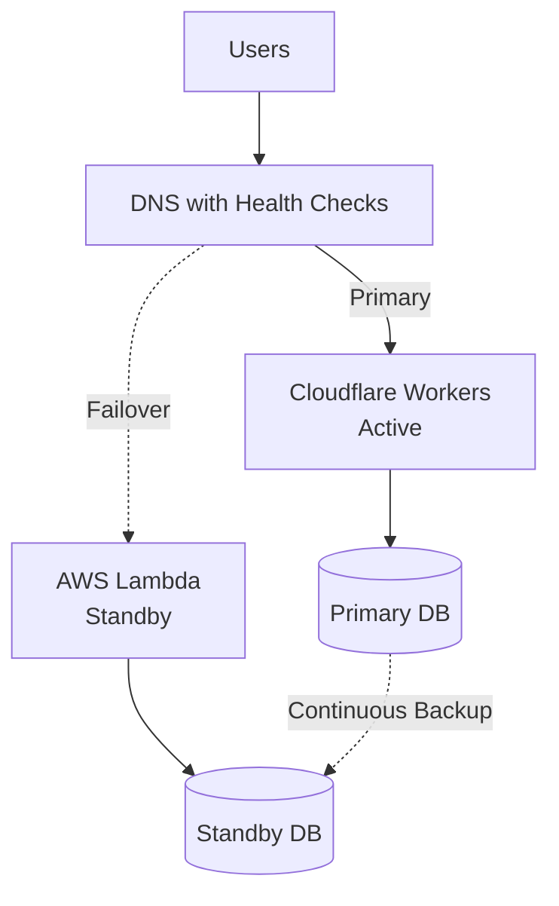

# Multi-Cloud Deployment

Run AuthHero across multiple cloud providers for high availability, geographic distribution, and resilience.

## Why Multi-Cloud?

- **High Availability** - Survive provider outages
- **Geographic Distribution** - Serve users from nearest location
- **Cost Optimization** - Use best pricing for each workload
- **Vendor Independence** - Avoid lock-in

## Architecture Patterns

### Active-Active (Global Distribution)

Deploy to multiple regions/providers simultaneously with traffic distributed globally.



**Use Cases:**
- Global user base
- < 100ms latency requirement
- 24/7 uptime critical

**Setup:**

1. **Deploy to multiple providers**
   ```bash
   # Cloudflare (edge)
   cd cloudflare && wrangler deploy
   
   # AWS US-EAST-1
   cd aws && sam deploy --region us-east-1
   
   # AWS EU-WEST-1
   cd aws && sam deploy --region eu-west-1
   ```

2. **Configure global load balancer**
   - Cloudflare Load Balancer
   - AWS Global Accelerator
   - Route 53 with geo-routing

3. **Set up database replication**
   - Aurora Global Database
   - CockroachDB multi-region
   - PlanetScale global replication

### Active-Passive (Failover)

Primary in one provider, automatic failover to another.



**Use Cases:**
- Cost-sensitive deployments
- Disaster recovery requirement
- Less critical latency needs

**Setup:**

1. **Deploy primary and standby**
   ```typescript
   // Primary: Cloudflare Workers
   export default {
     async fetch(request: Request, env: Env) {
       const { app } = initMultiTenant({
         dataAdapter: createCloudflareD1Adapter(env.AUTH_DB),
       });
       return app.fetch(request);
     }
   };
   ```

   ```typescript
   // Standby: AWS Lambda
   const { app } = initMultiTenant({
     dataAdapter: createAwsAdapter(rdsConfig),
   });
   export const handler = handle(app);
   ```

2. **Configure health checks**
   ```typescript
   // Add health endpoint to both
   app.get("/health", async (c) => {
     try {
       await dataAdapter.tenants.get("health-check");
       return c.json({ status: "ok" });
     } catch {
       return c.json({ status: "error" }, 503);
     }
   });
   ```

3. **Set up DNS failover**
   - Monitor `/health` endpoint
   - Automatic DNS switch on failure
   - 60-second TTL for fast failover

## Database Strategies

### Option 1: Multi-Region Database

Use a database that supports multi-region deployments.

#### CockroachDB

Distributed SQL with geo-partitioning:

```typescript
import { createKyselyAdapter } from "@authhero/kysely";
import { CockroachDialect } from "kysely-cockroach";

const dataAdapter = createKyselyAdapter({
  dialect: new CockroachDialect({
    connectionString: process.env.COCKROACH_URL,
  }),
});
```

**Benefits:**
- Automatic replication
- Geo-partitioning for data locality
- Strong consistency
- Automatic failover

**Setup:**
1. Create CockroachDB cluster
2. Configure regions
3. Set up geo-partitioning rules
4. Deploy AuthHero to each region

#### PlanetScale

Global MySQL with branching:

```typescript
import { createKyselyAdapter } from "@authhero/kysely";
import { MysqlDialect } from "kysely";

const dataAdapter = createKyselyAdapter({
  dialect: new MysqlDialect({
    connection: {
      host: process.env.PLANETSCALE_HOST,
      username: process.env.PLANETSCALE_USERNAME,
      password: process.env.PLANETSCALE_PASSWORD,
    },
  }),
});
```

**Benefits:**
- Global read replicas
- Branch-based workflows
- Automatic backups
- No ops burden

#### Aurora Global Database

Multi-region PostgreSQL:

```typescript
const dataAdapter = createAwsAdapter({
  host: process.env.AURORA_GLOBAL_ENDPOINT,
  database: "authhero",
  // ...
});
```

**Benefits:**
- < 1 second cross-region replication
- Automatic failover
- Up to 5 secondary regions
- Read replicas in each region

### Option 2: Independent Databases

Separate database for each provider with data sync.

```typescript
// Cloudflare: D1 Database
const cloudflareAdapter = createCloudflareD1Adapter(env.AUTH_DB);

// AWS: RDS PostgreSQL
const awsAdapter = createAwsAdapter(rdsConfig);
```

**Sync Strategies:**

1. **Event-driven sync**
   ```typescript
   // On data change, publish event
   await eventBridge.publish({
     type: "user.created",
     data: user,
   });
   
   // Sync service listens and replicates
   ```

2. **Periodic sync**
   ```bash
   # Cron job every 5 minutes
   0 */5 * * * /usr/bin/sync-databases.sh
   ```

3. **On-demand sync**
   - Sync only when needed
   - Use cache for reads
   - Accept eventual consistency

## Session Management

Sessions must work across providers.

### Option 1: Shared Session Store

Use Redis or similar:

```typescript
import { createRedisSessionStore } from "./session-store";

const sessionStore = createRedisSessionStore({
  url: process.env.REDIS_URL,
});

const { app } = initMultiTenant({
  dataAdapter,
  sessionStore, // Shared across all deployments
});
```

### Option 2: JWT Tokens

Stateless authentication:

```typescript
// No session store needed
// JWT tokens work everywhere
const { app } = initMultiTenant({
  dataAdapter,
  // JWT signing key must be same across deployments
  jwtSecret: process.env.JWT_SECRET,
});
```

**Benefits:**
- No shared infrastructure needed
- Works across all providers
- Scales infinitely

**Tradeoffs:**
- Cannot revoke tokens immediately
- Larger token size
- Security considerations

## Traffic Routing

### Geographic Routing

Route users to nearest deployment:

**Cloudflare Load Balancer:**
```javascript
{
  "pools": [
    {
      "id": "cloudflare-edge",
      "origins": ["workers.cloudflare.com"],
      "enabled": true
    },
    {
      "id": "aws-us-east",
      "origins": ["auth-us.example.com"],
      "enabled": true
    },
    {
      "id": "aws-eu-west",
      "origins": ["auth-eu.example.com"],
      "enabled": true
    }
  ],
  "geo_steering": {
    "policy": "geo"
  }
}
```

**Route 53 Geolocation Routing:**
```bash
aws route53 change-resource-record-sets \
  --hosted-zone-id Z123456 \
  --change-batch file://geo-routing.json
```

### Weighted Routing

Gradually shift traffic:

```javascript
{
  "weights": {
    "cloudflare": 50,  // 50% of traffic
    "aws-us": 30,      // 30% of traffic
    "aws-eu": 20       // 20% of traffic
  }
}
```

**Use for:**
- Blue-green deployments
- Canary releases
- A/B testing
- Gradual migration

## Cost Optimization

### Tiered Strategy

Use cheapest provider for each workload:

```
User Request
     │
     ▼
┌────────────────────┐
│ Cloudflare Workers │ ◀─ Authentication (cheapest, fastest)
│ Edge Layer         │
└────────────────────┘
     │ Heavy operations
     ▼
┌────────────────────┐
│ AWS Lambda         │ ◀─ Batch jobs, email sending
│ Regional Layer     │
└────────────────────┘
     │ Database
     ▼
┌────────────────────┐
│ Primary Database   │ ◀─ RDS or managed service
│ Data Layer         │
└────────────────────┘
```

**Cost Breakdown:**

| Workload | Best Provider | Monthly Cost (est.) |
|----------|--------------|---------------------|
| Auth requests (10M) | Cloudflare | $5 |
| Database (100GB) | AWS RDS | $100 |
| Email sending | AWS SES | $10 |
| File storage | R2/S3 | $5 |
| **Total** | | **$120** |

Compare to single-provider: ~$200/month

## Monitoring

Monitor each deployment separately:

```typescript
// Add provider tag to logs
app.use("*", async (c, next) => {
  c.set("provider", process.env.PROVIDER); // "cloudflare" | "aws"
  await next();
});

// Centralized logging
app.use("*", async (c, next) => {
  const start = performance.now();
  await next();
  
  await analytics.track({
    provider: c.get("provider"),
    path: c.req.path,
    duration: performance.now() - start,
  });
});
```

**Tools:**
- Datadog - Multi-cloud monitoring
- New Relic - Application performance
- Grafana Cloud - Metrics aggregation
- Sentry - Error tracking

## Example Configurations

### Cloudflare Primary + AWS Backup

```typescript
// cloudflare/src/index.ts
export default {
  async fetch(request: Request, env: Env) {
    const { app } = initMultiTenant({
      dataAdapter: createCloudflareD1Adapter(env.AUTH_DB),
    });
    return app.fetch(request);
  }
};
```

```typescript
// aws/src/index.ts
const { app } = initMultiTenant({
  dataAdapter: createAwsAdapter({
    // Read from Cloudflare D1 backup in S3
    backupSource: "s3://cloudflare-d1-backup/latest",
  }),
});
export const handler = handle(app);
```

### AWS Multi-Region Active-Active

```typescript
// Shared configuration
const config = {
  dataAdapter: createAwsAdapter({
    host: process.env.AURORA_GLOBAL_ENDPOINT,
    database: "authhero",
  }),
};

// us-east-1/src/index.ts
const { app } = initMultiTenant(config);
export const handler = handle(app);

// eu-west-1/src/index.ts
// Same code, different region
const { app } = initMultiTenant(config);
export const handler = handle(app);
```

## Testing Multi-Cloud

Verify failover works:

```bash
# Primary health check
curl https://auth.example.com/health

# Simulate primary failure
# (disable primary in load balancer)

# Verify traffic fails over
curl https://auth.example.com/health
# Should return 200 from backup

# Check latency from different regions
curl -w "@curl-format.txt" https://auth.example.com/health
```

## Migration Guide

Moving from single-cloud to multi-cloud:

1. **Phase 1: Add monitoring**
   - Set up health checks
   - Configure alerting
   - Baseline metrics

2. **Phase 2: Deploy standby**
   - Deploy to second provider
   - Set up database replication
   - Test failover

3. **Phase 3: Enable routing**
   - Configure load balancer
   - Start with 1% traffic to new provider
   - Monitor errors

4. **Phase 4: Scale up**
   - Gradually increase traffic
   - Add more regions
   - Optimize costs

## Best Practices

1. **Same configuration everywhere**
   - Use environment variables
   - Keep code identical
   - Automate deployments

2. **Test failover regularly**
   - Monthly failover drills
   - Automated testing
   - Document procedures

3. **Monitor everything**
   - Centralized logging
   - Cross-provider metrics
   - Alert on anomalies

4. **Plan for eventual consistency**
   - Design for it
   - Handle conflicts
   - User-visible state

5. **Keep it simple**
   - Start with two providers
   - Add complexity as needed
   - Don't over-engineer

## Next Steps

- [Cloudflare deployment](./cloudflare)
- [AWS deployment](./aws)
- [Widget assets configuration](./widget-assets)
- [Database adapters](../adapters/)
