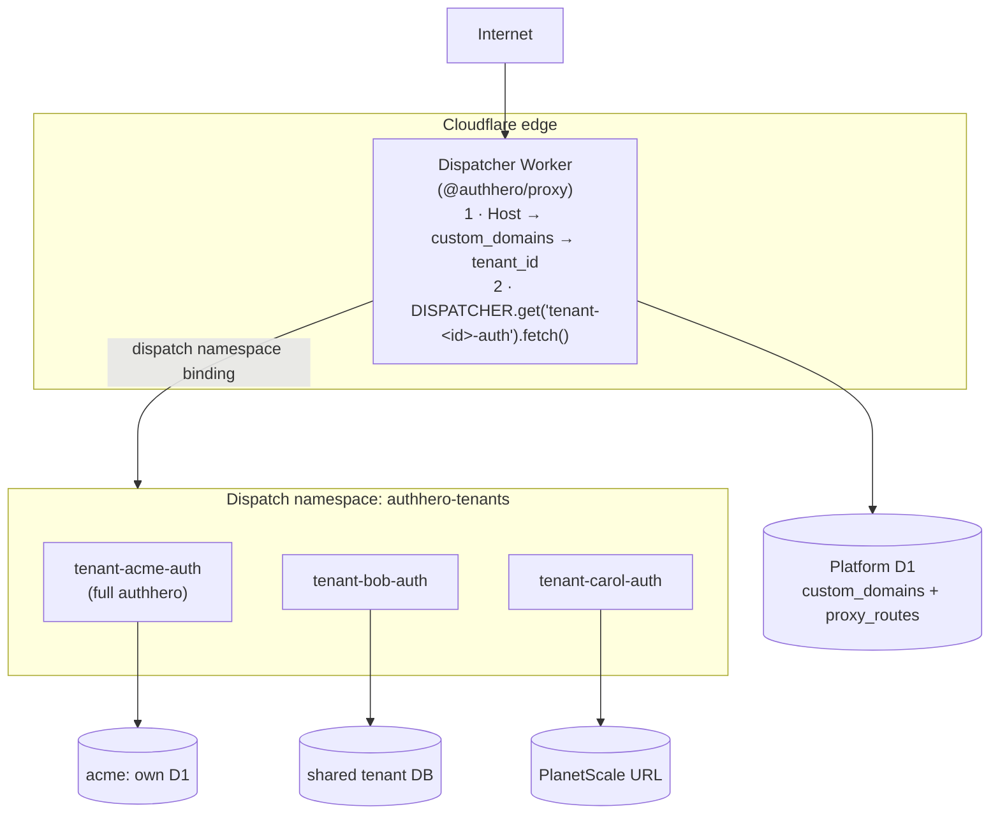
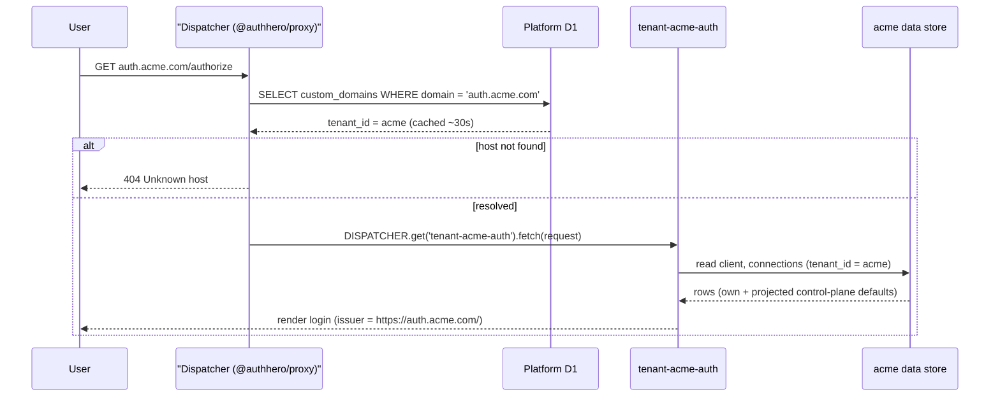
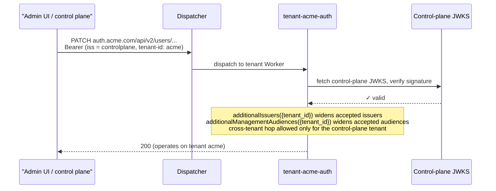

# Cloudflare Workers for Platforms

Deploy authhero as a multi-Worker SaaS platform where each tenant (publisher) gets their own isolated authhero Worker, fronted by a thin dispatcher Worker that routes by custom domain.

::: tip Two-tier deploy
WFP authhero is **two Workers**, not one:

1. **Dispatcher** — `@authhero/proxy` running as a Worker. Resolves the request's `Host` header to a tenant, then dispatches to that tenant's Worker via a [dispatch namespace](https://developers.cloudflare.com/cloudflare-for-platforms/workers-for-platforms/configuration/dispatch-namespaces/) binding.
2. **Tenant Worker(s)** — the full `authhero` app, one Worker per tenant, deployed _into_ the dispatch namespace.
:::

## When to use this

The default [Cloudflare Workers deployment](./cloudflare) runs **one** Worker that handles all tenants — tenant resolution happens inside the Worker via the `Host` header. That's the right answer for most deployments.

Reach for Workers for Platforms (WFP) when you need:

- **Per-tenant isolation** — a bug or runaway request in one tenant's Worker can't affect others
- **Per-tenant code customization** — publishers can ship modified authhero builds (different login flow, custom hooks, special branding logic) without a shared deploy
- **Per-tenant resource limits** — CPU time and subrequest caps applied per script
- **A true platform model** — you operate authhero as a SaaS where customers deploy "into" you

The trade-off is operational cost: every tenant has its own deployment lifecycle (worker upload, optional D1 creation, secrets distribution, custom domain wiring). The rest of this page is the playbook for that lifecycle.

## Architecture



The dispatcher reads only the **platform D1** to resolve a host; each tenant
Worker talks to whatever store its own bindings point at (own D1, a shared DB,
or PlanetScale). Three different data stores can be in play:

| Store                      | Lives in          | Owned by              | Purpose                                                                    |
| -------------------------- | ----------------- | --------------------- | -------------------------------------------------------------------------- |
| **Platform D1**            | one shared DB     | dispatcher            | `custom_domains` + `proxy_routes` — how the dispatcher resolves hosts      |
| **Per-tenant D1**          | optional          | each tenant Worker    | the tenant's own `users`, `clients`, `sessions`, etc. — full isolation     |
| **Shared tenant DB**       | one shared DB     | all tenant Workers    | shared `users`, `clients`, etc. — only data partition is `tenant_id`       |

You can mix: tenant A uses its own fresh D1, tenant B uses the shared tenant DB, tenant C uses a PlanetScale URL. Each tenant Worker's `wrangler` bindings dictate what _it_ talks to; the dispatcher only cares about the platform D1.

### Request flow

A user request never reaches a tenant Worker directly — it always lands on the
dispatcher first, which resolves the host and forwards into the namespace:



The dispatcher caches host → tenant resolution (~30s by default), so a newly
inserted `custom_domains` row may 404 until the cache expires — see
[Troubleshooting](#unknown-host-404-from-the-dispatcher).

## Prerequisites

- A Cloudflare account on the **Workers for Platforms** plan (dispatch namespaces require this)
- [Wrangler CLI](https://developers.cloudflare.com/workers/wrangler/install-and-update/) v3.50+
- Node.js 20+
- An [R2 bucket](https://developers.cloudflare.com/r2/) if you plan to use the bundle registry (see [Roadmap](#roadmap-api-driven-provisioning))

Verify your account has the WFP plan:

```bash
npx wrangler dispatch-namespace create test-namespace-delete-me
npx wrangler dispatch-namespace delete test-namespace-delete-me
```

If the first command 403s, your account doesn't have WFP enabled — talk to your Cloudflare account team.

## Step 1: Set up the dispatcher

### 1.1 Scaffold

```bash
npm create authhero@latest auth-dispatcher -- \
  --template=cloudflare-wfp-dispatcher
cd auth-dispatcher
npm install
```

This produces a thin Worker built on `@authhero/proxy` that uses the `dispatch_namespace` handler. Key files:

- `src/index.ts` — Worker entrypoint; wraps `createProxyDataAdapter` with a default dispatch fallback
- `src/types.ts` — `Env` with `AUTH_DB: D1Database` and `DISPATCHER: DispatchNamespace`
- `wrangler.toml` — declares the dispatch namespace binding and the platform D1

### 1.2 Create the dispatch namespace

```bash
npx wrangler dispatch-namespace create authhero-tenants
```

The name you pick here must match the `namespace = "..."` field in `wrangler.toml` and the `--dispatch-namespace=...` flag you'll use when deploying tenant Workers.

### 1.3 Create the platform D1

```bash
npx wrangler d1 create authhero-platform-db
```

The output gives you a `database_id`. Copy it into `wrangler.local.toml` (gitignored):

```toml
[[d1_databases]]
binding = "AUTH_DB"
database_name = "authhero-platform-db"
database_id = "abc123def456..."   # paste here
migrations_dir = "node_modules/@authhero/drizzle/drizzle"
```

::: tip Why a separate "platform" D1
The dispatcher only needs `tenants`, `custom_domains`, and `proxy_routes` rows. Keeping it on its own D1 means tenant Workers can't accidentally corrupt the routing table, and per-tenant deploys can't trip dispatcher rate limits.

You _can_ point the dispatcher at the same shared DB the tenants use — the schema is a superset — but separation is cleaner if you have the operational budget for two D1s.
:::

### 1.4 Apply the schema

The dispatcher template ships migrations from `@authhero/drizzle`:

```bash
npm run db:migrate:remote
```

That runs `wrangler d1 migrations apply AUTH_DB --remote --config wrangler.local.toml` against the platform D1. After it finishes you should see the `tenants`, `custom_domains`, and `proxy_routes` tables (plus the rest of the authhero schema — harmless on the platform D1).

For local development:

```bash
npm run db:migrate:local      # apply to local sqlite emulation of D1
```

### 1.5 Deploy the dispatcher

```bash
npm run deploy
```

The dispatcher is now live at `auth-dispatcher.<your-account>.workers.dev` but it has no tenants and won't resolve any hosts yet. You can sanity-check it:

```bash
curl -i https://auth-dispatcher.<your-account>.workers.dev
# HTTP/1.1 404
# Unknown host
```

That's the expected response — no `custom_domains` row matches `auth-dispatcher.<your-account>.workers.dev`.

## Step 2: Pick a tenant storage model

Each tenant Worker needs a database. You have three reasonable options; the choice affects the tenant's `storage_kind` field (see [Tenant lifecycle fields](#tenant-lifecycle-fields) below) and the bindings on that tenant's `wrangler.toml`.

### Option A: own D1 (full isolation)

Each tenant gets its own freshly-created D1, seeded with a fresh schema and an initial admin user. Best isolation, highest setup cost.

- **Pros**: complete data isolation; per-tenant backup/restore; per-tenant migration scheduling
- **Cons**: hits Cloudflare's D1-per-account limits; CI / provisioning has more moving parts
- **`storage_kind`**: `own_d1`

```toml
# tenant-acme/wrangler.toml
[[d1_databases]]
binding = "AUTH_DB"
database_name = "authhero-tenant-acme"
database_id = "xyz789..."
```

### Option B: existing D1 (shared per-batch)

A pre-created D1 (e.g. the platform D1, or one shared D1 per region) hosts data for many tenants, partitioned by `tenant_id` in every query. Same model the single-Worker deploy uses.

- **Pros**: one D1 to operate; simple migrations
- **Cons**: no data-layer isolation; one tenant's noisy queries impact all
- **`storage_kind`**: `existing_d1`

```toml
# tenant-acme/wrangler.toml
[[d1_databases]]
binding = "AUTH_DB"
database_name = "authhero-platform-db"
database_id = "abc123..."  # same as the dispatcher's D1
```

### Option C: PlanetScale (cross-region MySQL)

Tenant Workers connect to a shared PlanetScale URL via a secret binding instead of a D1. Good when D1's per-region replication isn't enough.

- **Pros**: cross-region writes; mature MySQL tooling
- **Cons**: extra network hops from the Worker; no data isolation
- **`storage_kind`**: `shared_planetscale`

```toml
# tenant-acme/wrangler.toml
# No D1 binding. PlanetScale URL is a secret instead.
```

```bash
echo "mysql://..." | wrangler secret put --name=tenant-acme-auth PLANETSCALE_URL
```

::: warning Pick early
The storage decision shapes the bundle you upload (the bindings in the Worker's `wrangler.toml` differ). It's far easier to pick once per tenant than to migrate later.
:::

## Step 3: Onboard a tenant

For each publisher, four discrete steps. We'll use `acme` as the example tenant id and `auth.acme.com` as their domain.

### 3.1 Create the tenant row + custom domain in the platform D1

Either via the dispatcher's management API (if you've deployed an admin instance of authhero) or by direct SQL:

::: code-group

```bash [Via management API]
curl -X POST https://admin.authhero.example.com/api/v2/tenants \
  -H "Authorization: Bearer $CONTROL_PLANE_TOKEN" \
  -H "Content-Type: application/json" \
  -d '{
    "id": "acme",
    "friendly_name": "Acme Inc",
    "audience": "https://auth.acme.com/",
    "sender_name": "Acme",
    "sender_email": "noreply@acme.com",
    "deployment_type": "wfp",
    "storage_kind": "own_d1",
    "bundle_configuration": "authhero-drizzle-d1",
    "worker_version": "v1.0.0"
  }'

curl -X POST https://admin.authhero.example.com/api/v2/custom-domains \
  -H "Authorization: Bearer $CONTROL_PLANE_TOKEN" \
  -H "Content-Type: application/json" \
  -d '{
    "tenant_id": "acme",
    "domain": "auth.acme.com",
    "type": "auth0_managed_certs"
  }'
```

```sql [Direct SQL]
-- Run against the platform D1 via `wrangler d1 execute authhero-platform-db --remote`
INSERT INTO tenants (id, friendly_name, audience, sender_name, sender_email,
                     deployment_type, storage_kind, bundle_configuration,
                     worker_version, provisioning_state, created_at, updated_at)
VALUES ('acme', 'Acme Inc', 'https://auth.acme.com/', 'Acme', 'noreply@acme.com',
        'wfp', 'own_d1', 'authhero-drizzle-d1', 'v1.0.0', 'pending',
        '2026-06-06T00:00:00Z', '2026-06-06T00:00:00Z');

INSERT INTO custom_domains (id, tenant_id, domain, type, created_at, updated_at)
VALUES ('cd-acme', 'acme', 'auth.acme.com', 'auth0_managed_certs',
        '2026-06-06T00:00:00Z', '2026-06-06T00:00:00Z');
```

:::

::: tip control-plane scope
The `POST /api/v2/tenants` endpoint requires the `create:tenants` scope **and** must be called against a control-plane tenant (see [Multi-Tenancy](/architecture/multi-tenancy)). Use a service-account token, never a tenant token.
:::

### 3.2 Provision the tenant's data store (only if `storage_kind = "own_d1"`)

```bash
# Create the per-tenant D1
npx wrangler d1 create authhero-tenant-acme

# Apply the schema bundle
npx wrangler d1 migrations apply authhero-tenant-acme --remote \
  --migrations-dir node_modules/@authhero/drizzle/drizzle
```

Then record the `database_id` Cloudflare returned:

```sql
UPDATE tenants SET d1_database_id = 'xyz789...' WHERE id = 'acme';
```

::: tip One-shot schema apply
Running `wrangler d1 migrations apply` does ~40 sequential HTTP calls to D1 (one per migration), which takes 8-20 seconds. If you need it faster — for programmatic provisioning from a Worker — bundle all migrations into a single SQL file and POST once to `/accounts/:id/d1/database/:dbid/query`. D1's query endpoint accepts multi-statement bodies up to ~100KB; the current drizzle bundle is ~916 lines and fits comfortably. The upcoming `CloudflarePlatformProvisioner` (see [Roadmap](#roadmap-api-driven-provisioning)) uses this technique.
:::

For Options B/C, skip this step — the data store already exists.

### 3.3 Seed initial data

The tenant Worker needs at least one admin user, signing keys, and the management API resource server. The `seed()` helper exported from `authhero` is idempotent and does this in one call:

```typescript
import { seed } from "authhero";
import { drizzle } from "drizzle-orm/d1";
import createAdapters from "@authhero/drizzle";

// Run once against the tenant's D1
const db = drizzle(env.AUTH_DB);
const data = createAdapters(db);

await seed({
  data,
  tenantId: "acme",
  adminEmail: "admin@acme.com",
});
```

Easiest way to invoke this: ship a one-shot Worker route in the tenant template (`POST /__seed`) gated behind a setup token, or run it locally with `wrangler dev` against the remote D1.

### 3.4 Deploy the tenant Worker into the dispatch namespace

Scaffold a tenant Worker from the [`cloudflare` template](./cloudflare), edit its `wrangler.toml` to bind to the right data store (see [Step 2](#step-2-pick-a-tenant-storage-model)), then deploy:

```bash
cd tenant-acme/
wrangler deploy \
  --dispatch-namespace=authhero-tenants \
  --name=tenant-acme-auth
```

The script name **must** match the dispatcher's template — by default `tenant-<tenant_id>-auth`. Override the template globally via the `SCRIPT_NAME_TEMPLATE` env var on the dispatcher (supports `{tenant_id}`, `{custom_domain_id}`, `{domain}`, `{host}` placeholders).

After a successful deploy, mark the tenant ready:

```sql
UPDATE tenants
SET provisioning_state = 'ready',
    provisioning_state_changed_at = '2026-06-06T00:00:00Z',
    worker_script_name = 'tenant-acme-auth'
WHERE id = 'acme';
```

### 3.5 Wire secrets

The tenant Worker needs at least `ENCRYPTION_KEY` (for at-rest encryption of credential fields) and any provider API keys it uses:

```bash
wrangler secret put --name=tenant-acme-auth ENCRYPTION_KEY
wrangler secret put --name=tenant-acme-auth EMAIL_API_KEY
# ... etc.
```

Generate `ENCRYPTION_KEY` per tenant — don't share it across the namespace. See [Encryption at Rest](/security/encryption-at-rest).

### 3.6 Point the tenant's custom domain at the dispatcher

In the Cloudflare Dashboard:

1. Workers & Pages → **dispatcher** Worker → Triggers → Add Custom Domain → `auth.acme.com`
2. Cloudflare provisions the TLS certificate and points DNS

Or in `wrangler.toml`:

```toml
[[routes]]
pattern = "auth.acme.com/*"
zone_name = "acme.com"
```

### 3.7 Verify

```bash
curl https://auth.acme.com/.well-known/openid-configuration
```

Expected: a JWKS issuer document with `"issuer": "https://auth.acme.com/"`. If you get `Unknown host` (404), the `custom_domains` row isn't in place or the dispatcher hasn't picked it up yet (it caches host resolutions for 30s by default — see [the proxy cache config](/customization/proxy/)).

## Per-tenant routing customization

The dispatcher synthesizes a default catch-all dispatch route when a host has no explicit `proxy_routes` rows. The default routes _everything_ to the tenant's namespace script.

To customize — add CORS, headers, intercept a path, mix the tenant Worker with a separate API — insert `proxy_routes` rows for that `custom_domain_id`. Sorted by `priority` ascending; first match wins.

Example: serve a static `/healthz` and apply CORS to the rest:

```sql
INSERT INTO proxy_routes (id, tenant_id, custom_domain_id, priority, match, handlers, created_at, updated_at)
VALUES (
  'route-acme-healthz', 'acme', 'cd-acme', 100,
  '{"path": "/healthz"}',
  '[{"type": "static", "options": {"status": 200, "body": "ok"}}]',
  '2026-06-06T00:00:00Z', '2026-06-06T00:00:00Z'
);
INSERT INTO proxy_routes (id, tenant_id, custom_domain_id, priority, match, handlers, created_at, updated_at)
VALUES (
  'route-acme-default', 'acme', 'cd-acme', 1000,
  '{"path": "/*"}',
  '[
    {"type": "cors", "options": {"origins": ["https://app.acme.com"]}},
    {"type": "dispatch_namespace", "options": {"binding": "DISPATCHER", "script_name": "tenant-acme-auth"}}
  ]',
  '2026-06-06T00:00:00Z', '2026-06-06T00:00:00Z'
);
```

See [the proxy handler reference](/customization/proxy/) for the full list (cors, headers, basic_auth, redirect, rewrite_location, http, dispatch_namespace, service_binding, static, cache).

## Control-plane admin tokens

The control plane administers tenants through the same management API the tenant
Workers expose. When an admin request is forwarded into a tenant Worker, the
token presents a problem worth understanding.

The control plane mints admin tokens with **its own issuer** — e.g.
`iss = https://controlplane.token.example.com/`, `tenant_id: "controlplane"`,
`org_name: "acme"`. That request is dispatched to `tenant-acme-auth`, whose
`env.ISSUER` is the per-tenant value `https://auth.acme.com/`. The signature
verifies fine (the tenant Worker fetches the control plane's JWKS), but two
checks would reject it out of the box:

1. **Issuer check** — `payload.iss` (control plane) ≠ this Worker's issuer.
2. **Audience check** — the management API requires the `urn:authhero:management`
   audience, and the token may carry a per-domain audience instead.



authhero never hardcodes or derives an issuer. The host app widens the accepted
set with two resolvers, both of which receive the token's `tenant_id` and
default to the strict single-value check when unset:

```typescript
import { init } from "authhero";

const { app } = init({
  dataAdapter,

  // Accept the control-plane issuer in addition to this Worker's own ISSUER.
  // Return [] to refuse — e.g. for tokens that shouldn't cross from the
  // control plane.
  additionalIssuers: ({ tenant_id }) =>
    tenant_id ? ["https://controlplane.token.example.com/"] : [],

  // Accept the control-plane / per-tenant audience alongside the built-in
  // urn:authhero:management.
  additionalManagementAudiences: ({ tenant_id }) => [
    "https://controlplane.token.example.com/v2/api/",
    `https://${tenant_id}.token.example.com/v2/api/`,
  ],
});
```

The cross-tenant hop itself (a token for tenant `controlplane` operating on
tenant `acme`) is gated separately: it's allowed only when the token's
`tenant_id` equals the deployment's configured `controlPlaneTenantId`. Any other
tenant-to-tenant hop is rejected with
`403 Cross-tenant management requires a control-plane token`. See
[Management API Security](/security/management-api) for that guard.

::: warning Scope the resolvers
These resolvers are purely additive and you own the scoping. Don't return a
broad list unconditionally — key the accepted issuers/audiences off `tenant_id`
(or other token context) so only genuine control-plane tokens are widened, and
return `[]` otherwise.
:::

## Tenant lifecycle fields

Every tenant row carries metadata that describes _how_ the tenant runs and where its data lives. These fields drive the dispatcher's routing and (in future versions, see [Roadmap](#roadmap-api-driven-provisioning)) the provisioning flow.

| Field                            | Type                                                   | Purpose                                                                                          |
| -------------------------------- | ------------------------------------------------------ | ------------------------------------------------------------------------------------------------ |
| `deployment_type`                | `"shared" \| "wfp"` (default: `"shared"`)              | Whether the tenant runs on the single-Worker deploy or in a dispatch namespace                   |
| `provisioning_state`             | `"pending" \| "ready" \| "failed"` (default: `"ready"`)| Lifecycle of the WFP setup. Shared tenants are always `ready`                                    |
| `provisioning_error`             | `string?`                                              | Human-readable failure reason when state is `failed`                                             |
| `provisioning_state_changed_at`  | ISO timestamp                                          | When the state last changed — useful for ops dashboards                                          |
| `bundle_configuration`           | e.g. `"authhero-drizzle-d1"`                           | Identifies which authhero build variant the tenant runs                                          |
| `worker_version`                 | e.g. `"v1.2.3"`                                        | Pins the release within that configuration                                                       |
| `worker_script_name`             | e.g. `"tenant-acme-auth"`                              | Script name in the dispatch namespace. Defaults to `tenant-<id>-auth`                            |
| `storage_kind`                   | `"own_d1" \| "existing_d1" \| "shared_planetscale"`    | Which storage option (A/B/C from [Step 2](#step-2-pick-a-tenant-storage-model)) the tenant uses  |
| `d1_database_id`                 | string                                                 | The actual D1 id when `storage_kind` is `own_d1` or `existing_d1`                                |

Existing shared tenants (created before these fields existed) keep working — `deployment_type` defaults to `"shared"` and `provisioning_state` defaults to `"ready"` at the database level. No backfill needed.

## The `TenantProvisioner` adapter

`authhero` exposes a `TenantProvisioner` interface so the provisioning side effects (creating a D1, uploading a Worker, wiring bindings) can be swapped without touching the API or admin UI.

```typescript
import type { Tenant, TenantsDataAdapter } from "@authhero/adapter-interfaces";

interface TenantProvisionerContext {
  tenants: TenantsDataAdapter;
}

interface TenantProvisioner {
  provision(tenant: Tenant, ctx: TenantProvisionerContext): Promise<void>;
}
```

Contract:

- **Idempotent.** The same tenant may be passed twice if a prior run crashed mid-flight or an operator retries.
- **Never throws.** Errors are captured into `provisioning_error` and `provisioning_state` is set to `"failed"`. The caller (typically `ctx.executionCtx.waitUntil(...)`) won't see a rejected promise.
- **Self-contained.** Safe to schedule via `waitUntil` — must not rely on the originating request surviving.

### Built-in implementations

| Implementation                        | Use when                                                                              |
| ------------------------------------- | ------------------------------------------------------------------------------------- |
| `NoopTenantProvisioner`               | All tenants are `deployment_type: "shared"`, or you provision WFP tenants manually    |
| `CloudflarePlatformProvisioner`       | (coming) Programmatically creates D1s and uploads Worker bundles from an R2 registry  |

### Wiring it up

```typescript
import { init, NoopTenantProvisioner } from "authhero";

const { app } = init({
  dataAdapter,
  provisioner: new NoopTenantProvisioner(),   // default — can be omitted
});
```

### Writing a custom provisioner

If your platform has bespoke needs (e.g. talks to a non-Cloudflare API, kicks off a CI job, posts to Slack), implement the interface directly:

```typescript
import type { TenantProvisioner } from "authhero";

class SlackNotifyingProvisioner implements TenantProvisioner {
  async provision(tenant, ctx) {
    try {
      // your bespoke side effects
      await uploadBundle(tenant);
      await postToSlack(`Provisioned ${tenant.id}`);
      await ctx.tenants.update(tenant.id, {
        provisioning_state: "ready",
        provisioning_state_changed_at: new Date().toISOString(),
        provisioning_error: undefined,
      });
    } catch (err) {
      await ctx.tenants.update(tenant.id, {
        provisioning_state: "failed",
        provisioning_state_changed_at: new Date().toISOString(),
        provisioning_error: err instanceof Error ? err.message : String(err),
      });
    }
  }
}
```

The same shape will (with a richer `ctx`) eventually be the contract for swapping in a [Cloudflare Workflow](https://developers.cloudflare.com/workflows/) for durable provisioning. See [Roadmap](#roadmap-api-driven-provisioning).

## Roadmap: API-driven provisioning

The manual flow in [Step 3](#step-3-onboard-a-tenant) works today and is the recommended path. A first-class API-driven flow is in progress and will become the default once shipped.

The end state:

1. **Admin UI form** picks `deployment_type: "wfp"`, `bundle_configuration`, `worker_version`, `storage_kind`.
2. **`POST /api/v2/tenants`** returns `202 Accepted` with `provisioning_state: "pending"`.
3. **`CloudflarePlatformProvisioner`** runs in `ctx.waitUntil()`:
   - Reads the bundle from R2 (`tenant-bundles/<configuration>/<version>/`)
   - Creates a D1 if `storage_kind = "own_d1"`, applies the bundled schema in a single query
   - Uploads `worker.js` to the dispatch namespace with bindings configured for the chosen storage
   - Marks `provisioning_state: "ready"`
4. **Admin UI polls** `GET /api/v2/tenants/:id` until state transitions, then shows success or the recorded error.

The R2 bundle layout:

```text
tenant-bundles/
  authhero-drizzle-d1/
    v1.2.3/
      worker.js
      schema-bundle.sql       # all migrations flattened
      meta.json
    v1.2.4/
      ...
  authhero-kysely-planetscale/
    v0.7.0/
      worker.js
      meta.json               # requires_own_db: false
```

`bundle_configuration` selects the variant; `worker_version` pins the release. New bundles are published by running `pnpm publish-bundle` in each `bundles/<configuration>/` workspace.

Track progress in [GitHub issue TBD]. Until then, treat the lifecycle fields as the public surface for tooling — keep them populated so the admin UI and downstream automation can render the right thing.

## Trade-offs vs. single Worker

|                                       | Single Worker                              | WFP per-tenant                                         |
| ------------------------------------- | ------------------------------------------ | ------------------------------------------------------ |
| Operational complexity                | Low                                        | High (deploy per tenant)                               |
| Isolation between tenants             | Soft (logical, via `tenant_id`)            | Hard (separate isolates per script)                    |
| Per-tenant code customization         | Not supported                              | Native (different bundle per tenant)                   |
| Per-tenant resource limits            | Not supported                              | Per-script CPU/subrequest caps                         |
| Cold-start cost                       | One Worker                                 | One per tenant (mitigated by namespace placement)      |
| Cost                                  | Workers Free / Paid plan                   | Workers for Platforms plan ($25/mo + per-script costs) |
| Data isolation                        | Logical only                               | Optional (`own_d1`)                                    |
| Maximum tenant count                  | 10,000s on one Worker                      | Limited by namespace script count (~10k typical)       |

## Limitations

- **Local dev cannot emulate the namespace.** `wrangler dev` runs the dispatcher locally, but `env.DISPATCHER.get(...).fetch(...)` only resolves against a real namespace in your Cloudflare account. Use `npm run dev:remote` to test end-to-end.
- **Per-tenant D1 limits.** Cloudflare imposes a maximum number of D1 databases per account. If you choose `own_d1` and onboard hundreds of tenants, you'll hit this — pick `existing_d1` or PlanetScale for the long tail.
- **Bindings propagate per script.** Each tenant Worker's `wrangler.toml` declares its own bindings; the dispatcher's bindings don't carry through. Codify the per-tenant `wrangler.toml` in your deploy pipeline.
- **Secrets distribution.** `ENCRYPTION_KEY` and other secrets must be set per-script via `wrangler secret put --name=tenant-<id>-auth …`. Plan to automate this (and rotation) in your deploy tooling.
- **Dispatch namespace cache.** The dispatcher caches host resolution for 30s by default. After inserting a new `custom_domains` row, the first request may still 404 until the cache expires. Configure a shorter `negativeTtlMs` (see [proxy cache options](/customization/proxy/)) if you onboard tenants frequently.

## Troubleshooting

### `Unknown host` 404 from the dispatcher

The hostname isn't in `custom_domains` for any tenant. Check:

```bash
wrangler d1 execute authhero-platform-db --remote \
  --command "SELECT * FROM custom_domains WHERE domain = 'auth.acme.com'"
```

If the row exists, the dispatcher may be serving a cached negative result. Wait 30s or restart the Worker (`wrangler deploy` no-op).

### `Worker not found in namespace`

The dispatcher resolved the host but `env.DISPATCHER.get('tenant-acme-auth')` 404s. Verify:

```bash
wrangler dispatch-namespace list authhero-tenants
```

Expected output should include `tenant-acme-auth`. If not, re-run `wrangler deploy --dispatch-namespace=authhero-tenants --name=tenant-acme-auth`.

Common causes:

- `worker_script_name` on the `tenants` row doesn't match what's actually deployed
- The dispatcher's `SCRIPT_NAME_TEMPLATE` was changed and existing rows still point to the old name

### `ENCRYPTION_KEY not set` errors from the tenant Worker

Each tenant Worker needs its own secret:

```bash
wrangler secret put --name=tenant-acme-auth ENCRYPTION_KEY
```

Secrets _do not_ propagate from the dispatcher to namespace scripts.

### D1 migrations time out

Applying ~40 migrations sequentially can hit Cloudflare's per-request limits when run from a Worker. Workarounds:

- Run `wrangler d1 migrations apply` from your dev machine, not from a Worker
- Use the one-shot bundle approach described in [Step 3.2](#_3-2-provision-the-tenant-s-data-store-only-if-storage-kind-own-d1): concatenate all migrations into a single SQL file and POST once to `/accounts/:id/d1/database/:dbid/query`

## Next Steps

- [Single-Worker Cloudflare deployment](./cloudflare)
- [Proxy package handler reference](/customization/proxy/)
- [Custom domain setup](/deployment/custom-domain-setup)
- [Multi-tenancy architecture](/architecture/multi-tenancy)
- [Encryption at Rest](/security/encryption-at-rest)
