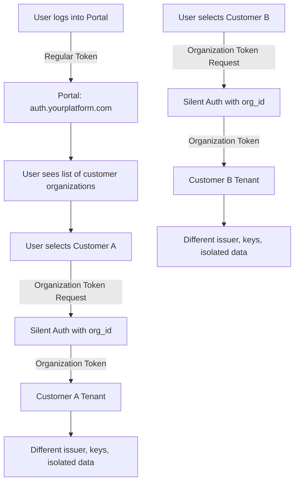

# Multi-Tenant SaaS Authentication Setup

::: tip What You'll Learn

- How to set up a central management portal with customer-specific authentication domains
- Why traditional solutions make this unnecessarily complex
- How to implement this in **under 10 minutes** using AuthHero's organization architecture
- How to handle internal access and cross-tenant permissions
  :::

## The Problem: You Have 100 Customers, But You Don't Want 100 Auth Systems

You're building a SaaS platform. Each customer signs up and wants:

- **Their own login page** at `auth.coffeeshop.com` (not `auth.yourplatform.com`)
- **First-party cookies** (for better security and privacy)
- **Complete data isolation** (their users never see other customers' data)

But you also need:

- **One central portal** where all customers manage their users
- **Internal admin access** to help customers and monitor the system
- **Support staff** who can access multiple customer accounts

**The Old Way (Auth0):** Build a complex custom solution connecting multiple tenants, organizations, and custom domains. Expect weeks of development and ongoing maintenance headaches.

**The AuthHero Way:** It works out of the box. No custom code needed (except one cache helper). Setup time: 10 minutes.

## Quick Start: Get Running in 10 Minutes

The fastest way to get started is using the `create-authhero` scaffolding tool:

::: code-group

```bash [npm]
npm create authhero@latest my-saas-auth
```

```bash [pnpm]
pnpm create authhero my-saas-auth
```

```bash [yarn]
yarn create authhero my-saas-auth
```

:::

**When prompted, select:** "Multi-tenant control-plane"

**What you get automatically:**

✅ Control-plane tenant for your portal  
✅ Self-serve customer sign-up (customers create their own tenants)  
✅ Organization auto-creation (linked to customer tenants)  
✅ Token cache isolation (no token conflicts between customers)  
✅ Pre-configured roles and permissions

**What happens when a customer signs up:**

1. System creates an **organization** in your control-plane
2. System creates a dedicated **tenant** for that customer
3. System **links** the organization to the customer tenant
4. Signing-up user becomes an **admin** of their organization

No manual setup required. Just run the scaffold and deploy.

## Architecture: How It Actually Works

Here's the flow when a user accesses a customer tenant:



````

**Key insight:** Each customer tenant has:
- ✅ Different cryptographic signing keys
- ✅ Different token issuer
- ✅ Completely isolated data
- ✅ Independent configuration

## Choosing Your Data Isolation Strategy

| Strategy | Cost | Security | Maintenance | Best For |
|----------|------|----------|-------------|----------|
| **Shared DB + Row-level filtering** | 💰 Low | ⚠️ Medium | ✅ Easy | Early-stage startups (<100 customers) |
| **Schema per Tenant** | 💰💰 Medium | 🔒 High | ⚠️ Complex | Mid-sized SaaS (100-1000 customers) |
| **Database per Tenant** | 💰💰💰 High | 🔒🔒 Maximum | ⚠️⚠️ Very Complex | Enterprise (regulated industries) |

::: warning The Migration Trap
Many startups start with Shared DB, then face a painful migration when they hit 50+ customers. Plan for Schema-per-Tenant from day one if you expect growth.
:::

## Understanding the Architecture

::: tip Automatic Setup with create-authhero
If you used `create-authhero` with the multi-tenant control-plane option, most of this is already set up for you. Organizations are automatically created via the multi-tenancy plugin when customer tenants are created.
:::

### The Control-Plane Tenant

The control-plane is a special tenant that:
- Handles authentication for your portal/admin interface
- Contains organizations that map to customer tenants
- Stores roles and permissions for portal users
- Issues tokens for both portal access and organization-scoped customer access

```typescript
// Example: Control-plane configuration in create-authhero
const CONTROL_PLANE_TENANT_ID = "control-plane";
````

### Automatic Organization & Tenant Linking

The multi-tenancy plugin listens to tenant creation events and automatically:

1. Creates an organization in the control-plane when a customer tenant is created
2. Links the organization to the customer tenant (stored in organization metadata)
3. Adds the signing-up user as an admin of the organization

This happens automatically through hooks - **you don't need to manually create organizations**.

### Resource Server and Role Synchronization

One of the most powerful features of the multi-tenant control-plane setup is **automatic synchronization** of resource servers and roles:

**How It Works:**

- Resource servers (APIs) and roles defined in the control-plane are automatically synced to all customer tenants
- When you create or update a resource server or role in the control-plane, it's propagated to all customer tenants
- This allows you to **manage all customers from a single place** instead of configuring each tenant individually

**Example Use Case:**

```typescript
// Define a resource server in the control-plane
const customerAPI = await managementClient.resourceServers.create({
  name: "Customer Portal API",
  identifier: "https://api.yourplatform.com",
  scopes: [
    { value: "read:profile", description: "Read user profile" },
    { value: "write:profile", description: "Update user profile" },
    { value: "manage:team", description: "Manage team members" },
  ],
});

// This resource server is automatically synced to ALL customer tenants!
// Each customer's users can now request tokens for this API
```

**Role Synchronization:**

```typescript
// Define roles in the control-plane
const adminRole = await managementClient.roles.create({
  name: "admin",
  description: "Full administrative access",
});

const userRole = await managementClient.roles.create({
  name: "user",
  description: "Standard user access",
});

// These roles are automatically available in all customer tenants
// Customer admins can assign these roles to their users
```

**Benefits:**

- ✅ Single source of truth for APIs and permissions across all customers
- ✅ Consistent permission model across all customer tenants
- ✅ Easy updates - change once in control-plane, applies everywhere
- ✅ No need to manually configure each customer tenant

**Excluding Internal Resources:**
As mentioned in the [Advanced Topics](#preventing-resource-server-sync) section, you can exclude internal-only resources from syncing using metadata flags or naming conventions.

### Managing Organization Members

::: tip
With `create-authhero`, the first user is automatically added to their organization during self-serve sign-up.
:::

To add additional users to an organization (e.g., inviting team members):

```typescript
// Add user to the organization
await managementClient.organizations.addMembers(organizationId, {
  members: ["user_id_123"],
});

// Assign roles to the user
await managementClient.organizations.addMemberRoles(
  organizationId,
  "user_id_123",
  {
    roles: ["rol_admin"], // or "rol_viewer"
  },
);
```

### Configuring Roles

::: tip
With `create-authhero`, basic roles are pre-configured in the control-plane tenant.
:::

Define roles in your control-plane tenant that control what users can do:

```typescript
// Create roles on the control-plane tenant
const adminRole = await managementClient.roles.create({
  name: "admin",
  description: "Full administrative access to customer tenant",
});

const viewerRole = await managementClient.roles.create({
  name: "viewer",
  description: "Read-only access to customer tenant",
});
```

### Implementing Organization Selection UI

In your portal, display organizations the user is a member of using the `/tenants` endpoint:

::: info AuthHero Extension
The `/tenants` endpoint is an **AuthHero extension** not available in Auth0. It provides powerful multi-tenant capabilities:

- List all organizations a user is a member of
- Enable self-serve tenant creation
- Allow users to create their own customer tenants directly from your portal
  :::

```typescript
// Get user's organizations from the control-plane using the /tenants endpoint
const token = await auth0Client.getTokenSilently();

const response = await fetch("https://auth.yourplatform.com/api/v2/tenants", {
  headers: {
    Authorization: `Bearer ${token}`,
  },
});

const organizations = await response.json();

// Display list for user to select
organizations.forEach((org) => {
  console.log(org.id, org.display_name);
});
```

**Self-Serve Tenant Creation:**

The `/tenants` endpoint also allows users to create their own tenants (customer organizations) through your portal:

```typescript
// Allow users to create a new customer tenant
async function createTenant(tenantName: string, displayName: string) {
  const token = await auth0Client.getTokenSilently();

  const response = await fetch("https://auth.yourplatform.com/api/v2/tenants", {
    method: "POST",
    headers: {
      Authorization: `Bearer ${token}`,
      "Content-Type": "application/json",
    },
    body: JSON.stringify({
      name: tenantName,
      display_name: displayName,
    }),
  });

  const newTenant = await response.json();

  // The multi-tenancy plugin will automatically:
  // 1. Create the tenant
  // 2. Create an organization in the control-plane
  // 3. Link the organization to the tenant
  // 4. Add the user as an admin of the organization

  return newTenant;
}
```

This makes it easy to build a completely self-serve multi-tenant platform where customers can sign up and start using your service immediately without any manual intervention.

## The Critical Implementation Detail: Token Cache Isolation

::: danger Common Mistake: Token Cache Clash
The default Auth0 SDK cache will return the **wrong token** when switching between customer organizations. This is the #1 bug developers hit with multi-tenant setups.
:::

**The Problem:**

1. User authenticates to **Customer A**, SDK caches the token
2. User switches to **Customer B** with `getTokenSilently({ organization: 'org_b' })`
3. SDK finds cached token from **Customer A** and returns it ❌
4. User gets access denied or sees wrong data

**The Solution:** Organization-isolated cache (included in `create-authhero` scaffolds)

```typescript
import { ICache, Cacheable, MaybePromise } from "@auth0/auth0-spa-js";

const CACHE_KEY_PREFIX = "@@auth0spajs@@";

/**
 * Custom cache provider that wraps localStorage and adds organization isolation.
 * This ensures that tokens and auth state are kept separate between organizations.
 */
export class OrgCache implements ICache {
  private orgId: string;

  constructor(orgId: string) {
    this.orgId = orgId;
  }

  public set<T = Cacheable>(key: string, entry: T) {
    const orgKey = `${key}:${this.orgId}`;
    localStorage.setItem(orgKey, JSON.stringify(entry));
  }

  public get<T = Cacheable>(key: string): MaybePromise<T | undefined> {
    const orgKey = `${key}:${this.orgId}`;
    const json = window.localStorage.getItem(orgKey);

    if (!json) return;

    try {
      const payload = JSON.parse(json) as T;
      return payload;
    } catch (e) {
      return;
    }
  }

  public remove(key: string) {
    const orgKey = `${key}:${this.orgId}`;
    localStorage.removeItem(orgKey);
  }

  public allKeys() {
    const orgSuffix = `:${this.orgId}`;
    return Object.keys(window.localStorage).filter(
      (key) => key.startsWith(CACHE_KEY_PREFIX) && key.endsWith(orgSuffix),
    );
  }
}
```

#### Create Organization-Specific Auth0 Client

```typescript
import { Auth0Client } from "@auth0/auth0-spa-js";

// Create an Auth0 client with organization-specific cache
function createOrganizationClient(domain: string, organizationId: string) {
  return new Auth0Client({
    domain: domain,
    clientId: "your-client-id",
    authorizationParams: {
      organization: organizationId,
      audience: "urn:authhero:management",
    },
    cache: new OrgCache(organizationId),
    cacheLocation: "localstorage",
  });
}
```

## Understanding Token Types: Internal vs. Organization Tokens

AuthHero uses two distinct token types for different access patterns:

| Token Type             | Has `org_id`? | Use Case                                         | Audience                  |
| ---------------------- | ------------- | ------------------------------------------------ | ------------------------- |
| **Internal Token**     | ❌ No         | Platform admin, support staff, internal services | `internal:platform-api`   |
| **Organization Token** | ✅ Yes        | Customer managing their own tenant               | `urn:authhero:management` |

**When to use each:**

```typescript
// ❌ WRONG: Using organization token for internal access
const token = await auth0Client.getTokenSilently({
  authorizationParams: {
    organization: "org_customer_a", // This scopes you to ONE customer
    audience: "internal:platform-api",
  },
});

// ✅ CORRECT: Using internal token for cross-tenant access
const internalToken = await auth0Client.getTokenSilently({
  authorizationParams: {
    // No organization parameter = internal token
    audience: "internal:platform-api",
  },
});
// This token can access ALL customers

// ✅ CORRECT: Using organization token for customer-specific access
const orgToken = await auth0Client.getTokenSilently({
  authorizationParams: {
    organization: "org_customer_a", // Scoped to Customer A only
    audience: "urn:authhero:management",
  },
});
```

**Backend validation shows the difference:**

```typescript
app.get("/customers/:customerId/users", async (c) => {
  const token = c.req.header("Authorization")?.replace("Bearer ", "");
  const claims = await auth.verifyToken(token);

  // Check if this is an internal token (no org_id)
  if (!claims.org_id) {
    // This is an internal/support token
    // Verify they have cross-tenant permissions
    if (!claims.permissions?.includes("support:access")) {
      return c.json({ error: "Insufficient permissions" }, 403);
    }
    // Allow access to any customer
  } else {
    // This is an organization token
    // Verify it matches the requested customer
    if (claims.org_id !== c.req.param("customerId")) {
      return c.json({ error: "Forbidden" }, 403);
    }
  }

  // Proceed with request...
});
```

::: tip Pro Tip: Token Inspection
Always decode tokens at [jwt.io](https://jwt.io) during development to verify they have the expected `org_id` claim (or lack thereof for internal tokens).
:::

## The Request Lifecycle: How a Customer Accesses Their Tenant

Let's follow "Alice at The Coffee Shop" as she manages her users:

**Step 1: Alice logs into your portal**

```typescript
// Alice authenticates to the control-plane
// No organization parameter = portal access
const portalToken = await auth0Client.getTokenSilently();
```

**Step 2: Portal shows Alice her organizations**

```typescript
// AuthHero-specific endpoint (not in Auth0)
const response = await fetch("https://auth.yourplatform.com/api/v2/tenants", {
  headers: { Authorization: `Bearer ${portalToken}` },
});

const organizations = await response.json();
// Alice sees: [{ id: 'org_coffee_shop', name: 'The Coffee Shop' }]
```

**Step 3: Alice selects "The Coffee Shop"**

```typescript
// Create organization-specific client with isolated cache
const coffeeShopClient = new Auth0Client({
  domain: "auth.yourplatform.com",
  clientId: "your-client-id",
  authorizationParams: {
    organization: "org_coffee_shop",
    audience: "urn:authhero:management",
  },
  cache: new OrgCache("org_coffee_shop"), // ⭐ Critical for token isolation
  cacheLocation: "localstorage",
});

// Get organization-scoped token
const coffeeShopToken = await coffeeShopClient.getTokenSilently({
  authorizationParams: {
    organization: "org_coffee_shop",
  },
});
```

**Step 4: Alice manages her users**

```typescript
// This token is scoped to The Coffee Shop tenant only
const response = await fetch(
  "https://api.yourplatform.com/customers/org_coffee_shop/users",
  {
    headers: { Authorization: `Bearer ${coffeeShopToken}` },
  },
);
```

**Step 5: Backend validates the token**

```typescript
app.get("/customers/:orgId/users", async (c) => {
  const token = c.req.header("Authorization")?.replace("Bearer ", "");
  const claims = await auth.verifyToken(token);

  // Verify org_id matches the requested resource
  if (claims.org_id !== c.req.param("orgId")) {
    return c.json({ error: "Forbidden" }, 403);
  }

  // Check permissions
  if (!claims.permissions?.includes("read:users")) {
    return c.json({ error: "Insufficient permissions" }, 403);
  }

  // Query users for this specific tenant
  const users = await db
    .select()
    .from(usersTable)
    .where(eq(usersTable.tenant_id, claims.org_id));

  return c.json(users);
});
```

## Internal Access: When Your Team Needs Cross-Tenant Permissions

**The Scenario:** Your support engineer needs to help customers across multiple tenants, or your analytics service needs to read data from all customers.

### Pattern 1: Control-Plane Resource Servers (Recommended)

Keep internal permissions **only** on the control-plane. Don't sync them to customer tenants.

**Setting up internal access:**

```typescript
// Create internal-only resource server on control-plane
const internalAPI = await managementClient.resourceServers.create({
  name: "Internal: Platform API",
  identifier: "internal:platform-api",
  scopes: [
    { value: "support:access", description: "Support staff access" },
    { value: "read:all-tenants", description: "Read all customer data" },
    { value: "analytics:read", description: "Analytics service access" },
  ],
  metadata: {
    sync: false, // ⭐ Don't sync to customer tenants
    internal: true,
  },
});

// Create support role
const supportRole = await managementClient.roles.create({
  name: "support-engineer",
  description: "Cross-tenant support access",
});

await managementClient.roles.addPermissions(supportRole.id, {
  permissions: [
    {
      resource_server_identifier: "internal:platform-api",
      permission_name: "support:access",
    },
  ],
});
```

**Support engineer accessing customer data:**

```typescript
// Support engineer gets internal token (no organization)
const supportToken = await auth0Client.getTokenSilently({
  authorizationParams: {
    audience: "internal:platform-api",
    scope: "support:access",
  },
});

// Can access ANY customer
const response = await fetch(
  "https://api.yourplatform.com/internal/customers/org_coffee_shop/users",
  {
    headers: { Authorization: `Bearer ${supportToken}` },
  },
);
```

**Backend validates internal access:**

```typescript
app.get("/internal/customers/:customerId/users", async (c) => {
  const token = c.req.header("Authorization")?.replace("Bearer ", "");
  const claims = await auth.verifyToken(token);

  // Must be an internal token (no org_id)
  if (claims.org_id) {
    return c.json({ error: "This endpoint requires internal access" }, 403);
  }

  // Must have support permission
  if (!claims.permissions?.includes("support:access")) {
    return c.json({ error: "Insufficient permissions" }, 403);
  }

  // Log for audit trail
  await auditLog({
    action: "support_access",
    user: claims.sub,
    customer: c.req.param("customerId"),
    timestamp: new Date(),
  });

  // Access any customer's data
  const users = await db
    .select()
    .from(usersTable)
    .where(eq(usersTable.tenant_id, c.req.param("customerId")));

  return c.json(users);
});
```

### Pattern 2: Multi-Organization Membership

For support staff who need to act within customer contexts (e.g., impersonating users for debugging):

```typescript
// Add support engineer to multiple customer organizations
await managementClient.organizations.addMembers("org_coffee_shop", {
  members: ["user_support_alice"],
});

await managementClient.organizations.addMemberRoles(
  "org_coffee_shop",
  "user_support_alice",
  {
    roles: ["rol_admin"],
  },
);

// Support engineer can now:
// 1. See all their organizations in portal
// 2. Select which customer to access
// 3. Get organization token for that customer
// 4. Act within customer context with full permissions
```

### Decision Matrix: Which Pattern to Use?

| Scenario                                  | Pattern                       | Token Type                   | Example                       |
| ----------------------------------------- | ----------------------------- | ---------------------------- | ----------------------------- |
| Analytics service reads all customer data | Control-plane resource server | Internal (no `org_id`)       | Billing, metrics, monitoring  |
| Support engineer helps specific customer  | Multi-organization membership | Organization (with `org_id`) | Debugging, user impersonation |
| Admin panel shows all customer stats      | Control-plane resource server | Internal (no `org_id`)       | Dashboard, reports            |
| Support needs customer-specific context   | Multi-organization membership | Organization (with `org_id`) | Testing features as customer  |

### Preventing Internal Resources from Syncing to Customers

When you sync resource servers from control-plane to customer tenants, exclude internal ones:

::: code-group

```typescript [Metadata Flag (Recommended)]
// Mark resources as non-syncable
const resourceServer = await managementClient.resourceServers.create({
  name: "Internal: Support Tools",
  identifier: "internal:support-tools",
  metadata: {
    sync: false, // Don't sync to customers
    internal: true,
  },
});

// In sync logic
async function syncResourceServers(targetTenantId: string) {
  const resourceServers = await managementClient.resourceServers.getAll();

  for (const rs of resourceServers) {
    // Skip internal resources
    if (rs.metadata?.sync === false || rs.metadata?.internal === true) {
      continue;
    }

    await syncToTenant(targetTenantId, rs);
  }
}
```

```typescript [Naming Convention]
// Use consistent prefix
const internalAPI = await managementClient.resourceServers.create({
  name: "Internal: Platform API",
  identifier: "internal:platform-api", // Prefix with 'internal:'
});

// In sync logic
async function syncResourceServers(targetTenantId: string) {
  const resourceServers = await managementClient.resourceServers.getAll();

  for (const rs of resourceServers) {
    // Skip resources with 'internal:' prefix
    if (rs.identifier.startsWith("internal:")) {
      continue;
    }

    await syncToTenant(targetTenantId, rs);
  }
}
```

```typescript [Hybrid Approach]
const INTERNAL_PREFIX = "internal:";

function isInternalResource(resourceServer) {
  return (
    resourceServer.metadata?.internal === true ||
    resourceServer.metadata?.sync === false ||
    resourceServer.identifier.startsWith(INTERNAL_PREFIX)
  );
}

async function syncResourceServers(targetTenantId: string) {
  const resourceServers = await managementClient.resourceServers.getAll();

  for (const rs of resourceServers) {
    if (isInternalResource(rs)) {
      console.log(`Skipping internal resource: ${rs.name}`);
      continue;
    }

    await syncToTenant(targetTenantId, rs);
  }
}
```

:::

## Complete Working Example: Portal with Organization Management

Here's a full React component showing organization selection and token management:

```tsx
import React, { useState, useEffect } from "react";
import { Auth0Client } from "@auth0/auth0-spa-js";
import { OrgCache } from "./utils/orgCache";

interface Organization {
  id: string;
  name: string;
  display_name: string;
}

export function OrganizationSelector() {
  const [organizations, setOrganizations] = useState<Organization[]>([]);
  const [selectedOrg, setSelectedOrg] = useState<string | null>(null);
  const [orgToken, setOrgToken] = useState<string | null>(null);

  // Main portal client (no organization)
  const auth0Client = new Auth0Client({
    domain: "auth.yourplatform.com",
    clientId: "your-client-id",
    authorizationParams: {
      audience: "urn:authhero:management",
    },
  });

  useEffect(() => {
    loadOrganizations();
  }, []);

  async function loadOrganizations() {
    const token = await auth0Client.getTokenSilently();

    // AuthHero extension: /tenants endpoint
    const response = await fetch(
      "https://auth.yourplatform.com/api/v2/tenants",
      {
        headers: { Authorization: `Bearer ${token}` },
      },
    );

    const orgs = await response.json();
    setOrganizations(orgs);
  }

  async function selectOrganization(orgId: string) {
    // Create org-specific client with isolated cache
    const orgClient = new Auth0Client({
      domain: "auth.yourplatform.com",
      clientId: "your-client-id",
      authorizationParams: {
        organization: orgId,
        audience: "urn:authhero:management",
      },
      cache: new OrgCache(orgId), // ⭐ Prevents cache conflicts
      cacheLocation: "localstorage",
    });

    try {
      // Silent auth with organization context
      const token = await orgClient.getTokenSilently({
        authorizationParams: {
          organization: orgId,
        },
      });

      setSelectedOrg(orgId);
      setOrgToken(token);
    } catch (error) {
      console.error("Failed to get organization token", error);
      // Redirect to login with org context if needed
      await orgClient.loginWithRedirect({
        authorizationParams: {
          organization: orgId,
        },
      });
    }
  }

  return (
    <div>
      <h2>Select Customer</h2>
      <ul>
        {organizations.map((org) => (
          <li key={org.id}>
            <button onClick={() => selectOrganization(org.id)}>
              {org.display_name}
            </button>
          </li>
        ))}
      </ul>

      {selectedOrg && (
        <div>
          <h3>Managing: {selectedOrg}</h3>
          <CustomerManagement token={orgToken!} orgId={selectedOrg} />
        </div>
      )}
    </div>
  );
}
```

### Step 7: Use Organization Token for Customer Tenant Management

Once you have the organization token, use it to manage the customer's tenant:

```typescript
// The organization token can now be used to access the customer's tenant
const response = await fetch(
  `https://api.yourplatform.com/customers/${organizationId}/users`,
  {
    headers: {
      Authorization: `Bearer ${organizationToken}`,
    },
  },
);
```

The key here is that the organization token:

- Has a different issuer
- Uses different signing keys
- Is scoped to the specific organization
- Contains the organization ID in the `org_id` claim
- Has the user's roles and permissions for that organization

### Step 8: Clear Organization Cache on Logout

When a user logs out, make sure to clear all organization-specific cached tokens:

```typescript
export function clearOrganizationTokenCache(): void {
  const keysToRemove = Object.keys(window.localStorage).filter(
    (key) => key.startsWith(CACHE_KEY_PREFIX) && key.match(/:[^:]+$/),
  );
  keysToRemove.forEach((key) => localStorage.removeItem(key));
}
```

## Complete Example: Portal with Organization Management

Here's a complete example of a React component that implements organization selection and token management:

```tsx
import React, { useState, useEffect } from "react";
import { Auth0Client } from "@auth0/auth0-spa-js";
import { OrgCache } from "./utils/orgCache";

interface Organization {
  id: string;
  name: string;
  display_name: string;
}

export function OrganizationSelector() {
  const [organizations, setOrganizations] = useState<Organization[]>([]);
  const [selectedOrg, setSelectedOrg] = useState<string | null>(null);
  const [orgToken, setOrgToken] = useState<string | null>(null);

  // Main auth client (no organization)
  const auth0Client = new Auth0Client({
    domain: "auth.yourplatform.com",
    clientId: "your-client-id",
    authorizationParams: {
      audience: "urn:authhero:management",
    },
  });

  useEffect(() => {
    loadOrganizations();
  }, []);

  async function loadOrganizations() {
    // Get user's organizations from the main tenant
    const token = await auth0Client.getTokenSilently();

    const response = await fetch(
      "https://api.yourplatform.com/user/organizations",
      {
        headers: {
          Authorization: `Bearer ${token}`,
        },
      },
    );

    const orgs = await response.json();
    setOrganizations(orgs);
  }

  async function selectOrganization(orgId: string) {
    // Create organization-specific client with custom cache
    const orgClient = new Auth0Client({
      domain: "auth.yourplatform.com",
      clientId: "your-client-id",
      authorizationParams: {
        organization: orgId,
        audience: "urn:authhero:management",
      },
      cache: new OrgCache(orgId),
      cacheLocation: "localstorage",
    });

    try {
      // Get organization-scoped token using silent authentication
      const token = await orgClient.getTokenSilently({
        authorizationParams: {
          organization: orgId,
        },
      });

      setSelectedOrg(orgId);
      setOrgToken(token);
    } catch (error) {
      console.error("Failed to get organization token", error);
      // Redirect to login with organization context if needed
      await orgClient.loginWithRedirect({
        authorizationParams: {
          organization: orgId,
        },
      });
    }
  }

  return (
    <div>
      <h2>Select Customer</h2>
      <ul>
        {organizations.map((org) => (
          <li key={org.id}>
            <button onClick={() => selectOrganization(org.id)}>
              {org.display_name}
            </button>
          </li>
        ))}
      </ul>

      {selectedOrg && (
        <div>
          <h3>Managing: {selectedOrg}</h3>
          <CustomerManagement token={orgToken!} orgId={selectedOrg} />
        </div>
      )}
    </div>
  );
}

interface CustomerManagementProps {
  token: string;
  orgId: string;
}

function CustomerManagement({ token, orgId }: CustomerManagementProps) {
  const [users, setUsers] = useState([]);

  useEffect(() => {
    loadUsers();
  }, [token, orgId]);

  async function loadUsers() {
    const response = await fetch(
      `https://api.yourplatform.com/customers/${orgId}/users`,
      {
        headers: {
          Authorization: `Bearer ${token}`,
        },
      },
    );

    const data = await response.json();
    setUsers(data);
  }

  return (
    <div>
      <h4>Users</h4>
      {/* Render users and management UI */}
    </div>
  );
}
```

## Backend Implementation

On your backend, you'll need to validate the organization token and enforce authorization:

```typescript
import { Hono } from "hono";
import { createAuthHero } from "authhero";

const app = new Hono();

const auth = createAuthHero({
  database: adapter,
});

// Middleware to verify organization token
app.use("/customers/:orgId/*", async (c, next) => {
  const token = c.req.header("Authorization")?.replace("Bearer ", "");

  if (!token) {
    return c.json({ error: "Unauthorized" }, 401);
  }

  // Verify the token and extract claims
  const claims = await auth.verifyToken(token);

  // Check that the org_id in the token matches the requested organization
  const requestedOrgId = c.req.param("orgId");
  if (claims.org_id !== requestedOrgId) {
    return c.json({ error: "Forbidden" }, 403);
  }

  // Check user permissions (roles)
  if (!claims.permissions?.includes("read:users")) {
    return c.json({ error: "Insufficient permissions" }, 403);
  }

  c.set("user", claims);
  await next();
});

// Example endpoint to list users in customer tenant
app.get("/customers/:orgId/users", async (c) => {
  const orgId = c.req.param("orgId");

  // Query users in the customer's tenant
  const users = await db
    .select()
    .from(usersTable)
    .where(eq(usersTable.tenant_id, orgId));

  return c.json(users);
});

export default app;
```

## Key Benefits of This Approach

1. **Zero Configuration**: This is entirely out of the box with AuthHero - no complex custom implementation needed

2. **Complete Isolation**: Each customer tenant has:
   - Different issuer
   - Different signing keys
   - Isolated data
   - Independent configuration

3. **Granular Access Control**: Use organizations and roles to control:
   - Who can access which customer tenants
   - What permissions they have (admin, viewer, etc.)
   - Multiple users per organization

4. **First-Party Cookies**: Each customer can use their own domain with first-party cookies for their end-users

5. **Scalable**: Add new customers and users without changing your architecture

6. **Familiar Auth Pattern**: Uses standard OAuth 2.0 flows that developers already understand

## Migration from Auth0

Moving from Auth0 to AuthHero? Here's the migration path:

**Before (Auth0 - Complex Custom Implementation):**

- ❌ Multiple disconnected tenants
- ❌ Custom code to link organizations across tenants
- ❌ Manual organization/tenant synchronization
- ❌ Complex permission mapping

**After (AuthHero - Works Out of the Box):**

- ✅ Single control-plane tenant
- ✅ Automatic organization-tenant linking
- ✅ Built-in resource server synchronization
- ✅ Organization-based access control

**Migration Steps:**

1. Export organizations from Auth0 Management API
2. Create corresponding organizations in AuthHero control-plane
3. Update frontend to use `OrgCache` implementation
4. Point API calls to AuthHero endpoints
5. Test organization selection and token flows

Most of your application logic stays the same since AuthHero is Auth0-compatible.

## Troubleshooting Guide

### Issue: Organization Token Returns 401 Unauthorized

**Check these in order:**

1. **Decode the token at jwt.io** - Does it have the `org_id` claim?
2. **Verify organization exists** - Call `/api/v2/organizations/{org_id}`
3. **Check user membership** - Is the user a member of the organization?
4. **Verify user roles** - Does the user have the required role in the organization?

```typescript
// Debug helper
async function debugOrganizationToken(token: string) {
  const decoded = JSON.parse(atob(token.split(".")[1]));
  console.log("Token claims:", decoded);
  console.log("Organization ID:", decoded.org_id);
  console.log("Permissions:", decoded.permissions);
  console.log("Issuer:", decoded.iss);
}
```

### Issue: Silent Authentication Fails When Switching Organizations

**Symptoms:** `login_required` error when calling `getTokenSilently()` with a different organization

**Solution:** This is usually because you're trying to use a refresh token to switch orgs. Refresh tokens cannot change the organization parameter.

```typescript
// ❌ WRONG: Trying to use cached refresh token for different org
const token = await auth0Client.getTokenSilently({
  authorizationParams: {
    organization: "org_different", // This will fail if cached token is for different org
  },
});

// ✅ CORRECT: Create new client instance with org-specific cache
const orgClient = new Auth0Client({
  domain: "auth.yourplatform.com",
  clientId: "your-client-id",
  authorizationParams: {
    organization: "org_different",
  },
  cache: new OrgCache("org_different"), // Fresh cache for this org
  cacheLocation: "localstorage",
});

const token = await orgClient.getTokenSilently();
```

### Issue: Getting Wrong Customer's Data

**Symptoms:** User sees data from Customer A when they selected Customer B

**Root Cause:** Cache clash - the SDK returned a cached token for the wrong organization

**Solution:** Verify you're using `OrgCache` and creating separate Auth0Client instances per organization

```typescript
// ✅ Verify your implementation matches this pattern
const orgClient = new Auth0Client({
  // ...other config
  cache: new OrgCache(organizationId), // Must be present
  cacheLocation: "localstorage",
});
```

## Advanced Topics

### Internal Permissions and Cross-Tenant Access

When building a SaaS platform, you'll often need internal services and support staff to access multiple or all customer tenants. There are several architectural patterns to handle this:

#### Pattern 1: Control Plane Resource Servers (Recommended)

Keep internal and cross-tenant permissions **only** on the control plane (portal tenant). Don't sync these to customer tenants.

**Use cases:**

- Internal admin tools that need access to all customers
- Support staff accessing multiple customer tenants
- Internal services (analytics, monitoring, billing) that read data across tenants
- Platform-level APIs

**Implementation:**

```typescript
// Create a resource server on the control plane for internal tools
const internalAPI = await managementClient.resourceServers.create({
  name: "Internal Platform API",
  identifier: "https://internal.yourplatform.com",
  scopes: [
    {
      value: "read:all-tenants",
      description: "Read access to all customer data",
    },
    {
      value: "write:all-tenants",
      description: "Write access to all customer data",
    },
    { value: "manage:billing", description: "Manage customer billing" },
    { value: "support:access", description: "Support staff access" },
  ],
  // Mark as non-syncable (see "Preventing Resource Sync" below)
  metadata: {
    sync: false,
    internal: true,
  },
});

// Create roles for internal staff
const supportRole = await managementClient.roles.create({
  name: "support-engineer",
  description: "Support engineer with multi-tenant access",
});

// Grant the role access to internal API
await managementClient.roles.addPermissions(supportRole.id, {
  permissions: [
    {
      resource_server_identifier: "https://internal.yourplatform.com",
      permission_name: "support:access",
    },
  ],
});
```

**Accessing customer data with internal permissions:**

When an internal service or support user needs to access customer data:

1. They authenticate to the control plane (no organization)
2. Get a token with internal permissions
3. Use that token to access your platform APIs
4. Your platform APIs validate the internal permissions and access customer data directly

```typescript
// Internal service or support authentication
const internalToken = await auth0Client.getTokenSilently({
  authorizationParams: {
    audience: "https://internal.yourplatform.com",
    scope: "support:access read:all-tenants",
  },
});

// Use this token to access platform APIs
const response = await fetch(
  "https://api.yourplatform.com/internal/customers/customer-123/users",
  {
    headers: {
      Authorization: `Bearer ${internalToken}`,
    },
  },
);
```

**Backend validation for internal access:**

```typescript
app.get("/internal/customers/:customerId/users", async (c) => {
  const token = c.req.header("Authorization")?.replace("Bearer ", "");
  const claims = await auth.verifyToken(token);

  // Verify this is an internal token (no org_id)
  if (claims.org_id) {
    return c.json({ error: "This endpoint requires internal access" }, 403);
  }

  // Check for internal permissions
  if (!claims.permissions?.includes("support:access")) {
    return c.json({ error: "Insufficient permissions" }, 403);
  }

  // Access allowed - query customer data directly
  const customerId = c.req.param("customerId");
  const users = await db
    .select()
    .from(usersTable)
    .where(eq(usersTable.tenant_id, customerId));

  return c.json(users);
});
```

#### Pattern 2: Multi-Organization Access

For scenarios where internal users need to impersonate or act within specific customer contexts, use organization memberships:

```typescript
// Add a support engineer to multiple customer organizations
const supportUser = await managementClient.users.create({
  email: "support@yourplatform.com",
  connection: "Username-Password-Authentication",
});

// Add them to multiple customer organizations
await managementClient.organizations.addMembers("org_customer_a", {
  members: [supportUser.user_id],
});

await managementClient.organizations.addMemberRoles(
  "org_customer_a",
  supportUser.user_id,
  {
    roles: ["rol_admin"], // Or a special support role
  },
);

// Repeat for other customers
await managementClient.organizations.addMembers("org_customer_b", {
  members: [supportUser.user_id],
});
```

Now the support user can:

1. See all their organizations in the portal
2. Select which customer to access
3. Get an organization token for that customer
4. Access customer-specific resources with full context

### Preventing Resource Server Sync

If you're building a system that syncs resource servers from the control plane to customer tenants, you'll want to exclude internal resources. Here are two approaches:

#### Approach 1: Metadata Flag (Recommended)

Use a metadata property to mark resources as non-syncable:

```typescript
// When creating resource servers
const resourceServer = await managementClient.resourceServers.create({
  name: "My API",
  identifier: "https://api.example.com",
  metadata: {
    sync: false, // Don't sync this to customer tenants
    internal: true,
  },
});

// In your sync logic
async function syncResourceServers(targetTenantId: string) {
  const resourceServers = await managementClient.resourceServers.getAll();

  for (const rs of resourceServers) {
    // Skip resources marked as non-syncable
    if (rs.metadata?.sync === false || rs.metadata?.internal === true) {
      continue;
    }

    // Sync to customer tenant
    await syncToTenant(targetTenantId, rs);
  }
}
```

#### Approach 2: Naming Convention

Use a consistent prefix for internal resources:

```typescript
// Internal resources
const internalAPI = await managementClient.resourceServers.create({
  name: "Internal: Platform API",
  identifier: "https://internal.yourplatform.com", // Starts with 'internal.'
});

const supportTools = await managementClient.resourceServers.create({
  name: "Internal: Support Tools",
  identifier: "https://internal-support.yourplatform.com",
});

// Customer-facing resources (these get synced)
const customerAPI = await managementClient.resourceServers.create({
  name: "Customer API",
  identifier: "https://api.yourplatform.com",
});

// In your sync logic
async function syncResourceServers(targetTenantId: string) {
  const resourceServers = await managementClient.resourceServers.getAll();

  for (const rs of resourceServers) {
    // Skip resources with 'internal' in the identifier
    if (rs.identifier.includes("internal")) {
      continue;
    }

    // Or check the name prefix
    if (rs.name.startsWith("Internal:")) {
      continue;
    }

    await syncToTenant(targetTenantId, rs);
  }
}
```

#### Approach 3: Hybrid (Belt and Suspenders)

Combine both approaches for maximum clarity:

```typescript
const INTERNAL_PREFIX = "internal:";

// Helper to create internal resource
async function createInternalResource(config) {
  return managementClient.resourceServers.create({
    ...config,
    identifier: config.identifier.startsWith(INTERNAL_PREFIX)
      ? config.identifier
      : `${INTERNAL_PREFIX}${config.identifier}`,
    metadata: {
      ...(config.metadata || {}),
      sync: false,
      internal: true,
    },
  });
}

// Helper to check if resource is internal
function isInternalResource(resourceServer) {
  return (
    resourceServer.metadata?.internal === true ||
    resourceServer.metadata?.sync === false ||
    resourceServer.identifier.startsWith(INTERNAL_PREFIX) ||
    resourceServer.name.startsWith("Internal:")
  );
}

// Use in sync logic
async function syncResourceServers(targetTenantId: string) {
  const resourceServers = await managementClient.resourceServers.getAll();

  for (const rs of resourceServers) {
    if (isInternalResource(rs)) {
      console.log(`Skipping internal resource: ${rs.name}`);
      continue;
    }

    await syncToTenant(targetTenantId, rs);
  }
}
```

### Complete Example: Internal Support Access

Here's a complete example showing how support staff can access customer tenants:

```typescript
// 1. Create internal resource server
const internalAPI = await managementClient.resourceServers.create({
  name: "Internal: Platform API",
  identifier: "internal:platform-api",
  scopes: [
    { value: "support:read", description: "Read customer data for support" },
    { value: "support:write", description: "Modify customer data for support" },
  ],
  metadata: {
    sync: false,
    internal: true,
  },
});

// 2. Create support role on control plane
const supportRole = await managementClient.roles.create({
  name: "support-engineer",
  description: "Support engineer with cross-tenant access",
});

await managementClient.roles.addPermissions(supportRole.id, {
  permissions: [
    {
      resource_server_identifier: "internal:platform-api",
      permission_name: "support:read",
    },
    {
      resource_server_identifier: "internal:platform-api",
      permission_name: "support:write",
    },
  ],
});

// 3. Assign support role to users
const supportUser = await managementClient.users.create({
  email: "alice@yourcompany.com",
  connection: "Username-Password-Authentication",
});

await managementClient.users.assignRoles(supportUser.user_id, {
  roles: [supportRole.id],
});

// 4. Support engineer authenticates
const supportToken = await auth0Client.getTokenSilently({
  authorizationParams: {
    audience: "internal:platform-api",
    scope: "support:read support:write",
  },
});

// 5. Backend validates and provides access
app.get("/internal/customers/:customerId/users", async (c) => {
  const token = c.req.header("Authorization")?.replace("Bearer ", "");
  const claims = await auth.verifyToken(token);

  // Must be an internal token
  if (claims.org_id) {
    return c.json({ error: "Requires internal access token" }, 403);
  }

  // Must have support permission
  if (!claims.permissions?.includes("support:read")) {
    return c.json({ error: "Insufficient permissions" }, 403);
  }

  // Log the access for audit purposes
  await auditLog({
    action: "support_access",
    user: claims.sub,
    customer: c.req.param("customerId"),
    timestamp: new Date(),
  });

  // Access customer data
  const users = await db
    .select()
    .from(usersTable)
    .where(eq(usersTable.tenant_id, c.req.param("customerId")));

  return c.json(users);
});
```

### Decision Matrix

| Scenario                                  | Recommended Pattern           | Token Type                       |
| ----------------------------------------- | ----------------------------- | -------------------------------- |
| Internal admin tools                      | Control plane resource server | Internal token (no org_id)       |
| Support staff accessing specific customer | Multi-organization membership | Organization token (with org_id) |
| Cross-tenant analytics service            | Control plane resource server | Internal token (no org_id)       |
| Customer managing their own users         | Organization membership       | Organization token (with org_id) |
| Platform billing service                  | Control plane resource server | Internal token (no org_id)       |
| Support needs customer context            | Multi-organization membership | Organization token (with org_id) |

### Best Practices

1. **Separation of Concerns**: Keep internal resources on the control plane, customer resources on customer tenants
2. **Explicit Marking**: Always mark internal resources with both metadata and naming conventions
3. **Audit Logging**: Log all internal/support access to customer data
4. **Principle of Least Privilege**: Give internal services only the permissions they need
5. **Token Type Validation**: Always check whether a token has `org_id` to determine if it's internal or customer-scoped
6. **Documentation**: Document which resources are internal vs. customer-facing in your team's runbooks

## Next Steps

- [Custom Domain Setup](./custom-domain-setup.md) - Configure custom domains for your customer tenants
- [RBAC and Scopes](./rbac-and-scopes.md) - Learn more about role-based access control
- [Hooks](./hooks.md) - Customize authentication flows with hooks

## Key Takeaways

✅ **Use `create-authhero`** with multi-tenant option for automatic setup  
✅ **Implement `OrgCache`** to prevent token conflicts (included in scaffold)  
✅ **Use internal tokens** (no `org_id`) for cross-tenant access  
✅ **Use organization tokens** (with `org_id`) for customer-specific access  
✅ **Mark internal resources** with `metadata.sync = false`  
✅ **Create org-specific Auth0Client instances** when switching customers  
✅ **Always validate `org_id`** in your backend

## Next Steps

- [Custom Domain Setup](./custom-domain-setup.md) - Configure `auth.coffeeshop.com` for customers
- [RBAC and Scopes](./rbac-and-scopes.md) - Define granular permissions
- [Hooks](./hooks.md) - Customize authentication flows

## Need Help?

- 📖 [AuthHero Documentation](/)
- 💬 [Discord Community](https://discord.gg/authhero)
- 🐛 [GitHub Issues](https://github.com/authhero/authhero/issues)
