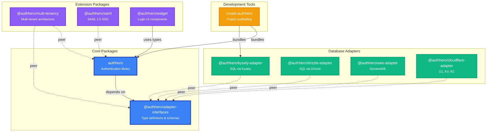

# Package Overview

AuthHero is a monorepo containing multiple packages that work together to provide a complete authentication solution. This page provides an overview of each package and their dependencies.

## Package Architecture

The following diagram shows all AuthHero packages and their dependencies:



**Legend:**
- 🔵 **Core Packages** - Foundation types and authentication library
- 🟢 **Database Adapters** - Implement storage for different databases
- 🟣 **Extension Packages** - Add-on functionality (multi-tenancy, SAML, UI)
- 🟡 **Development Tools** - CLI and scaffolding tools
- Solid arrow (→) - Direct dependency
- Dashed arrow (⇢) - Peer dependency

## Core Packages

### `@authhero/adapter-interfaces`

**Purpose:** Type definitions and interfaces for database adapters.

**Dependencies:**
- `@hono/zod-openapi` (peer)
- `nanoid`

**Used by:** All adapter packages, `authhero`, `@authhero/multi-tenancy`

**Description:** Defines the contract that all database adapters must implement. This package contains TypeScript interfaces and Zod schemas for tenants, users, applications, connections, and all other entities in the AuthHero system.

### `authhero`

**Purpose:** Core authentication library with universal login, OAuth2/OIDC flows, and API endpoints.

**Dependencies:**
- `@authhero/adapter-interfaces`
- `@hono/zod-openapi`
- Various utility libraries

**Peer Dependencies:**
- `hono`

**Used by:** `@authhero/multi-tenancy`, `@authhero/saml`, `@authhero/widget`, `create-authhero`

**Description:** The main AuthHero library that provides authentication flows, API endpoints, hooks system, and the universal login experience. This is the package most applications will interact with directly.

## Database Adapters

### `@authhero/kysely-adapter`

**Purpose:** SQL database adapter using Kysely query builder.

**Dependencies:**
- `@authhero/adapter-interfaces`
- `kysely`

**Peer Dependencies:**
- `@hono/zod-openapi`
- `hono`
- `kysely-bun-sqlite` (optional)
- `kysely-planetscale` (optional)

**Description:** Implements the adapter interface for SQL databases using Kysely. Supports PostgreSQL, MySQL, SQLite, and PlanetScale. Includes migration scripts and schema generation.

### `@authhero/drizzle-adapter`

**Purpose:** SQL database adapter using Drizzle ORM.

**Dependencies:**
- `@authhero/adapter-interfaces`
- `drizzle-orm`

**Description:** Alternative SQL adapter using Drizzle ORM. Provides the same functionality as kysely-adapter but with Drizzle's API.

### `@authhero/aws-adapter`

**Purpose:** AWS DynamoDB adapter.

**Dependencies:**
- `@authhero/adapter-interfaces`
- AWS SDK

**Description:** Implements the adapter interface for AWS DynamoDB, enabling serverless deployments on AWS Lambda and similar environments.

### `@authhero/cloudflare-adapter`

**Purpose:** Cloudflare-specific adapters and utilities.

**Dependencies:**
- `@authhero/adapter-interfaces`
- Cloudflare Workers types

**Description:** Adapters for Cloudflare D1 (SQL), KV (key-value), R2 (object storage), Analytics Engine, and custom domain management. Optimized for Cloudflare Workers.

## Extension Packages

### `@authhero/multi-tenancy`

**Purpose:** Multi-tenant architecture with organization-based access control and database isolation.

**Dependencies:**
- `zod`

**Peer Dependencies:**
- `authhero`
- `@authhero/adapter-interfaces`
- `@hono/zod-openapi`
- `hono`

**Description:** Provides tools for building multi-tenant SaaS applications. Features include:
- Tenant lifecycle management (create, update, delete hooks)
- Entity synchronization from control plane to child tenants
- Per-tenant database isolation
- Organization-based access control
- Runtime settings fallback
- Subdomain routing

### `@authhero/saml`

**Purpose:** SAML 2.0 protocol support for enterprise SSO.

**Dependencies:**
- `authhero`
- SAML libraries

**Description:** Adds SAML 2.0 Service Provider (SP) capabilities to AuthHero, enabling integration with enterprise identity providers like Okta, Azure AD, and Google Workspace.

### `@authhero/widget`

**Purpose:** Embeddable login UI widget.

**Dependencies:**
- React
- `authhero` (for types)

**Description:** Pre-built, customizable login/signup UI components that can be embedded in your application. Supports theming and branding customization.

## Tools

### `create-authhero`

**Purpose:** Project scaffolding CLI tool.

**Dependencies:**
- `authhero`
- `@authhero/kysely-adapter`

**Description:** CLI tool for quickly scaffolding new AuthHero projects with best practices and example configurations. Similar to `create-react-app` or `create-next-app`.

**Usage:**
```bash
npm create authhero@latest my-auth-server
```

## Dependency Strategy

### Peer Dependencies

Packages use peer dependencies for:
- **Runtime frameworks** (`hono`, `@hono/zod-openapi`) - ensures the same version across the application
- **Type sources** (`authhero`, `@authhero/adapter-interfaces`) - prevents type duplication and version conflicts

### Direct Dependencies

Packages use direct dependencies for:
- **Utility libraries** specific to the package's functionality
- **Type-only dependencies** that don't appear in the public API

### Benefits of This Approach

1. **No Type Duplication:** Types like `DataAdapters`, `Tenant`, etc., are imported from peer dependencies rather than inlined
2. **Version Consistency:** Applications use a single version of core packages
3. **Smaller Bundle Sizes:** Shared dependencies aren't bundled multiple times
4. **Clear Boundaries:** The dependency graph shows the logical architecture of the system

## Choosing Packages for Your Project

### Minimal Setup
- `authhero`
- One database adapter (`@authhero/kysely-adapter` recommended)

### Multi-Tenant SaaS
Add:
- `@authhero/multi-tenancy`

### Enterprise SSO
Add:
- `@authhero/saml`

### Custom UI
Add:
- `@authhero/widget`

### Quick Start
Use:
- `create-authhero` to scaffold your project

## Version Compatibility

All packages follow semantic versioning and maintain compatibility within major versions. It's recommended to use the same major version of all AuthHero packages in your project.

Check the [changelog](../CHANGELOG.md) for breaking changes and migration guides when upgrading.
