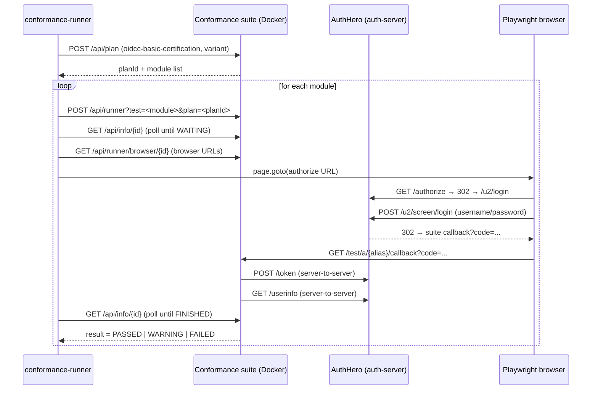

# OIDC Conformance Tests

AuthHero ships an automated runner that drives the [OpenID Foundation conformance suite](https://gitlab.com/openid/conformance-suite) against a local AuthHero instance. The runner lives in `apps/conformance-runner` and is invoked with a single command:

```bash
pnpm conformance:run
```

This page explains how the runner is wired, what test plans are exercised today, and which modules are known-passing. For the standards themselves, see [OpenID Connect Core](/standards/openid-connect-core) and [Discovery](/standards/openid-connect-discovery).

## Why a conformance runner

The conformance suite is the canonical interoperability test for OpenID Providers. Running it manually means:

1. Starting the suite's Docker stack
2. Creating a test plan in its web UI
3. Clicking through each test (~38 in the Basic OP plan), filling the AuthHero login form once per redirect
4. Comparing pass/fail by hand

That's slow and easy to skip. The runner automates steps 1–4 so the suite can become a regular check rather than a quarterly chore.

## How it works

The runner is **API-driven for plan management** and uses **Playwright only for the OAuth browser flow**. The suite exposes a documented REST API at `https://localhost.emobix.co.uk:8443/api/...`; the only step that genuinely needs a real browser is the redirect from the suite to AuthHero's `/authorize` endpoint and back through the universal-login form.



### Components

| Path | Purpose |
| ---- | ------- |
| `apps/conformance-runner/playwright.config.ts` | Playwright project config: `globalSetup`, `webServer` (auth-server), Chromium, `ignoreHTTPSErrors` for the suite's self-signed cert. |
| `apps/conformance-runner/global-setup.ts` | Runs `pnpm conformance:start` + `pnpm conformance:seed`, then polls the suite API until ready. Set `SKIP_SETUP=1` to skip this when the stack is already up. |
| `apps/conformance-runner/lib/conformance-api.ts` | Typed REST client for the suite (`createPlan`, `createTestFromPlan`, `getInfo`, `getBrowserStatus`, `waitForState`, `getTestLog`). |
| `apps/conformance-runner/lib/run-browser-flow.ts` | Polls a test for `WAITING` state, opens browser URLs, fills the AuthHero universal-login form, and returns when the test is `FINISHED` or `INTERRUPTED`. |
| `apps/conformance-runner/lib/test-plan-config.ts` | The plan name, variant selection, and inline JSON config sent to the suite (issuer URL, client credentials, alias). |
| `apps/conformance-runner/tests/oidcc-basic.spec.ts` | One Playwright test per module in the Basic plan. Each asserts `result === "PASSED"` (or `WARNING` if `ALLOW_WARNING=1`). |

### Key configuration

The runner expects:

- The auth-server reachable at `http://localhost:3000` and publishing `http://host.docker.internal:3000/` as its issuer (so the suite's Docker container can reach it).
- Two seeded clients: `test-client-id` / `test-client-secret` and `test-client-id-2` / `test-client-secret-2`, both with `https://localhost.emobix.co.uk:8443/test/a/my-local-test/callback` in their callbacks.
- One seeded user: `admin` / `password2` with a fully populated OIDC profile (used by scope and userinfo tests).
- The control-plane tenant configured with `default_audience: "urn:authhero:management"`.

All four come from `pnpm conformance:seed`, which calls the generated `auth-server/src/seed.ts` with `--clients` and `--user-profile` JSON arguments. When the seed.ts is generated via `pnpm create-authhero --conformance`, the `default_audience` is also baked in.

::: info Why `default_audience`?
The conformance suite's `/token` request follows OIDC Core verbatim — no `audience` parameter. AuthHero, like Auth0, normally requires an audience to mint an access token. The seed sets a tenant-level `default_audience` so OIDC-only flows can proceed without an Auth0-specific extension.
:::

## What's covered today

The runner currently exercises one plan:

### `oidcc-basic-certification-test-plan`

The OpenID Foundation's Basic OP certification suite. Variant: `{ server_metadata: "discovery", client_registration: "static_client" }`. The runner enumerates **38 modules statically** (one Playwright test per known module name); the live suite currently resolves the plan to **35 modules** for this variant, so 3 spec entries are skipped at runtime via `test.skip(!moduleEntry, …)`. The list below covers everything the runner emits:

- **Core code flow** — `oidcc-server`, `oidcc-response-type-missing`, `oidcc-ensure-post-request-succeeds`
- **ID token verification** — `oidcc-idtoken-signature`, `oidcc-idtoken-unsigned`
- **UserInfo** — `oidcc-userinfo-get`, `oidcc-userinfo-post-header`, `oidcc-userinfo-post-body`
- **Scopes** — `oidcc-scope-profile`, `oidcc-scope-email`, `oidcc-scope-address`, `oidcc-scope-phone`, `oidcc-scope-all`, `oidcc-ensure-other-scope-order-succeeds`
- **Display & prompt** — `oidcc-display-page`, `oidcc-display-popup`, `oidcc-prompt-login`, `oidcc-prompt-none-not-logged-in`, `oidcc-prompt-none-logged-in`
- **`max_age`** — `oidcc-max-age-1`, `oidcc-max-age-10000`
- **Hints & locales** — `oidcc-id-token-hint`, `oidcc-login-hint`, `oidcc-ui-locales`, `oidcc-claims-locales`, `oidcc-ensure-request-with-acr-values-succeeds`
- **Code reuse** — `oidcc-codereuse`, `oidcc-codereuse-30seconds`
- **Redirect URI / nonce** — `oidcc-ensure-registered-redirect-uri`, `oidcc-ensure-request-without-nonce-succeeds-for-code-flow`, `oidcc-ensure-request-with-unknown-parameter-succeeds`
- **`client_secret_post`** — `oidcc-server-client-secret-post`
- **Request objects** — `oidcc-request-uri-unsigned`, `oidcc-unsigned-request-object-supported-correctly-or-rejected-as-unsupported`, `oidcc-ensure-request-object-with-redirect-uri`
- **Claims & PKCE** — `oidcc-claims-essential`, `oidcc-ensure-request-with-valid-pkce-succeeds`
- **Refresh** — `oidcc-refresh-token`

### Currently validated

| Module | Status | Notes |
| ------ | ------ | ----- |
| `oidcc-server` | ✅ Passing | The happy-path code flow. End-to-end validated locally in ~3s. |
| Other modules in the live plan | 🟡 Not yet exercised | Runner is wired and emits one Playwright test per module; landing the runner unblocks systematic verification. |

::: tip
After running the suite, `pnpm conformance:report` opens the Playwright HTML report. Each row links to the suite's `log-detail.html` page for that test — useful for diagnosing failures where the suite caught a real conformance issue.
:::

### Out of scope (for now)

The runner is structured so adding more plans is just a new spec file with a different `planName`/variant. The following are explicitly not yet wired up:

- `oidcc-implicit-certification-test-plan` (implicit flow)
- `oidcc-hybrid-certification-test-plan` (hybrid flow)
- `oidcc-comprehensive-certification-test-plan` (full OP)
- FAPI plans (require mTLS, DPoP, or signed request objects beyond the current AuthHero surface)

## Running it locally

### One-time setup

```bash
# 1. Clone the conformance suite into ~/conformance-suite (it's a sibling repo, not a submodule)
git clone https://gitlab.com/openid/conformance-suite.git ~/conformance-suite

# 2. Generate or check out the auth-server (it's gitignored — it's a generated package)
pnpm create-authhero --conformance

# 3. Install Chromium for Playwright (one-time, ~92 MB)
pnpm --filter @authhero/conformance-runner exec playwright install chromium
```

The hostname `localhost.emobix.co.uk` resolves to `127.0.0.1` via public DNS, so no `/etc/hosts` patching is needed.

### Running the suite

```bash
pnpm conformance:run                       # full plan
pnpm conformance:run -- --grep oidcc-server # one module
pnpm conformance:run -- --ui               # interactive Playwright UI
pnpm conformance:report                    # open last HTML report
```

`pnpm conformance:run` will:

1. `pnpm conformance:start` — bring up the suite's Docker stack
2. `pnpm conformance:seed` — wipe and reseed `db.sqlite` with conformance clients and the test user
3. Start the auth-server on port 3000
4. Wait for the suite's `/api/runner/available` endpoint
5. Create the plan via the suite's REST API
6. For each module in the plan, run a Playwright test that drives the OAuth flow

To stop the suite: `pnpm conformance:stop`.

### Environment variables

| Var | Default | Purpose |
| --- | ------- | ------- |
| `CONFORMANCE_BASE_URL` | `https://localhost.emobix.co.uk:8443` | Suite URL |
| `AUTHHERO_BASE_URL` | `http://localhost:3000` | Auth-server URL (host-side) |
| `AUTHHERO_ISSUER` | `http://host.docker.internal:3000/` | Issuer in `/.well-known/openid-configuration`; must be reachable from inside the suite's Docker container |
| `CONFORMANCE_USERNAME` | `admin` | Seeded user |
| `CONFORMANCE_PASSWORD` | `password2` | Seeded password |
| `CONFORMANCE_ALIAS` | `my-local-test` | Plan alias (matches seeded callback URLs) |
| `ALLOW_WARNING` | unset | When set, modules ending in `WARNING` count as pass |
| `SKIP_SETUP` | unset | Skip Docker startup + reseed (useful when iterating) |

## Running in CI

A manually-triggered GitHub Actions workflow lives at `.github/workflows/conformance.yml`. To run it: open the **Actions** tab → **OIDC Conformance** → **Run workflow**, optionally supplying a `--grep` filter and toggling `allow_warning`.

What the workflow does:

1. Checks out the repo and installs dependencies.
2. Builds the workspace packages the auth-server consumes (`adapter-interfaces`, `kysely-adapter`, `multi-tenancy`, `widget`, `authhero`).
3. Generates `packages/create-authhero/auth-server/` fresh via `pnpm tsx src/index.ts auth-server --conformance --workspace --skip-install --skip-start --yes`.
4. Re-runs `pnpm install` to wire the generated package into the workspace, then runs `pnpm conformance:seed`.
5. Clones `gitlab.com/openid/conformance-suite`, builds it via the OIDF's Maven builder image (`builder-compose.yml`), and caches `~/.m2/repository` + `~/conformance-suite/target` so subsequent runs skip the build.
6. Starts the suite via `pnpm conformance:start` (the dev-mac compose file already includes `extra_hosts: ["host.docker.internal:host-gateway"]`, which is what makes the suite container reach the host auth-server on Linux Docker).
7. Installs Playwright Chromium with system deps.
8. Runs `pnpm conformance:run` with `SKIP_SETUP=1` (suite + DB are already prepared in steps 4–6).
9. Uploads the Playwright HTML report (always) and traces (on failure) as artifacts. On failure, also dumps the suite container's tail logs.

Approximate runtime: ~15–20 min cold cache (suite Maven build dominates), ~5–8 min warm cache. The job times out at 60 min.

It is **not** wired to PRs — runtime is too high for per-PR signal. Use it on demand when changing OAuth/OIDC code or before tagging a release.

## When a test fails

Three kinds of failure are useful to distinguish:

1. **Real conformance violation** — the suite's `/api/log/{id}` lists the failing assertion. The Playwright test's error message includes the first `FAILURE` entry verbatim (e.g. `[CallTokenEndpoint] Error from the token endpoint`) and a link to `https://localhost.emobix.co.uk:8443/log-detail.html?log=<id>` for the full log.
2. **Setup mismatch** — wrong client ID, missing callback URL, missing audience. Re-run `pnpm conformance:seed` and double-check the seed produced the expected rows. The `default_audience` row on the control-plane tenant is the most common one to be missing on older seed.ts files.
3. **Runner bug** — Playwright timeout with no useful message. Run with `pnpm conformance:run -- --grep <module> --headed` to watch the browser.

## Related documentation

- [OpenID Connect Core 1.0](/standards/openid-connect-core) — what the spec actually requires
- [OpenID Connect Discovery 1.0](/standards/openid-connect-discovery) — the `/.well-known/openid-configuration` document the suite consumes
- [Local Development](/deployment/local) — running AuthHero standalone
- [Testing](/contributing/testing) — non-conformance test guidelines
