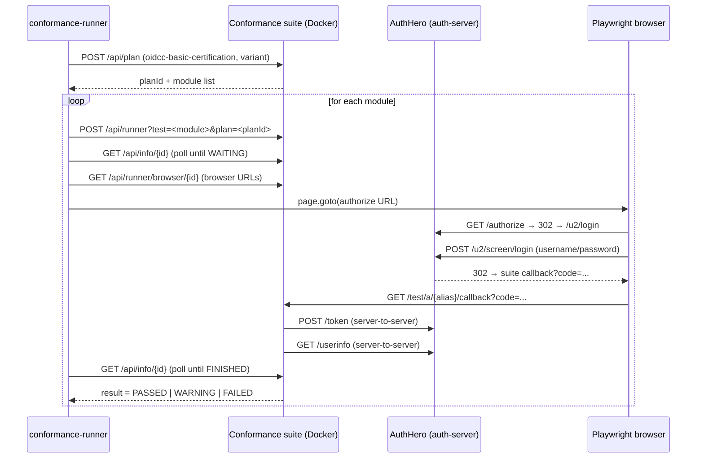

# OIDC Conformance Tests

AuthHero ships an automated runner that drives the [OpenID Foundation conformance suite](https://gitlab.com/openid/conformance-suite) against a local AuthHero instance. The runner lives in `apps/conformance-runner` and is invoked with a single command:

```bash
pnpm conformance:run
```

This page explains how the runner is wired, what test plans are exercised today, and which modules are known-passing. For the standards themselves, see [OpenID Connect Core](/standards/openid-connect-core) and [Discovery](/standards/openid-connect-discovery).

## Why a conformance runner

The conformance suite is the canonical interoperability test for OpenID Providers. Running it manually means:

1. Starting the suite's Docker stack
2. Creating a test plan in its web UI
3. Clicking through each test (~38 in the Basic OP plan), filling the AuthHero login form once per redirect
4. Comparing pass/fail by hand

That's slow and easy to skip. The runner automates steps 1–4 so the suite can become a regular check rather than a quarterly chore.

## How it works

The runner is **API-driven for plan management** and uses **Playwright only for the OAuth browser flow**. The suite exposes a documented REST API at `https://localhost.emobix.co.uk:8443/api/...`; the only step that genuinely needs a real browser is the redirect from the suite to AuthHero's `/authorize` endpoint and back through the universal-login form.



### Components

| Path | Purpose |
| ---- | ------- |
| `apps/conformance-runner/playwright.config.ts` | Playwright project config: `globalSetup`, `webServer` (auth-server), Chromium, `ignoreHTTPSErrors` for the suite's self-signed cert. |
| `apps/conformance-runner/global-setup.ts` | Runs `pnpm conformance:start` + `pnpm conformance:seed`, then polls the suite API until ready. Set `SKIP_SETUP=1` to skip this when the stack is already up. |
| `apps/conformance-runner/lib/conformance-api.ts` | Typed REST client for the suite (`createPlan`, `createTestFromPlan`, `getInfo`, `getBrowserStatus`, `waitForState`, `getTestLog`). |
| `apps/conformance-runner/lib/run-browser-flow.ts` | Opens each browser URL the suite hands out, fills the AuthHero universal-login form, and returns when the test is `FINISHED` or `INTERRUPTED`. |
| `apps/conformance-runner/lib/test-plan-config.ts` | The plan name, variant selection, and inline JSON config sent to the suite (issuer URL, client credentials, alias). |
| `apps/conformance-runner/tests/*.spec.ts` | One spec per plan (Basic, Form Post Basic, Implicit, Form Post Implicit, RP-Initiated Logout, Config, Dynamic). Each spec generates one Playwright test per module in its plan and drives the lifecycle (`createTestFromPlan` → `waitForState` for `WAITING` → `runBrowserFlow` → `waitForState` for terminal). Asserts `result` is `PASSED`, `REVIEW`, or `SKIPPED` (and additionally `WARNING` if `ALLOW_WARNING=1` or the module is on the per-spec allowlist). |

### Key configuration

The runner expects:

- The auth-server reachable at `http://localhost:3000` and publishing `http://host.docker.internal:3000/` as its issuer (so the suite's Docker container can reach it).
- Two seeded clients: `test-client-id` / `test-client-secret` and `test-client-id-2` / `test-client-secret-2`, both with `https://localhost.emobix.co.uk:8443/test/a/my-local-test/callback` in their callbacks.
- One seeded user: `admin` / `password2` with a fully populated OIDC profile (used by scope and userinfo tests).
- The control-plane tenant configured with `default_audience: "urn:authhero:management"`.

All four come from `pnpm conformance:seed`, which calls the generated `auth-server/src/seed.ts` with `--clients` and `--user-profile` JSON arguments. When the seed.ts is generated via `pnpm create-authhero --conformance`, the `default_audience` is also baked in.

::: info Why `default_audience`?
The conformance suite's `/token` request follows OIDC Core verbatim — no `audience` parameter. AuthHero, like Auth0, normally requires an audience to mint an access token. The seed sets a tenant-level `default_audience` so OIDC-only flows can proceed without an Auth0-specific extension.
:::

## What's covered today

The runner currently drives nine plans against AuthHero. Each module below maps 1-to-1 with an upstream conformance suite test (linked from the suite's web UI as `log-detail.html?log=…` on a run).

::: tip
The status column is the on-the-record outcome from the most recent green CI run. The lists are kept in sync with the spec files themselves — entries removed from a plan's `getStaticModulesForPlan()` should also disappear here, and new entries should land with a one-liner.
:::

### `oidcc-config-certification-test-plan`

The OpenID Configuration certification — verifies the discovery document against the OIDC Discovery 1.0 spec. The plan ships a single module, run on every conformance pass.

| Module | What it tests | Status |
| ------ | ------------- | ------ |
| `oidcc-discovery-endpoint-verification` | `/.well-known/openid-configuration` is reachable, returns valid JSON, and advertises required claims (`issuer`, `jwks_uri`, `authorization_endpoint`, `token_endpoint`, `response_types_supported`, `subject_types_supported`, `id_token_signing_alg_values_supported`). | ✅ |

### `oidcc-basic-certification-test-plan`

The OpenID Foundation's Basic OP certification suite. Variant: `{ server_metadata: "discovery", client_registration: "static_client" }`. The runner enumerates 38 modules statically; the live suite resolves the plan to 35 for this variant, so 3 spec entries are skipped at runtime via `test.skip(!moduleEntry, …)`.

::: details Core code flow (9 modules, all ✅)
| Module | What it tests | Status |
| ------ | ------------- | ------ |
| `oidcc-server` | Happy-path authorization-code flow end-to-end (authorize → callback → token → userinfo). | ✅ |
| `oidcc-response-type-missing` | Authorize without `response_type` is rejected. | ✅ |
| `oidcc-ensure-post-request-succeeds` | Authorize accepts `POST` form-encoded as well as `GET`. | ✅ |
| `oidcc-ensure-request-with-unknown-parameter-succeeds` | Unknown query parameters are ignored, not errored on. | ✅ |
| `oidcc-ensure-registered-redirect-uri` | Token request with an unregistered `redirect_uri` is rejected. | ✅ |
| `oidcc-ensure-request-without-nonce-succeeds-for-code-flow` | Code flow works without `nonce` (only required for implicit/hybrid). | ✅ |
| `oidcc-ensure-other-scope-order-succeeds` | Scope ordering doesn't matter (`profile email openid` works). | ✅ |
| `oidcc-ensure-request-with-acr-values-succeeds` | `acr_values` parameter is accepted (even when not acted on). | ✅ |
| `oidcc-server-client-secret-post` | Token endpoint accepts `client_secret_post` auth, not just `client_secret_basic`. | ✅ |
:::

::: details ID token & userinfo (6 modules, 1 🟡)
| Module | What it tests | Status |
| ------ | ------------- | ------ |
| `oidcc-idtoken-signature` | ID token's RS256 signature is valid and verifiable via the JWKS. | ✅ |
| `oidcc-idtoken-unsigned` | Server rejects requests asking for an unsigned (`alg=none`) ID token. | ✅ |
| `oidcc-userinfo-get` | `GET /userinfo` with bearer token returns claims. | ✅ |
| `oidcc-userinfo-post-header` | `POST /userinfo` with `Authorization: Bearer …` returns claims. | ✅ |
| `oidcc-userinfo-post-body` | `POST /userinfo` with `access_token` in form body returns claims. | ✅ |
| `oidcc-claims-essential` | `claims` parameter with `essential: true` claims is honored. | ✅ |
:::

::: details Scopes (5 modules, all ✅)
| Module | What it tests | Status |
| ------ | ------------- | ------ |
| `oidcc-scope-profile` | `profile` scope returns name/given_name/family_name/etc. | ✅ |
| `oidcc-scope-email` | `email` scope returns `email` and `email_verified`. | ✅ |
| `oidcc-scope-address` | `address` scope returns the structured `address` claim. | ✅ |
| `oidcc-scope-phone` | `phone` scope returns `phone_number` and `phone_number_verified`. | ✅ |
| `oidcc-scope-all` | All standard scopes together return the full claim set. | ✅ |
:::

::: details Display, prompt, and re-auth (7 modules, all ✅)
| Module | What it tests | Status |
| ------ | ------------- | ------ |
| `oidcc-display-page` | `display=page` is accepted (default behavior). | ✅ |
| `oidcc-display-popup` | `display=popup` is accepted. | ✅ |
| `oidcc-prompt-login` | `prompt=login` forces re-auth even with an active session. | ✅ |
| `oidcc-prompt-none-not-logged-in` | `prompt=none` returns `login_required` when no session exists. | ✅ |
| `oidcc-prompt-none-logged-in` | `prompt=none` succeeds silently when a session exists. | ✅ |
| `oidcc-max-age-1` | `max_age=1` triggers re-auth (auth_time refreshes). | ✅ |
| `oidcc-max-age-10000` | `max_age=10000` reuses the existing session. | ✅ |
:::

::: details Hints & locales (4 modules, all ✅)
| Module | What it tests | Status |
| ------ | ------------- | ------ |
| `oidcc-id-token-hint` | `id_token_hint` is accepted on `/authorize`. | ✅ |
| `oidcc-login-hint` | `login_hint` pre-populates the universal-login form. | ✅ |
| `oidcc-ui-locales` | `ui_locales` is accepted (even if not localized). | ✅ |
| `oidcc-claims-locales` | `claims_locales` is accepted on `/authorize`. | ✅ |
:::

::: details Code reuse / replay (2 modules, all ✅)
| Module | What it tests | Status |
| ------ | ------------- | ------ |
| `oidcc-codereuse` | A second token exchange with the same authorization code is rejected. | ✅ |
| `oidcc-codereuse-30seconds` | Code reuse is rejected even within a short window. | ✅ |
:::

::: details Request objects & PKCE (4 modules, all ✅)
| Module | What it tests | Status |
| ------ | ------------- | ------ |
| `oidcc-request-uri-unsigned` | Server correctly rejects or supports `request_uri` with an unsigned object per its declared metadata. | ✅ |
| `oidcc-unsigned-request-object-supported-correctly-or-rejected-as-unsupported` | Unsigned `request` objects are either supported correctly or rejected (no half-state). | ✅ |
| `oidcc-ensure-request-object-with-redirect-uri` | `redirect_uri` inside a request object is honored. | ✅ |
| `oidcc-ensure-request-with-valid-pkce-succeeds` | Code flow with `S256` PKCE verifier succeeds end-to-end. | ✅ |
:::

::: details Refresh tokens (1 module, ✅)
| Module | What it tests | Status |
| ------ | ------------- | ------ |
| `oidcc-refresh-token` | `offline_access` issues a refresh token; `grant_type=refresh_token` mints a new access/ID token pair. | ✅ |
:::

### `oidcc-formpost-basic-certification-test-plan`

Same module set as the Basic plan, but every authorization response is delivered via `response_mode=form_post` — the OP returns an HTML form that auto-submits to the registered redirect URI as a `POST`. Variant: `{ server_metadata: "discovery", client_registration: "static_client" }` (the `formpost` profile is encoded in the plan name itself, not the variant).

Adding this plan exercises the form-post code path end-to-end without re-implementing every Basic-flow assertion. Module behavior matches the Basic plan tables above, with two notable points:

- `oidcc-ensure-post-request-succeeds` runs the same `POST /authorize` check, but the *response* leg lands at the redirect URI as `application/x-www-form-urlencoded` rather than a `?query=…` redirect.

The `response_modes_supported` discovery entry includes `form_post`, so AuthHero is eligible for this plan with no extra configuration.

### `oidcc-rp-initiated-logout-certification-test-plan`

The OIDC RP-Initiated Logout 1.0 plan. Variant: `{ client_registration: "static_client", response_type: "code" }`. `end_session_endpoint` is advertised by default; the per-tenant flag `oidc_logout.rp_logout_end_session_endpoint_discovery` is opt-*out* if a tenant needs to hide it — see [OIDC RP-Initiated Logout 1.0](/standards/oidc-rp-initiated-logout).

::: details All 11 logout modules (all ✅)
| Module | What it tests | Status |
| ------ | ------------- | ------ |
| `oidcc-rp-initiated-logout-discovery-endpoint-verification` | `end_session_endpoint` is advertised in `/.well-known/openid-configuration`. | ✅ |
| `oidcc-rp-initiated-logout` | Happy-path logout: redirect to `post_logout_redirect_uri` with `state` echoed back. | ✅ |
| `oidcc-rp-initiated-logout-bad-post-logout-redirect-uri` | An unregistered `post_logout_redirect_uri` is rejected (no redirect). | ✅ |
| `oidcc-rp-initiated-logout-modified-id-token-hint` | A tampered `id_token_hint` (signature broken) is rejected. | ✅ |
| `oidcc-rp-initiated-logout-bad-id-token-hint` | A malformed (non-JWT) `id_token_hint` is rejected. | ✅ |
| `oidcc-rp-initiated-logout-no-id-token-hint` | Logout still proceeds when only `client_id` (and not `id_token_hint`) is supplied. | ✅ |
| `oidcc-rp-initiated-logout-no-params` | Bare `GET /oidc/logout` with no params renders a confirmation page. | ✅ |
| `oidcc-rp-initiated-logout-no-post-logout-redirect-uri` | With `id_token_hint` only, the OP renders the signed-out page (no redirect). | ✅ |
| `oidcc-rp-initiated-logout-no-state` | Logout works when `state` is omitted (no `state` on the redirect). | ✅ |
| `oidcc-rp-initiated-logout-only-state` | `state` without `post_logout_redirect_uri` is accepted; no redirect occurs. | ✅ |
| `oidcc-rp-initiated-logout-query-added-to-post-logout-redirect-uri` | A registered URI with extra query parameters added is rejected (Simple String Comparison per RFC 3986 §6.2.1). | ✅ |
:::

::: tip
`pnpm conformance:report` opens the Playwright HTML report. Each row links to the suite's `log-detail.html` page for that test — useful for diagnosing failures where the suite caught a real conformance issue.
:::

### `oidcc-implicit-certification-test-plan`

Newly wired up — the spec file is at [oidcc-implicit.spec.ts](https://github.com/markusahlstrand/authhero/blob/main/apps/conformance-runner/tests/oidcc-implicit.spec.ts). Variant: `{ server_metadata: "discovery", client_registration: "static_client" }` — the plan pins `response_type` per-module internally (`id_token` for some, `id_token token` for others), so passing `response_type` as a plan-level variant trips the suite's "Variant 'X' has been set by user, but test plan already sets this variant for module ..." 500. The plan passes in CI (the workflow runs the full suite and only records a pass marker on a clean run); modules absent from the live plan are skipped via `test.skip`. Triage gaps surface as Playwright failures with the usual `log-detail.html` link.

### `oidcc-formpost-implicit-certification-test-plan`

Newly wired up — the spec file is at [oidcc-form-post-implicit.spec.ts](https://github.com/markusahlstrand/authhero/blob/main/apps/conformance-runner/tests/oidcc-form-post-implicit.spec.ts). Variant: `{ server_metadata: "discovery", client_registration: "static_client" }` (the `formpost` profile is encoded in the plan name itself, not the variant; same module-level pinning of `response_type` as the plain Implicit plan). Module set mirrors the Implicit plan, but every authorization response is delivered via `response_mode=form_post`. The plan passes in CI; modules absent from the live plan are filtered via `test.skip`.

### `oidcc-dynamic-certification-test-plan`

Newly wired up — the spec file is at [oidcc-dynamic.spec.ts](https://github.com/markusahlstrand/authhero/blob/main/apps/conformance-runner/tests/oidcc-dynamic.spec.ts). Variant: `{ server_metadata: "discovery", client_registration: "dynamic_client" }`. Same code-flow modules as the Basic plan, but the suite registers its own client via `POST /oidc/register` (RFC 7591) instead of using the seeded `test-client-id`. The conformance tenant has `enable_dynamic_client_registration: true` set automatically by `create-authhero --conformance` so the `registration_endpoint` is advertised in discovery and the open-registration path is allowed (no Initial Access Token required). The plan passes in CI; modules absent from the live plan are filtered via `test.skip`.

### `oidcc-hybrid-certification-test-plan`

Newly wired up — the spec file is at [oidcc-hybrid.spec.ts](https://github.com/markusahlstrand/authhero/blob/main/apps/conformance-runner/tests/oidcc-hybrid.spec.ts). Variant: `{ server_metadata: "discovery", client_registration: "static_client" }` (the hybrid plan pins `response_type` per-module: `code id_token`, `code token`, `code id_token token`). The OP returns a code on every flow plus an `id_token` and/or `access_token` in the redirect fragment; the code is exchanged at `/oauth/token` afterwards. The id_token issued from `/authorize` carries `c_hash` (always) and `at_hash` (when an access_token is co-issued), per OIDC Core 3.3.2.11. The plan passes in CI; modules absent from the live plan are filtered via `test.skip`.

### `oidcc-formpost-hybrid-certification-test-plan`

Newly wired up — the spec file is at [oidcc-form-post-hybrid.spec.ts](https://github.com/markusahlstrand/authhero/blob/main/apps/conformance-runner/tests/oidcc-form-post-hybrid.spec.ts). Variant: `{ server_metadata: "discovery", client_registration: "static_client" }` (the `formpost` profile is encoded in the plan name itself, not the variant; same module-level pinning of `response_type` as the plain Hybrid plan). Module set mirrors the Hybrid plan, but every authorization response — code plus `id_token` and/or `access_token` — is delivered via `response_mode=form_post` instead of the fragment. This completes the response-mode matrix: all three flows (basic, implicit, hybrid) are now tested in both their default response mode and form_post. The plan passes in CI; modules absent from the live plan are filtered via `test.skip`.

### Out of scope (for now)

The runner is structured so adding more plans is just a new spec file with a different `planName`/variant. The following are explicitly not yet wired up:

- `oidcc-comprehensive-certification-test-plan` (full OP — superset of basic + implicit + hybrid)
- `oidcc-frontchannel-rp-initiated-logout-certification-test-plan` and `oidcc-backchannel-rp-initiated-logout-certification-test-plan` (front/back-channel logout — AuthHero only ships RP-Initiated Logout today)
- FAPI plans (require mTLS, DPoP, or signed request objects beyond the current AuthHero surface)

## Running it locally

### One-time setup

```bash
# 1. Clone the conformance suite into ~/conformance-suite (it's a sibling repo, not a submodule)
git clone https://gitlab.com/openid/conformance-suite.git ~/conformance-suite

# 2. Generate or check out the auth-server (it's gitignored — it's a generated package)
pnpm create-authhero --conformance

# 3. Install Chromium for Playwright (one-time, ~92 MB)
pnpm --filter @authhero/conformance-runner exec playwright install chromium
```

The hostname `localhost.emobix.co.uk` resolves to `127.0.0.1` via public DNS, so no `/etc/hosts` patching is needed.

### Running the suite

```bash
pnpm conformance:run                       # full plan
pnpm conformance:run -- --grep oidcc-server # one module
pnpm conformance:run -- --ui               # interactive Playwright UI
pnpm conformance:report                    # open last HTML report
```

`pnpm conformance:run` will:

1. `pnpm conformance:start` — bring up the suite's Docker stack
2. `pnpm conformance:seed` — wipe and reseed `db.sqlite` with conformance clients and the test user
3. Start the auth-server on port 3000
4. Wait for the suite's `/api/runner/available` endpoint
5. Create the plan via the suite's REST API
6. For each module in the plan, run a Playwright test that drives the OAuth flow

To stop the suite: `pnpm conformance:stop`.

### Environment variables

| Var | Default | Purpose |
| --- | ------- | ------- |
| `CONFORMANCE_BASE_URL` | `https://localhost.emobix.co.uk:8443` | Suite URL |
| `AUTHHERO_BASE_URL` | `http://localhost:3000` | Auth-server URL (host-side) |
| `AUTHHERO_ISSUER` | `http://host.docker.internal:3000/` | Issuer in `/.well-known/openid-configuration`; must be reachable from inside the suite's Docker container |
| `CONFORMANCE_USERNAME` | `admin` | Seeded user |
| `CONFORMANCE_PASSWORD` | `password2` | Seeded password |
| `CONFORMANCE_ALIAS` | `my-local-test` | Plan alias (matches seeded callback URLs) |
| `ALLOW_WARNING` | unset | When set, modules ending in `WARNING` count as pass |
| `SKIP_SETUP` | unset | Skip Docker startup + reseed (useful when iterating) |

## Running in CI

A manually-triggered GitHub Actions workflow lives at `.github/workflows/conformance.yml`. To run it: open the **Actions** tab → **OIDC Conformance** → **Run workflow**, optionally supplying a `--grep` filter and toggling `allow_warning`.

What the workflow does:

1. Checks out the repo and installs dependencies.
2. Builds the workspace packages the auth-server consumes (`adapter-interfaces`, `kysely-adapter`, `multi-tenancy`, `widget`, `authhero`).
3. Generates `packages/create-authhero/auth-server/` fresh via `pnpm tsx src/index.ts auth-server --conformance --workspace --skip-install --skip-start --yes`.
4. Re-runs `pnpm install` to wire the generated package into the workspace, then runs `pnpm conformance:seed`.
5. Clones `gitlab.com/openid/conformance-suite`, builds it via the OIDF's Maven builder image (`builder-compose.yml`), and caches `~/.m2/repository` + `~/conformance-suite/target` so subsequent runs skip the build.
6. Starts the suite via `pnpm conformance:start` (the dev-mac compose file already includes `extra_hosts: ["host.docker.internal:host-gateway"]`, which is what makes the suite container reach the host auth-server on Linux Docker).
7. Installs Playwright Chromium with system deps.
8. Runs `pnpm conformance:run` with `SKIP_SETUP=1` (suite + DB are already prepared in steps 4–6).
9. Uploads the Playwright HTML report (always) and traces (on failure) as artifacts. On failure, also dumps the suite container's tail logs.

Approximate runtime: ~15–20 min cold cache (suite Maven build dominates), ~5–8 min warm cache. The job times out at 60 min.

It is **not** wired to PRs — runtime is too high for per-PR signal. Use it on demand when changing OAuth/OIDC code or before tagging a release.

## When a test fails

Three kinds of failure are useful to distinguish:

1. **Real conformance violation** — the suite's `/api/log/{id}` lists the failing assertion. The Playwright test's error message includes the first `FAILURE` entry verbatim (e.g. `[CallTokenEndpoint] Error from the token endpoint`) and a link to `https://localhost.emobix.co.uk:8443/log-detail.html?log=<id>` for the full log.
2. **Setup mismatch** — wrong client ID, missing callback URL, missing audience. Re-run `pnpm conformance:seed` and double-check the seed produced the expected rows. The `default_audience` row on the control-plane tenant is the most common one to be missing on older seed.ts files.
3. **Runner bug** — Playwright timeout with no useful message. Run with `pnpm conformance:run -- --grep <module> --headed` to watch the browser.

## Related documentation

- [OpenID Connect Core 1.0](/standards/openid-connect-core) — what the spec actually requires
- [OpenID Connect Discovery 1.0](/standards/openid-connect-discovery) — the `/.well-known/openid-configuration` document the suite consumes
- [Local Development](/deployment/local) — running AuthHero standalone
- [Testing](/contributing/testing) — non-conformance test guidelines
