# AuthHero Database Schema

This document contains the database schema diagram for the AuthHero authentication system.

## Entity Relationship Diagram

```mermaid
erDiagram
    %% Core Tables
    tenants {
        varchar id PK
        varchar name
        varchar audience
        varchar sender_email
        varchar sender_name
        varchar language
        varchar logo
        varchar primary_color
        varchar secondary_color
        varchar support_url
        varchar created_at
        varchar updated_at
    }

    users {
        varchar user_id PK
        varchar tenant_id PK,FK
        varchar email
        varchar given_name
        varchar family_name
        varchar nickname
        varchar name
        varchar picture
        varchar phone_number
        boolean phone_verified
        varchar username
        varchar linked_to FK
        varchar last_ip
        integer login_count
        varchar last_login
        varchar provider
        varchar connection
        boolean email_verified
        boolean is_social
        varchar app_metadata
        varchar user_metadata
        varchar profileData
        varchar locale
        varchar created_at
        varchar updated_at
    }

    applications {
        varchar id PK
        varchar tenant_id FK
        varchar name
        varchar client_secret
        varchar allowed_logout_urls
        varchar authentication_settings
        varchar addons
        varchar callbacks
        varchar allowed_origins
        varchar web_origins
        varchar allowed_clients
        varchar options_kid
        varchar options_team_id
        varchar options_client_id
        varchar options_client_secret
        varchar options_scope
        varchar options_realms
        varchar options_app_secret
        varchar email_validation
        boolean disable_sign_ups
        varchar created_at
        varchar updated_at
    }

    connections {
        varchar id PK
        varchar tenant_id FK
        varchar name
        varchar response_type
        varchar response_mode
        varchar strategy
        varchar options
        varchar created_at
        varchar updated_at
    }

    %% Authentication & Sessions
    sessions {
        varchar id PK
        varchar tenant_id FK
        varchar user_id FK
        varchar login_session_id FK
        varchar created_at
        varchar updated_at
        varchar expires_at
        varchar idle_expires_at
        varchar authenticated_at
        varchar last_interaction_at
        varchar used_at
        varchar revoked_at
        varchar device
        varchar clients
    }

    login_sessions {
        varchar id PK
        varchar tenant_id FK
        varchar session_id FK
        varchar csrf_token
        varchar authParams_client_id
        varchar authParams_vendor_id
        varchar authParams_username
        varchar authParams_response_type
        varchar authParams_response_mode
        varchar authParams_audience
        varchar authParams_scope
        varchar authParams_state
        varchar authParams_nonce
        varchar authParams_code_challenge_method
        varchar authParams_code_challenge
        varchar authParams_redirect_uri
        varchar authParams_organization
        varchar authParams_prompt
        varchar authParams_act_as
        varchar authParams_ui_locales
        varchar authorization_url
        varchar ip
        varchar useragent
        varchar auth0Client
        boolean login_completed
        varchar created_at
        varchar updated_at
        varchar expires_at
    }

    refresh_tokens {
        varchar id PK
        varchar client_id FK
        varchar tenant_id FK
        varchar session_id
        varchar user_id FK
        varchar device
        varchar resource_servers
        boolean rotating
        varchar created_at
        varchar expires_at
        varchar idle_expires_at
        varchar last_exchanged_at
    }

    codes {
        varchar code_id PK
        varchar code_type PK
        varchar tenant_id FK
        varchar user_id FK
        varchar login_id
        varchar connection_id
        varchar code_verifier
        varchar code_challenge
        varchar code_challenge_method
        varchar redirect_uri
        varchar nonce
        varchar state
        varchar created_at
        varchar expires_at
        varchar used_at
    }

    passwords {
        varchar user_id PK,FK
        varchar tenant_id PK,FK
        varchar password
        varchar algorithm
        varchar created_at
        varchar updated_at
    }

    %% RBAC (Role-Based Access Control)
    roles {
        varchar id PK
        varchar tenant_id PK,FK
        varchar name
        varchar description
        varchar created_at
        varchar updated_at
    }

    resource_servers {
        varchar id PK
        varchar tenant_id PK,FK
        varchar identifier
        varchar name
        varchar scopes
        varchar signing_alg
        varchar signing_secret
        integer token_lifetime
        integer token_lifetime_for_web
        integer skip_consent_for_verifiable_first_party_clients
        integer allow_offline_access
        varchar verification_key
        varchar options
        varchar created_at
        varchar updated_at
    }

    role_permissions {
        varchar tenant_id PK,FK
        varchar role_id PK,FK
        varchar resource_server_identifier PK
        varchar permission_name PK
        varchar created_at
    }

    user_permissions {
        varchar tenant_id PK,FK
        varchar user_id PK,FK
        varchar resource_server_identifier PK
        varchar permission_name PK
        varchar created_at
    }

    user_roles {
        varchar tenant_id PK,FK
        varchar user_id PK,FK
        varchar role_id PK,FK
        varchar created_at
    }

    %% Organizations (Multi-tenant Organizations)
    organizations {
        varchar id PK
        varchar tenant_id FK
        varchar name
        varchar display_name
        text branding
        text metadata
        text enabled_connections
        text token_quota
        varchar created_at
        varchar updated_at
    }

    user_organizations {
        varchar id PK
        varchar tenant_id FK
        varchar user_id FK
        varchar organization_id FK
        varchar created_at
        varchar updated_at
    }

    %% Customization & Branding
    themes {
        varchar tenant_id PK,FK
        varchar themeId PK
        varchar displayName
        varchar colors_primary_button_label
        varchar colors_primary_button
        varchar colors_secondary_button_border
        varchar colors_secondary_button_label
        varchar colors_base_focus_color
        varchar colors_base_hover_color
        varchar colors_body_text
        varchar colors_captcha_widget_theme
        varchar colors_error
        varchar colors_header
        varchar colors_icons
        varchar colors_input_background
        varchar colors_input_border
        varchar colors_input_filled_text
        varchar colors_input_labels_placeholders
        varchar colors_links_focused_components
        varchar colors_success
        varchar colors_widget_background
        varchar colors_widget_border
        integer borders_button_border_radius
        integer borders_button_border_weight
        varchar borders_buttons_style
        integer borders_input_border_radius
        integer borders_input_border_weight
        varchar borders_inputs_style
        boolean borders_show_widget_shadow
        integer borders_widget_border_weight
        integer borders_widget_corner_radius
        integer fonts_body_text_bold
        integer fonts_body_text_size
        integer fonts_buttons_text_bold
        integer fonts_buttons_text_size
        varchar fonts_font_url
        integer fonts_input_labels_bold
        integer fonts_input_labels_size
        boolean fonts_links_bold
        integer fonts_links_size
        varchar fonts_links_style
        integer fonts_reference_text_size
        boolean fonts_subtitle_bold
        integer fonts_subtitle_size
        boolean fonts_title_bold
        integer fonts_title_size
        varchar page_background_background_color
        varchar page_background_background_image_url
        varchar page_background_page_layout
        varchar widget_header_text_alignment
        integer widget_logo_height
        varchar widget_logo_position
        varchar widget_logo_url
        varchar widget_social_buttons_layout
        varchar created_at
        varchar updated_at
    }

    branding {
        varchar tenant_id PK,FK
        varchar logo_url
        varchar favicon_url
        varchar font_url
        varchar colors_primary
        varchar colors_page_background_type
        varchar colors_page_background_start
        varchar colors_page_background_end
        integer colors_page_background_angle_dev
    }

    %% Configuration & Settings
    prompt_settings {
        varchar tenant_id PK,FK
        varchar universal_login_experience
        boolean identifier_first
        boolean password_first
        boolean webauthn_platform_first_factor
    }

    email_providers {
        varchar tenant_id PK,FK
        varchar name
        boolean enabled
        varchar default_from_address
        varchar credentials
        varchar settings
        varchar created_at
        varchar updated_at
    }

    custom_domains {
        varchar custom_domain_id PK
        varchar tenant_id FK
        varchar domain
        boolean primary
        varchar status
        varchar type
        varchar origin_domain_name
        varchar verification
        varchar custom_client_ip_header
        varchar tls_policy
        varchar domain_metadata
        varchar created_at
        varchar updated_at
    }

    %% Forms & Hooks
    forms {
        varchar id PK
        varchar tenant_id FK
        varchar name
        varchar messages
        varchar languages
        varchar translations
        varchar nodes
        varchar start
        varchar ending
        varchar style
        varchar created_at
        varchar updated_at
    }

    hooks {
        varchar hook_id PK
        varchar tenant_id FK
        varchar trigger_id
        boolean enabled
        boolean synchronous
        integer priority
        text form_id
        varchar url
        varchar created_at
        varchar updated_at
    }

    %% Security & Cryptography
    keys {
        varchar kid PK
        varchar tenant_id FK
        varchar connection FK
        varchar type
        varchar cert
        varchar pkcs7
        varchar fingerprint
        varchar thumbprint
        varchar current_since
        varchar current_until
        varchar created_at
        varchar revoked_at
    }

    %% Audit & Logging
    logs {
        varchar id PK
        varchar tenant_id FK
        varchar user_id
        varchar ip
        varchar type
        varchar date
        varchar client_id
        varchar client_name
        varchar description
        varchar details
        varchar user_name
        varchar auth0_client
        boolean isMobile
        varchar connection
        varchar connection_id
        varchar audience
        varchar scope
        varchar strategy
        varchar strategy_type
        varchar hostname
        varchar session_connection
        varchar user_agent
    }

    %% Legacy/Administrative
    members {
        varchar id PK
        varchar tenant_id FK
        varchar sub
        varchar email
        varchar name
        varchar status
        varchar role
        varchar picture
        varchar created_at
        varchar updated_at
    }

    migrations {
        varchar id PK
        varchar tenant_id FK
        varchar provider
        varchar client_id
        varchar origin
        varchar domain
        varchar created_at
        varchar updated_at
    }

    %% Relationships
    tenants ||--o{ users : "has many"
    tenants ||--o{ applications : "has many"
    tenants ||--o{ connections : "has many"
    tenants ||--o{ sessions : "has many"
    tenants ||--o{ login_sessions : "has many"
    tenants ||--o{ refresh_tokens : "has many"
    tenants ||--o{ codes : "has many"
    tenants ||--o{ roles : "has many"
    tenants ||--o{ resource_servers : "has many"
    tenants ||--o{ organizations : "has many"
    tenants ||--|| themes : "has one"
    tenants ||--|| branding : "has one"
    tenants ||--|| prompt_settings : "has one"
    tenants ||--|| email_providers : "has one"
    tenants ||--o{ custom_domains : "has many"
    tenants ||--o{ forms : "has many"
    tenants ||--o{ hooks : "has many"
    tenants ||--o{ keys : "has many"
    tenants ||--o{ logs : "has many"
    tenants ||--o{ members : "has many"
    tenants ||--o{ migrations : "has many"

    users ||--|| passwords : "has one"
    users ||--o{ sessions : "has many"
    users ||--o{ refresh_tokens : "has many"
    users ||--o{ codes : "has many"
    users ||--o{ user_permissions : "has many"
    users ||--o{ user_roles : "has many"
    users ||--o{ user_organizations : "has many"
    users ||--o{ users : "linked to (self-reference)"

    applications ||--o{ refresh_tokens : "has many"

    connections ||--o{ keys : "has many"

    sessions ||--|| login_sessions : "belongs to"

    roles ||--o{ role_permissions : "has many"
    roles ||--o{ user_roles : "has many"

    resource_servers ||--o{ role_permissions : "has many"
    resource_servers ||--o{ user_permissions : "has many"

    organizations ||--o{ user_organizations : "has many"

    user_organizations }o--|| users : "belongs to"
    user_organizations }o--|| organizations : "belongs to"

    forms ||--o{ hooks : "used by"
```

## Key Relationships

### Multi-Tenancy

- All major entities are scoped to a `tenant_id`
- Each tenant can have multiple users, applications, connections, etc.
- Provides complete data isolation between tenants

### User Management

- Users can be linked to other users (social account linking)
- Users have passwords, sessions, and permissions
- Email and phone uniqueness is enforced per provider per tenant

### Authentication Flow

- Login sessions track the authentication process
- Sessions represent authenticated user sessions
- Refresh tokens enable token renewal
- Codes handle various OAuth flows (authorization codes, etc.)

### Role-Based Access Control (RBAC)

- Resource servers define APIs and their scopes
- Roles group permissions from resource servers
- Users can have both direct permissions and role-based permissions
- Organizations can have their own access control

### Customization

- Themes provide comprehensive UI customization
- Branding offers simpler logo/color customization
- Custom domains enable white-label deployments
- Forms and hooks enable workflow customization

### Security

- Keys manage cryptographic materials for JWT signing
- Comprehensive audit logging tracks all activities
- Email providers enable custom email delivery
