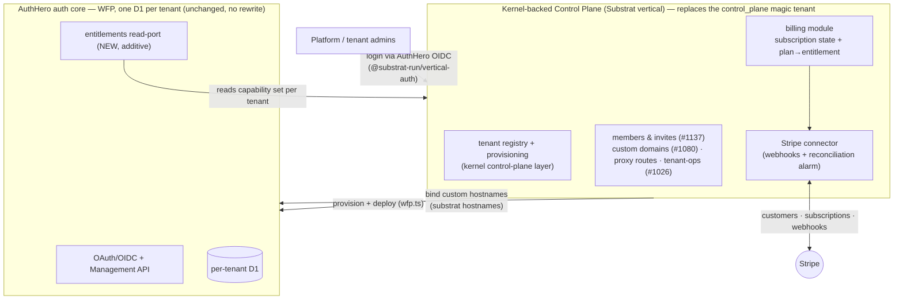
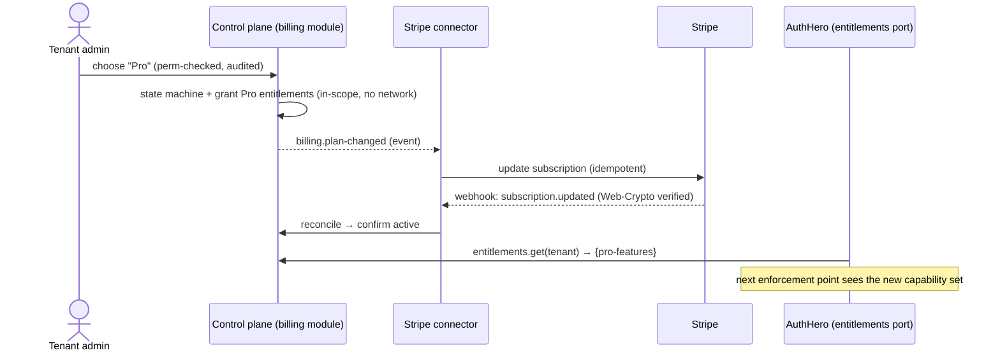

# Design: AuthHero Control Plane & Billing on Substrat

- **Status:** Draft / for discussion
- **Author:** Markus Ahlstrand
- **Created:** 2026-07-23 · **Revised:** 2026-07-28 (verified against Substrat repo at `/Users/markus/Projects/private/substrat`)
- **Related:** AuthHero #1026 (tenant operations), #1057 (transactional outbox), #1080 (control-plane authority / delegating adapters), #1137 (tenant self-manage members), #1181 (cp signing keys); Substrat `@substrat-run/cli`, `control-plane-api` (`wfp.ts`), `@substrat-run/vertical-auth`, `substrat hostnames`

---

## 1. Summary

The spine of this design is a **kernel-backed control plane**: the operational plane that
provisions and manages AuthHero tenants and everything around them — **provisioning, tenant
members/invites, custom domains, proxy routes, plans & billing**. Today that job is done by a
*magic tenant inside AuthHero* (`tenantId = "control_plane"`) with cross-tenant concerns bolted
on as special routes. This proposes replacing that with a purpose-built **Substrat kernel
vertical** — which is the same thing we've been calling "the console."

The line that makes it tractable:

> **The AuthHero auth core stays on WFP with one D1 per tenant — no kernel rewrite.** It keeps
> its own tenancy, migrations, and auth logic. Only the **control plane** becomes kernel-backed.
> The auth core gains exactly **one** additive touch-point: an `entitlements` read-port it
> consults where a plan limit bites. It never learns what Stripe or the kernel are.

So the split is:

- **Auth core** → hosted on Substrat's WFP platform, per-tenant D1, unchanged runtime.
- **Control plane (= console)** → a kernel vertical: real tenancy, permissions with proof
  paths, kernel-stamped audit, first-class provisioning. It *provisions and deploys* the auth
  core and owns billing, members, and custom domains.

This puts the SaaS-operations job where its invariants belong, and dissolves the current
conflation of "the platform" with "a tenant of the platform."

---

## 2. The problem today: the control plane is a reused auth-tenant

The control plane is currently `tenantId = "control_plane"` — a **tenant inside AuthHero itself**
([`seed.ts:666`](../../packages/authhero/src/seed.ts#L666), `isControlPlane`; admins log in with
`organization: "control_plane"`). The platform's management layer is modelled as one of the
customer tenants, reusing auth-tenant machinery (users, orgs, members, cp-scoped signing keys
from #1181) to represent "who runs the platform."

Genuinely cross-tenant concerns — host→tenant resolution, custom-domains sync, proxy-route sync,
tenant-members — are then **bolted on** as `proxy-control-plane` routes with their own token/
scope verification (the `CONTROL_PLANE_*_SCOPE` constants in
[`routes/proxy-control-plane/`](../../packages/authhero/src/routes/proxy-control-plane/index.ts)),
*because the per-tenant model cannot express "operate across all tenants."*

The costs of that shape:

- **Conflation.** A control plane that is simultaneously a tenant of the system it controls.
- **Bolt-on cross-tenant surface.** Every platform-wide operation is a special route with
  bespoke auth, outside the normal model.
- **Soft bootstrap knot.** The platform's own admins are users in a tenant of the very AuthHero
  they administer.

---

## 3. The target: a kernel-backed control plane

Substrat's kernel is not only scopes — it has an **audited control-plane layer above them**
(`host.admin`, `control-plane-do`, `control-plane-api`): *"the control plane comes first and is
audited."* That layer is the **sanctioned cross-tenant authority**, so a control plane is not a
violation of the kernel's "no cross-tenant API" rule — it's the one place that rule is designed
not to apply. The mapping is almost 1:1:

| Today (messy) | Kernel-backed |
|---|---|
| `control_plane` magic tenant | the kernel **control plane** (`host.admin`) — not a tenant at all |
| each AuthHero tenant | a kernel **tenant + provisioned scope** the CP addresses |
| platform admins = users *in* AuthHero | control-plane **principals** (staff roster), logging in *via* AuthHero OIDC as an RP — not a tenant inside it |
| bolt-on `CONTROL_PLANE_*_SCOPE` routes | first-class control-plane **operations**, audited, with proof paths |
| cp signing keys, provisioning races (#1026), members (#1137) | kernel provisioning + atomic audit + roles/grants |

The conflation dissolves: admins authenticate *through* AuthHero but live in the control plane,
and the auth core is a runtime the control plane provisions and deploys — not where platform
identity lives.

### Two separate control planes, one-way dependency

There are **two** control planes at **two layers**, and they must not merge:

- **Substrat's platform control plane** (`control-plane-api` / `apps/control-plane`) — generic
  infrastructure that provisions tenants/scopes, grants/reads entitlements, and deploys verticals
  for *any* vertical. It **takes no dependency on AuthHero** and never will.
- **AuthHero's control plane** — a product management layer (auth config, members, custom domains,
  billing). It runs **as a vertical hosted on the platform** and *consumes* the platform CP via
  the sanctioned client (`control-plane-api/client.ts`: `createTenant`, `provisionScope`,
  `grantEntitlement`, `listEntitlements`, over an injectable service-binding fetch).

The dependency is strictly **one-way: AuthHero → Substrat.** The sandbox contract enforces the
separation — a hosted vertical gets *its own `ScopeDO` only*, **no `CONTROL_PLANE` binding**, and
provisioning is **pull** (K-31: the platform calls the vertical to provision; the vertical can't
create tenants/entitlements itself). So "kernel-backed" here means AuthHero's CP is a vertical
*on* the kernel/platform, consuming the generic CP API — **not** a fork of, or merge into,
Substrat's own control plane.

---

## 4. Architecture



Two databases per tenant, never one:

- **Auth core:** per-tenant **D1**, schema owned by AuthHero's drizzle adapter (users, clients,
  connections, its own migration journal). One DB per tenant via **WFP** — the isolation you
  wanted, with no rewrite.
- **Control plane:** kernel **scopes (DO/SQLite)** — `_substrat_*` audit spine, per-module
  journaled migrations, kernel-stamped events, permissions with proof paths.

They **cannot** share one physical DB (kernel rule 4 + AuthHero's adapter contract each own
their schema/migrations; different storage products). **The join key is the tenant id** — the
control plane's tenant id *is* the AuthHero (WFP) tenant id.

---

## 5. Components

### 5.1 The control-plane vertical (Substrat, new/converged)

The spine. Owns, as first-class audited operations:

- **Tenant provisioning & lifecycle** (folds in #1026) — provision a tenant → bring up its
  auth-core D1 (delegated to WFP) and its control-plane scope on one lifecycle event; lazy,
  self-healing migrations replace the best-effort `afterCreate` seeding.
- **Members & invites** (folds in #1137) — the people who administer a *tenant/account*, as
  kernel roles/grants. (Distinct from Auth0 org invitations — see §7.)
- **Custom domains & proxy routes** (folds in #1080) — the control plane is the authority; the
  runtime is a delegating consumer. Now backed by `substrat hostnames` (§8).
- **Plans & billing** (5.2–5.3).

### 5.2 Billing module (Substrat, new, shared — in-scope, no network)

> **Vocabulary note:** the current Substrat has no `engine-*` packages — the reuse unit is a
> **vertical / shared package** plus a **marketplace**. What earlier drafts called
> `engine-billing`/`engine-invoicing` should be read as a shared billing *module/package*. The
> design (state machine vs connector split) is unchanged; only the packaging term is.

Owns the **subscription state machine** and the **plan→entitlement effect**. Generic across every
SaaS on the platform, so it's a shared module, not console-private code.

- States `trialing → active → past_due → canceled` (mirrors Stripe), no illegal jumps.
- **A plan change grants/revokes kernel entitlements** (the kernel's entitlement/grant
  primitive — verify current API name). Unentitled features don't resolve — better than a flag.
- Emits fat events (`billing.plan-changed`, …). **No `fetch`** (rule 2) — never talks to Stripe.
- Money as minor-unit **strings** via `@substrat-run/contracts` helpers (rule 8), never floats.

### 5.3 Stripe connector (Substrat, new, shared — network + webhooks + reconciliation)

The **executor**, following the existing **Scrive connector** pattern (external API + webhook +
cron/alarm reconciliation). Lives *outside* module code — Stripe calls must never run inside a
scope transaction (rule 2).

- **Outbound:** consumes billing events → creates/updates Stripe customers & subscriptions, with
  idempotency keys.
- **Inbound webhooks:** verify `Stripe-Signature` with **Web Crypto** (`crypto.subtle`), *not*
  stripe-node's Node-crypto `constructEvent` (rule 9 + web-crypto-only).
- **Reconciliation alarm (mandatory).** Webhooks are at-least-once, out-of-order, droppable —
  the Scrive connector's last blocker before publish was exactly this sweep. A periodic alarm
  reconciles scope state against Stripe as the backstop.
- **Webhook routing is control-plane, not scoped.** A webhook arrives with a customer/subscription
  id and *no tenant* — keep a `tenant ↔ stripe_customer` map at the control plane; the single
  ingress fans out to the right scope.

### 5.4 `entitlements` read-port (AuthHero — the *one* auth-core change)

A plan isn't real unless something enforces it, and enforcement lives where the limited resource
is created — **inside the auth core** (Nth active user, MFA-as-paid-feature, custom-domain
gating, connection count, …). So AuthHero gains a **read-only** capability:

```
entitlements.get(tenantId) -> Set<capability>   // "what is this tenant entitled to?"
```

- Modelled as an **adapter port** (the pattern the codebase already lives by), so `authhero`
  stays ignorant of Stripe/kernel/plans. The control plane supplies the implementation; a default
  adapter returns "everything" for self-hosted/OSS users.
- Read at enforcement points via the existing hook/middleware seam. Cache per tenant; the control
  plane pushes invalidation (or short TTL) on plan change.
- **The only modification to the `authhero` package, and it's additive.**

---

## 6. Auth for admins: already built

Platform/tenant admins sign in via **AuthHero OIDC**, as a relying party — not as a tenant inside
AuthHero. Substrat's `@substrat-run/vertical-auth` already implements this: its
`oidc-rp-provider` lists issuers as *"a team's Auth Server app, Supabase, Auth0, **AuthHero**,
Keycloak"* ("one script, many issuers"), and maps `sub → principal`. So the console's own login is
largely pre-wired. (One thing to reconcile: Substrat also ships `demos/auth-server` — decide
"AuthHero vs Substrat's auth-server" as the issuer.)

---

## 7. What lives where — the wrap-vs-modify table

| Concern | Moves to control plane (kernel vertical) | Touches `authhero` package | Stays in `authhero`, unchanged |
|---|---|---|---|
| Tenant provisioning / lifecycle (#1026) | ✅ | — | (auth-core D1 provisioned via delegated WFP) |
| Tenant members & invites (#1137) | ✅ authority | possibly: `tenant-members` becomes a projection/delegate | — |
| Custom domains / proxy routes (#1080) | ✅ authority | thin delegating adapter (as today) | — |
| Plans / subscriptions / Stripe | ✅ billing module + connector | — | — |
| Plan **enforcement** (limits/features) | policy defined here | ✅ **`entitlements` read-port (only change)** | enforcement *points* already exist |
| Usage signals (MAU, counts) | consumed here | mostly none (existing outbox) | `stats` / outbox already emit |
| **Auth0 Organization invitations** | — | — | ✅ `Invite.ts` — end-user/org feature, different layer |
| OAuth/OIDC, users, clients, connections, per-tenant D1 | — | — | ✅ entirely (WFP-hosted) |

### The invitation distinction (important)

AuthHero has **two** things that both sound like "members/invites":

1. **Organization invitations** ([`Invite.ts`](../../packages/adapter-interfaces/src/types/Invite.ts),
   `organization_id`, `client_id`) — a *customer inviting their own end-users* into an
   organization inside their tenant. An **Auth0-compatible product feature of the auth core. Stays
   in AuthHero, untouched.**
2. **Tenant members** ([`tenant-members.ts`](../../packages/authhero/src/routes/management-api/tenant-members.ts),
   #1137) — the *people who administer the tenant/account itself*. **The control plane's concern.**

Only (2) moves. Conflating the two is the main way this goes wrong.

---

## 8. Hosting & platform state (verified 2026-07-28)

Substrat is **two separable layers**:

1. **Substrat-the-kernel** — the framework the control-plane vertical and billing module are
   built against. AuthHero's OAuth core is **not** a kernel module and won't become one.
2. **Substrat-the-platform** — a hosting layer on **Cloudflare WFP**. `control-plane-api/wfp.ts`
   uploads a built worker **bundle** into a dispatch namespace (exactly `wrangler deploy`'s
   multipart shape); the author never holds a CF token; a **sandbox contract**
   (`docs/design/self-serve-deploy.md`) admits opaque bundles safely.

What's now real (was speculative in earlier drafts):

- **CLI** (`@substrat-run/cli`, published): `login/whoami/push/versions/promote/publish/hostnames/scope`.
  Deploy model = **push (pending) → admission (human console decision) → serve**; immutable
  content-addressed versions; in-place deploy with data-follows-version + PITR backout.
- **Hosts arbitrary Workers, not just kernel modules.** A vertical declares `substrat.runtimeNeeds`
  (entry/build/`needsNodeCompat`/own-`stores` incl. **D1**) and the CLI derives the wrangler
  config — so **AuthHero can be hosted as a Worker without a kernel rewrite**; the real work is
  fitting its bindings to the sandbox contract.
- **Custom hostnames = built/in-flight** (not "not built"): `substrat hostnames` binds a hostname
  to a **surface** of an install — platform hostname rides the wildcard cert (live now), a custom
  domain lands `pending`. This *is* the `domain → (tenant, surface)` model this doc wanted.

### AuthHero as the platform's first dogfood test

AuthHero is a *demanding* first guest — latency-sensitive OAuth hot path, per-tenant D1 at scale,
custom hostnames, and a **non-kernel guest**. Staged cheapest-first (this is the entry point of
the phased plan):

1. **CLI deploy, no custom domains** — push AuthHero (few tenants) onto a `substrat.run` host.
   Proves CLI + WFP dispatch + per-tenant D1 + auth flows end-to-end.
2. **Provisioning at count** — prove isolation and cold-start/latency at real tenant counts.
3. **Custom hostnames** — `auth.customer.com` end-to-end (the ACM/PSL test).

---

## 9. Key flows

### 9.1 Plan upgrade → enforceable entitlement



### 9.2 Tenant provisioning (replaces the magic-tenant + afterCreate path)

Control plane provisions a tenant → brings up the auth-core D1 (delegated WFP) **and** its
control-plane scope on one audited lifecycle event → binds a platform hostname → the tenant is
serving. No `control_plane`-tenant seeding, no ready-but-empty-D1 race.

### 9.3 Reconciliation backstop

Alarm fires → connector lists Stripe subscriptions for known customers → diffs against scope
state → emits corrective events for drift. Not a v2 nicety — it's what makes billing trustworthy.

---

## 10. Risks & hard problems

- **Bootstrap / break-glass.** Admins log in via AuthHero while the CP manages AuthHero. The auth
  core already cold-starts independently (it's the IdP), but the CP needs a **break-glass** path
  so a broken AuthHero can't lock out platform operators.
- **Migration off the `control_plane` tenant.** Live data/behaviour (cp signing keys #1181,
  members #1137, custom domains, proxy routes) must move without downtime. Sequence it.
- **Entitlement read on the hot path.** `entitlements.get` sits in the auth core's request path —
  must be cheap (cache per tenant, CP-pushed invalidation).
- **Webhook idempotency & ordering.** Kernel event log + reconciliation sweep + outbound
  idempotency keys. Don't ship the happy-path handler alone.
- **Web Crypto signature verification.** stripe-node's `constructEvent` won't run on Workers.
- **Hot-path latency of hosting.** WFP dispatch cold-start for the auth core — the stage-2 test.

---

## 11. Open decisions

1. **Boundary is settled: two separate control planes, one-way dependency.** AuthHero's CP is a
   vertical hosted on the platform, consuming Substrat's generic CP API (`createTenant`/
   `provisionScope`/`grant`+`listEntitlements`); Substrat takes **no** dependency on AuthHero. The
   remaining question is only *how much* AuthHero's CP leans on the platform CP vs. carries its
   own — not whether to merge.
2. **The in-flight fork, now.** #1137 (members) and #1026 (tenant-ops) are being built *in the
   `control_plane` tenant today.* Do they keep landing there, or pivot onto the kernel CP? Deciding
   late means migrating twice.
3. **Break-glass model** for CP access when AuthHero is unavailable.
4. **Issuer for admin login** — AuthHero vs Substrat's `demos/auth-server`.
5. **Billing shape** = Stripe subscriptions (invoice-document billing deferred).

---

## 12. Phased plan

1. **Stage 1 — hosting spike (dogfood test).** Push AuthHero as a Worker onto the platform via
   the CLI, few tenants, no custom domains. Proves the platform *and* gives a running
   AuthHero-on-Substrat to build the CP against. Prereq: bindings-vs-sandbox-contract diff +
   AuthHero's `runtimeNeeds`.
2. **Stage 2 — control-plane skeleton + entitlements seam.** Stand up the kernel CP with a tenant
   registry + provisioning of one tenant; AuthHero `entitlements` read-port with a default
   "allow-all" adapter. Prove: CP provisions a tenant, and a capability it sets is read by the
   auth core. No Stripe, no UI.
3. **Stage 3 — move the cross-tenant concerns off the magic tenant.** Members (#1137), custom
   domains (#1080), proxy routes, tenant-ops (#1026) become CP operations. Retire
   `control_plane`-tenant reliance behind the CP.
4. **Stage 4 — billing.** Subscription state machine + plan→entitlement, then the Stripe connector
   (outbound + webhook + reconciliation alarm).
5. **Stage 5 — console screens & custom hostnames.** Plan picker, billing history, team; bind
   `auth.customer.com` via `substrat hostnames`.
6. **Later — unified invoicing**, if unified documents across charge sources are ever needed.
